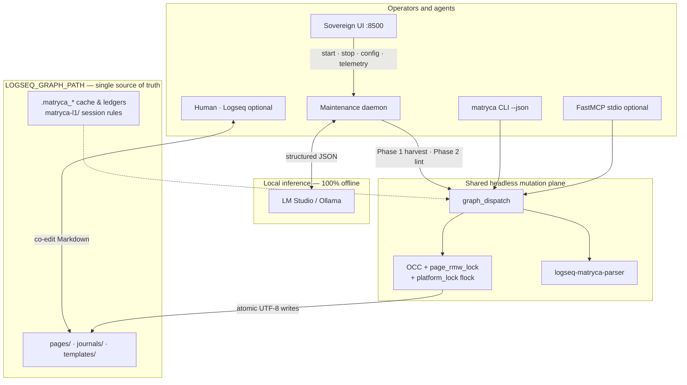

# Matryca Plumber

[](https://github.com/MarcoPorcellato/matryca-plumber/actions/workflows/ci.yml)
[](https://pypi.org/project/matryca-plumber/)
[](https://pypi.org/project/matryca-plumber/)
[](https://github.com/MarcoPorcellato/matryca-plumber/releases)
[](https://github.com/MarcoPorcellato/matryca-plumber/blob/main/pyproject.toml#L10)
[](https://github.com/MarcoPorcellato/matryca-plumber/actions/workflows/ci.yml)
[](https://github.com/MarcoPorcellato/matryca-plumber/blob/main/pyproject.toml#L138)

[](https://github.com/astral-sh/ruff)
[](https://github.com/MarcoPorcellato/matryca-plumber/blob/main/CONTRIBUTING.md)
[](LICENSE)
[](#what-it-does)
[](#what-it-does)
[](#what-it-does)
[](https://github.com/logseq/logseq)
[](SECURITY.md)
[](CONTRIBUTING.md)
[](CODE_OF_CONDUCT.md)


> I gave my AI access to my notes. It corrupted them.  
> I built Matryca Plumber so that never happens again.

<p align="center"><strong>CLI · MCP · background daemon · Sovereign UI · Logseq OG · OCC-safe · local-first</strong></p>

<p align="center">
  <a href="#get-started-60-seconds">Install</a> ·
  <a href="#tana--logseq-og-migration">Tana import</a> ·
  <a href="#how-it-works-30-seconds">Architecture</a> ·
  <a href="#how-it-compares">Compare</a> ·
  <a href="llms.txt">Agents</a> ·
  <a href="#documentation">Docs</a> ·
  <a href="CONTRIBUTING.md">Contributing</a>
</p>

<p align="center"><sub>
  <b>AI agents:</b> read <a href="llms.txt"><code>llms.txt</code></a> — run <code>uvx matryca-plumber --help</code>; do not parse Markdown manually.
</sub></p>

**Matryca Plumber** is the definitive bridge between your trusted AI agent and your **Logseq OG** vault — a **headless CLI** and **MCP server** for safe read/write on Logseq's block tree (no raw Markdown parsing, no Logseq API, no silent overwrites), plus a **background daemon** and **Sovereign UI**. **v1.11.0** adds **Tana → Logseq OG migration**; **v1.11.1** pins **`logseq-matryca-parser` 1.4.0** for latest graph-integrity fixes. Built on [Andrej Karpathy's LLM-Wiki vision](https://karpathy.ai/blog). **Current: v1.11.1** — [`CHANGELOG.md`](CHANGELOG.md).

**Developed by [Marco Porcellato](https://github.com/MarcoPorcellato) · [Matryca.ai](https://matryca.ai)** — the product name is **Matryca Plumber** (not “Matryca” alone). See [`docs/BRANDING.md`](docs/BRANDING.md).


## What it does

- **Tana → Logseq OG import** — `matryca import tana --file export.json [--apply]` and MCP **`import_tana`** stream Tana workspace JSON into your vault: `ijson` anti-OOM parsing, `logseq/config.edn` journal routing, depth-split, catalog wikilink resolution, `tana-id` idempotent OCC writes — **dry-run by default** ([`docs/openspec/tana-import.md`](docs/openspec/tana-import.md))
- **Agent CLI** — `matryca --json read`, `context load`, `read subtree` — structured access to pages and block trees without hand-parsing `.md`
- **MCP server** — eight FastMCP stdio tools for Cursor / Claude Desktop; query and mutate the graph headlessly (`MATRYCA_MCP_ENABLED=true` when you trust the host)
- **Logseq-native writes** — `logseq-matryca-parser` AST compliance: line-0 frontmatter, `+2` block properties, namespace encoding — agents stop breaking vaults
- **OCC safety** — `st_mtime` snapshots + page locks; if you edited while the model was thinking, the commit aborts — your typing always wins
- **Background daemon** — semantic summaries, dangling `[[link]]` healing, entity consolidation while you sleep (local LLM via LM Studio / Ollama)
- **Sovereign UI** — browser dashboard at `:8500`; pre-flight checklist, trust tiers, live telemetry — configure everything without terminal env vars
- **Link hygiene** — background URL/asset checks, Journey Log in today's journal — no per-cycle journal spam
- **100% local-first** — vault stays on disk; no cloud API key required

## Tana → Logseq OG migration

Export your Tana workspace as JSON (**Export workspace as JSON** in Tana), then import into a **clone** of your Logseq graph first:

```bash
export LOGSEQ_GRAPH_PATH=/path/to/your/logseq/graph

# Dry-run (default) — JSON report on stdout; stderr warns no writes
matryca import tana --file ~/Downloads/workspace.json | jq '.write'

# Commit after reviewing counters
matryca import tana --file ~/Downloads/workspace.json --apply | jq '.write.pages_created'
```

| Tana concept | Logseq OG destination |
|--------------|----------------------|
| Entity / supertag page | `Tana/{Supertag}/{Name}` under `pages/` |
| `#day` / calendar node | `journals/` (title from your `logseq/config.edn`) |
| Nested children | Indented bullets with fresh `id::` UUIDs |
| Tana node ID | `tana-id::` property (idempotent re-import skip) |

Full pipeline spec: [`docs/openspec/tana-import.md`](docs/openspec/tana-import.md) · MCP: **`import_tana(export_path, dry_run=True)`**

## How it works (30 seconds)

CLI, MCP, daemon, and Sovereign UI converge on **one OCC-protected mutation plane** — same vault on disk, no Logseq HTTP API.



- **Single mutation plane** — `graph_dispatch` + OCC locks; CLI, MCP, and daemon share the same write contract
- **Phase 1 → Phase 2** — catalog harvest, then cognitive lint against a local LLM
- **Parser-first** — agents never touch raw Markdown; the AST layer handles Logseq quirks
- **One vault path** — `LOGSEQ_GRAPH_PATH` (set in the Sovereign UI or `.env`)

→ [`docs/ARCHITECTURE.md`](docs/ARCHITECTURE.md)

## Get started (60 seconds)

```bash
# 1 — Try instantly (opens Sovereign UI in your browser)
uvx --from matryca-plumber matryca-plumber status

# 2 — Configure in the browser — no terminal env vars needed
#    Pre-flight → Settings (gear) → Logseq Graph Path → local LLM → Start Engine

# 3 — Optional: install globally + background service
uv tool install matryca-plumber
matryca service install
```

The first command opens the **Sovereign UI** at [http://127.0.0.1:8500](http://127.0.0.1:8500). Use the pre-flight wizard to point at your vault, pick a local LLM, and click **Start Engine**. The daemon does not run until you confirm.

| Command | What it starts | Browser / `:8500` | Maintenance daemon |
|---------|----------------|-------------------|----------------------|
| **`matryca plumber status`** (recommended) | Sovereign UI + local API | Yes | No — use **Start Engine** or `plumber start` |
| **`matryca plumber ui`** | Same as `status` | Yes | No |
| **`matryca plumber start`** | Background daemon only | No | Yes |
| **`matryca plumber stop`** | — | — | Stops daemon |

**Common mistake:** `matryca plumber start` does **not** open the dashboard — run `matryca plumber status` (or use **Start Engine** from the UI).

## How it compares

| Feature | Matryca Plumber | Official Logseq AI Plugin | Obsidian LLM Plugins |
|---------|-----------------|----------------------------|----------------------|
| Local-only | Yes — vault stays on disk | Typically cloud-backed | Mixed (local + cloud options) |
| No API Key required | Yes — local LLM endpoint | Usually requires provider API key | Often requires API key |
| OCC Safety (no corruption) | Yes — `st_mtime` + page locks | No comparable write guard | No standard OCC layer |
| MCP Support | Yes — FastMCP stdio tools | No | Varies by plugin |
| Agent CLI (structured graph access) | Yes — `matryca --json` | No | Varies by plugin |
| Tana workspace import | Yes — `import tana` / `import_tana` (dry-run default) | No | No |

*Matryca Plumber targets Logseq OG (Markdown on disk); Obsidian comparisons refer to common community plugins, not a single product.*

## Clone your graph first

Matryca Plumber edits local `.md` files directly. OCC prevents silent data loss, but **test on a clone first** — especially before **`import tana --apply`**:

1. Duplicate your graph folder (e.g. `MyGraph` → `MyGraph_Test`) and add it in Logseq via **Add new graph**.
2. **If you use Logseq Sync:** do *not* enable Sync on the test graph.
3. In the Sovereign UI: **Settings** → **Logseq Graph Path** → point at the clone → Save.

Once comfortable, switch to your main graph in Settings.

## Trust & Safety

You are in control. Nothing mutates your prose unless you explicitly enable it in the UI.

| Mode | Risk | What it allows |
|------|------|----------------|
| 🟢 **Safe Mode** | Read-only | Semantic cache, entity consolidation (`alias::`), property hygiene — **never edits bullet text**. |
| 🟠 **Augmented Mode** | Side-blocks | **Heal Dangling Links**, **Backpropagate Links** — original bullets stay intact. |
| 🔴 **Surgeon Mode** | Inline edits | **Inline Semantic Corrections**, **Auto-Split Dense Blocks** — **strictly opt-in**. |

> "Logseq is building the best local outliner database. But AI Agent memory is at the very bottom of their roadmap. Matryca Plumber gives you that future today, safely bridging your local agents to your Logseq graph without waiting years." — Marco Porcellato, Matryca.ai

<details>
<summary><b>Agent CLI & MCP</b></summary>

Point the vault in the Sovereign UI (or `.env`) — agents inherit `LOGSEQ_GRAPH_PATH`.

```bash
matryca --json read page "My Project"
matryca context load "My Project"
matryca import tana --file ~/Downloads/workspace.json   # dry-run; add --apply to write
```

Eight MCP tools (five mega-tools + **`store_fact`** + **`ingest_document`** + **`import_tana`**) — `MATRYCA_MCP_ENABLED=true` when you trust the host. Spec: [`llms.txt`](llms.txt) · [`docs/openspec/agent-dx.md`](docs/openspec/agent-dx.md) · [`docs/openspec/tana-import.md`](docs/openspec/tana-import.md) · [`docs/openspec/agent-onboarding.md`](docs/openspec/agent-onboarding.md)

</details>

<details>
<summary><b>Sovereign UI, configuration & full capabilities</b></summary>

**UI** (`:8500`) — pre-flight checklist, live telemetry, trust tiers, Bearer auth ([`SECURITY.md`](SECURITY.md)). Recommended LLM: **Gemma 4-E4b Instruct** (`gemma-4-e4b-it`) on 16 GB RAM.

**Daemon** — semantic indexing, dangling links, entity consolidation, auto-split, `ingest_document`, `import_tana`, link verification, LLM OS Soft Gate. OpenSpec: [`docs/openspec/README.md`](docs/openspec/README.md).

**Advanced `.env`** — copy [`.env.example`](.env.example); Tana knobs: `MATRYCA_TANA_IMPORT_NAMESPACE`, `MATRYCA_TANA_DEPTH_LIMIT`; edge profile for large vaults: [`docs/v1.8-OPTIMIZATION-PLAN.md`](docs/v1.8-OPTIMIZATION-PLAN.md). Release history: [`CHANGELOG.md`](CHANGELOG.md).

</details>

## Developer setup

```bash
git clone https://github.com/MarcoPorcellato/matryca-plumber.git && cd matryca-plumber
make install
cd frontend && npm install && npm run build && cd ..
make test-fast    # fast loop (~5s)
make check        # full CI gate before PR
```

## Documentation

| Start here | Go deeper |
|------------|-----------|
| [`SUPPORT.md`](SUPPORT.md) | [`docs/ARCHITECTURE.md`](docs/ARCHITECTURE.md) |
| [`CONTRIBUTING.md`](CONTRIBUTING.md) | [`docs/openspec/README.md`](docs/openspec/README.md) |
| [`llms.txt`](llms.txt) | [`docs/openspec/tana-import.md`](docs/openspec/tana-import.md) |
| [`ROADMAP.md`](ROADMAP.md) | [`CHANGELOG.md`](CHANGELOG.md) |
| [`SYSTEM_PROMPT.md`](SYSTEM_PROMPT.md) | [`docs/integrations/hermes-agent.md`](docs/integrations/hermes-agent.md) |
| [Good first issues](https://github.com/MarcoPorcellato/matryca-plumber/issues?q=is%3Aopen+label%3A%22good+first+issue%22) | [`good_first_issues_blueprints.md`](good_first_issues_blueprints.md) |
| [`docs/releases/v1.11.1-GITHUB.md`](docs/releases/v1.11.1-GITHUB.md) | Copy-paste GitHub Release body for v1.11.1 |

## License

Apache-2.0 — see [LICENSE](LICENSE).


## Star History

<a href="https://www.star-history.com/#MarcoPorcellato/matryca-plumber&Date">
  <picture>
    <source media="(prefers-color-scheme: dark)" srcset="https://api.star-history.com/svg?repos=MarcoPorcellato/matryca-plumber&type=Date&theme=dark" />
    <source media="(prefers-color-scheme: light)" srcset="https://api.star-history.com/svg?repos=MarcoPorcellato/matryca-plumber&type=Date" />
    
  </picture>
</a>
