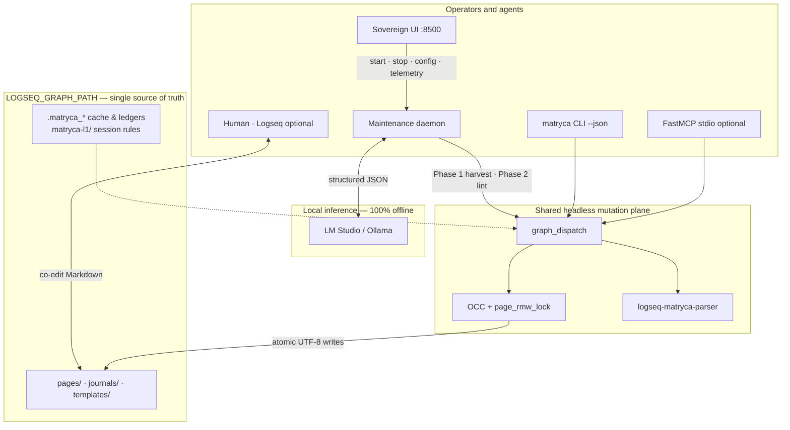

# Matryca Plumber

[](https://github.com/MarcoPorcellato/matryca-plumber/actions/workflows/ci.yml)
[](https://pypi.org/project/matryca-plumber/)
[](https://pypi.org/project/matryca-plumber/)
[](https://github.com/MarcoPorcellato/matryca-plumber/releases)
[](https://github.com/MarcoPorcellato/matryca-plumber/blob/main/pyproject.toml#L10)
[](https://github.com/MarcoPorcellato/matryca-plumber/actions/workflows/ci.yml)
[](https://github.com/MarcoPorcellato/matryca-plumber/blob/main/pyproject.toml#L138)

[](https://github.com/astral-sh/ruff)
[](https://github.com/MarcoPorcellato/matryca-plumber/blob/main/CONTRIBUTING.md)
[](LICENSE)
[](#-key-features--differentiators)
[](#-key-features--differentiators)
[](#-what-does-it-actually-do)
[](https://github.com/logseq/logseq)
[](SECURITY.md)
[](CONTRIBUTING.md)
[](CODE_OF_CONDUCT.md)


> I gave my AI access to my notes. It corrupted them.  
> I built Matryca Plumber so that never happens again.

**Built on [Andrej Karpathy's LLM-Wiki vision](https://karpathy.ai/blog), Matryca Plumber** is a local background assistant that keeps your Logseq notes organized, linked, and safe while you (or your AI) work — no cloud, no Logseq API, no silent overwrites. It has also CLI/MCP for your AI agents to directly read/write on your notes. It's a promising new architecture for agentic memory with graph architecture and markdown based.

**Developed by [Marco Porcellato](https://github.com/MarcoPorcellato) · [Matryca.ai](https://matryca.ai)** — the product name is **Matryca Plumber** (not “Matryca” alone). See [`docs/BRANDING.md`](docs/BRANDING.md).


## What it does for you

- Runs in the background on your laptop and reads your note files locally
- Summarizes pages, suggests tags, and fixes broken `[[links]]` while you sleep
- Lets Cursor / Claude connect via MCP to query and update notes safely
- Aborts AI edits if you changed the same page — your typing always wins
- Works offline with LM Studio or Ollama (no OpenAI/Anthropic subscription required)
- Ships a local dashboard (`matryca plumber status`) to start/stop and tune safety modes

## How it compares

| Feature | Matryca Plumber | Official Logseq AI Plugin | Obsidian LLM Plugins |
|---------|-----------------|----------------------------|----------------------|
| Local-only | Yes — vault stays on disk | Typically cloud-backed | Mixed (local + cloud options) |
| No API Key required | Yes — local LLM endpoint | Usually requires provider API key | Often requires API key |
| OCC Safety (no corruption) | Yes — `st_mtime` + page locks | No comparable write guard | No standard OCC layer |
| MCP Support | Yes — FastMCP stdio tools | No | Varies by plugin |

*Matryca Plumber targets Logseq OG (Markdown on disk); Obsidian comparisons refer to common community plugins, not a single product.*

> 🤖 **Are you an AI Agent (Cursor, Windsurf, Claude, Hermes)?**
> To interact with the user's Logseq graph, do not parse Markdown manually. 
> Execute `uvx matryca-plumber --help` directly in the terminal to read the graph via PyPI, or read [`llms.txt`](llms.txt) / [`.well-known/llms.txt`](.well-known/llms.txt) for verified **v1.10.0** CLI/MCP commands (`LOGSEQ_GRAPH_PATH`, stdio MCP, Hermes lazy handshake, AX lenient page resolution, Security & Sandbox hardening, catalog/registry integrity, journal Phase-2 semantic bypass, `bootstrap_status`, no `--graph`). Spec: [`docs/openspec/agent-onboarding.md`](docs/openspec/agent-onboarding.md) · AX: [`docs/openspec/agent-ax-robustness.md`](docs/openspec/agent-ax-robustness.md) · Security: [`docs/openspec/security-sandbox.md`](docs/openspec/security-sandbox.md) · Hermes: [`docs/integrations/hermes-agent.md`](docs/integrations/hermes-agent.md) · LLM OS: [`docs/openspec/llm-os-instructions.md`](docs/openspec/llm-os-instructions.md).

> **Current: v1.10.2** — **Fast test gate & CI fixes:** `make test-fast` (~5s) skips integration subprocess tests; `make test-integration` for that slice; CI mypy clean on semantic cache router tests — builds on v1.10.0 catalog/registry integrity. Upgrade with `uvx matryca-plumber`; full notes in [`CHANGELOG.md`](CHANGELOG.md).

> "Logseq is building the best local outliner database. But AI Agent memory is at the very bottom of their roadmap. Matryca Plumber gives you that future today, safely bridging your local agents to your Logseq graph without waiting years." - Marco Porcellato - Matryca.ai chief architect and co-founder

Under the hood it is a headless daemon + CLI that edits your Logseq `.md` files directly — see [**Architecture**](#-architecture-at-a-glance) and [**What does it actually do?**](#-what-does-it-actually-do) below.

---

## ⚠️ Important: Clone Your Graph First

Matryca Plumber edits your local `.md` files directly. While it features safe Optimistic Concurrency Control (OCC) to prevent data loss, **we strongly recommend testing it on a clone of your graph first**. This allows you to see the AI in action and explore its capabilities without affecting your primary notes.

**How to safely clone your graph (crucial if you use Logseq Sync):**
1. Make a copy of your entire Logseq graph folder on your computer (e.g., duplicate your `MyGraph` folder and rename it to `MyGraph_Test`).
2. Open Logseq, click on your graph name in the top left, and select **Add new graph**.
3. Choose the new `MyGraph_Test` directory.
4. **If you use Logseq Sync:** Do *not* enable Sync on this test graph. This ensures the AI's test edits remain strictly local and do not propagate to your other devices.
5. Alternatively, for a minimal test graph:
  a. Create an empty folder and add it as a new graph in Logseq.
  b. Close Logseq; copy only pages/, journals/, assets/ from production.
  c. Reopen and Re-index.
6. Point Matryca Plumber's `.env` configuration (`LOGSEQ_GRAPH_PATH`) to this test folder.

Once you are comfortable with how Matryca Plumber behaves and have tuned the safety tiers, you can point it to your main graph.

---

## 🚀 Quick Install & Getting Started

The fastest way to get started is using [uv](https://docs.astral.sh/uv/), the blazing-fast Python package manager.

### 1. Try it instantly (Zero-install)
Run the CLI directly without polluting your system. This **only opens the Sovereign UI** at [http://127.0.0.1:8500](http://127.0.0.1:8500) — it does **not** start graph maintenance until you complete the pre-flight checklist and click **Start Engine** (or run `matryca plumber start` separately).
```bash
uvx --from matryca-plumber matryca-plumber status
```
(`matryca-plumber status` is shorthand for `matryca plumber status`.)

### 2. Global Installation (Recommended)
Install the binary to use the `matryca` command anywhere:
```bash
uv tool install matryca-plumber
```

### 3. Open the control room (recommended first step)
```bash
matryca plumber status
# same as: matryca-plumber status
```
The browser opens the **Sovereign UI**. A **Pre-flight checklist** modal appears when checks are not yet green (it auto-dismisses once they pass). Use **Continue to dashboard** or reopen **Pre-flight** from the header anytime, then click **Start Engine** to launch the maintenance daemon from the UI.

**Optional — headless daemon before opening the UI:**
```bash
matryca plumber start    # background worker only; no browser
matryca plumber status   # UI still shows pre-flight; engine may already show IDLE/RUNNING
```

### Plumber commands — UI vs daemon

`matryca-plumber status` is shorthand for `matryca plumber status` (same for `start`, `stop`, `ui`, `audit`, `cluster`).

| Command | What it starts | Browser / `:8500` | Maintenance daemon |
|---------|----------------|-------------------|----------------------|
| **`matryca plumber status`** (recommended) | Sovereign UI + local API | Yes — [http://127.0.0.1:8500](http://127.0.0.1:8500) | No — use **Start Engine** in the UI or `plumber start` |
| **`matryca plumber ui`** | Same as `status` | Yes | No |
| **`matryca plumber start`** | Background daemon only | No | Yes |
| **`matryca plumber start --foreground`** | Foreground daemon (logs in terminal) | No | Yes |
| **`matryca plumber stop`** | — | — | Stops daemon |

The UI binds port **8500** in seconds (lazy graph index). Graph analytics cards may take longer on the **first** load while the in-memory AST warms up. The React bundle is served from `frontend/dist/` (auto-built on first `status`/`ui` when `frontend/node_modules/` exists).

**Common mistake:** `matryca plumber start` does **not** open the dashboard — run `matryca plumber status` in another terminal (or skip `start` and use **Start Engine** from the UI).

### 4. Set it and forget it (Background Service)
Install it as a LaunchAgent/systemd service so it wakes up with your OS:
```bash
matryca service install
```

### 5. Agent-native CLI (v1.9 — optional, no MCP required)

Same headless contract as MCP tools; add **`--json`** for structured stdout:

```bash
export LOGSEQ_GRAPH_PATH=/path/to/your/graph

matryca --json read page "My Project"
matryca context load "My Project"
matryca context load "My Project|aaaaaaaa-aaaa-aaaa-aaaa-aaaaaaaaaaaa"
matryca --json read subtree '{"page":"My Project","block_uuid":"…","heading":"Implementation"}'
```

Full spec: [`docs/openspec/agent-dx.md`](docs/openspec/agent-dx.md). Background link checks: [`docs/openspec/link-verification.md`](docs/openspec/link-verification.md).

---

## 🧠 What does it actually do?

Unlike generic scripts, Matryca Plumber is a continuous background engine. When paired with a local LLM (**Gemma 4-E4b Instruct** via LM Studio or Ollama), it provides:

- **Semantic Indexing**: Automatically generates summaries, suggested tags, and cross-references for your pages.
- **Dangling Link Healing**: Finds broken `[[WikiLinks]]` and creates isolated seed pages for them.
- **Entity Consolidation**: Suggests `alias::` properties for overlapping concepts.
- **Auto-Split Dense Blocks**: Extracts oversized subtrees into new pages to keep your graph fast and readable.
- **Claude Desktop Integration (FastMCP)**: Seven MCP tools (five mega-tools + **`store_fact`** + **`ingest_document`**) query and mutate your graph headlessly. Set `MATRYCA_MCP_ENABLED=true` in `.env` only on machines where you trust the MCP host (stdio MCP is off by default; the host has full graph read/write with no separate authentication).
- **Telos & Identity (in-graph persona)**: Optional `pages/matryca___config.md` or `pages/matryca-config.md` with `- # Telos` and `- # AI Constraints` headings — injected into daemon LLM prompts and MCP output; **`store_fact`** appends durable preferences under Constraints ([`docs/openspec/identity-config.md`](docs/openspec/identity-config.md)).
- **Atomic document ingestion**: **`ingest_document`** parses external Markdown via an OS temp file (never under `pages/`), stamps fresh `id::` UUIDs, and appends to daily `Ingest/YYYY-MM-DD` or `MATRYCA_INGEST_PAGE`, with optional `LOG` / `GLOSSARY` ledgers ([`docs/openspec/ingest.md`](docs/openspec/ingest.md)).
- **Structural link verification (v1.9)**: Passive harvest of URLs and `assets/` paths into `.matryca_link_registry.json`; async HTTP HEAD + filesystem checks; OCC-safe **`dead-link::`** / **`missing-asset::`** block properties ([`docs/openspec/link-verification.md`](docs/openspec/link-verification.md)).
- **Agent-centric DX (v1.9)**: Global CLI **`--json`**, **`matryca context load`**, **`read subtree`**, and **Journey Log** — one cumulative `- 🤖 Matryca Activity` bullet in today's journal (daily totals, updated in place) ([`docs/openspec/agent-dx.md`](docs/openspec/agent-dx.md)).
- **Agent onboarding (v1.9.2+)**: Machine-readable [`llms.txt`](llms.txt) with PyPI/`uvx` execution contract and anti-patterns ([`docs/openspec/agent-onboarding.md`](docs/openspec/agent-onboarding.md)).
- **Security & Sandbox (v1.9.9)**: Sandbox-validated graph reads (`read_graph_file_text`), bounded JSON checkpoints, link-registry path validation, CI `sandbox-read-check` ([`docs/openspec/security-sandbox.md`](docs/openspec/security-sandbox.md), [`SECURITY.md`](SECURITY.md)).
- **LLM OS contract (v1.9.5)**: Tier-2 agents check `bootstrap_status` and `[[Matryca Master Index]]` before blind vault search; Soft Gate offers Local Daemon / Blind Search / Cloud Indexing ([`docs/openspec/llm-os-instructions.md`](docs/openspec/llm-os-instructions.md), [`SYSTEM_PROMPT.md`](SYSTEM_PROMPT.md) § "LLM OS").

---

## 🏗️ Architecture at a glance

Matryca Plumber is a **three-surface runtime** — background daemon, Sovereign UI, and optional CLI/MCP — that converges on **one headless mutation plane**. Every surface reads and writes the same Logseq OG vault on disk (`LOGSEQ_GRAPH_PATH`): no Logseq HTTP API, no cloud database, no split-brain datastore. Humans co-edit the same `.md` trees while the daemon runs Phase 1 catalog harvest and Phase 2 cognitive lint against a **local LLM** (LM Studio or Ollama).



Deep dive: [`docs/ARCHITECTURE.md`](docs/ARCHITECTURE.md) (Phase 1→2 lifecycle, Trust & Safety tiers, LLM OS contract).

---

## 🖥️ The Sovereign UI

Matryca Plumber is 100% headless, but it ships with a **Sovereign UI Cockpit** (`matryca plumber status` or `uvx … matryca-plumber status`). 
It's a local React dashboard running on `http://127.0.0.1:8500` that provides:
- **Pre-flight checklist** (modal when checks fail; auto-dismiss when green): operator guidance plus automated readiness checks — only **`fail`** blocks **Start Engine**; **`warn`** is advisory (e.g. degraded file locks, model not listed).
- **Live Graph Telemetry (v1.9.3)**: Progress bar, Phase 1/2 pills, and token counters refresh about every **5 seconds** while the engine runs — including during long LLM turns ([`docs/openspec/live-telemetry-ui.md`](docs/openspec/live-telemetry-ui.md)).
- **Dynamic Impact**: Mathematically separates *Organic Human Mind* (your notes) from *Agent Cognition* (AI enhancements).
- **Zero-Trust Security**: Every REST call requires a Bearer token (`X-Matryca-Token`). Set `MATRYCA_UI_TOKEN` on shared hosts; new installs from [`.env.example`](.env.example) template `MATRYCA_UI_REQUIRE_EXPLICIT_TOKEN=true`. Session bootstrap is loopback-only; split rate limits for authenticated vs anonymous API traffic.
- **Trust & Safety Drawer**: Visually toggle what the AI is allowed to edit (Safe Mode, Augmented Mode, Surgeon Mode).

See [`SECURITY.md`](SECURITY.md) for the full operator hardening matrix (`MATRYCA_MCP_ENABLED`, graph path allowlist, bounded JSON, shared LLM SSRF policy, log redaction).

### Pre-flight checklist (what you see in the app)

Matryca Plumber provisions missing runtime files automatically where possible (repo `.env` from `.env.example`, `matryca-l1/`, cache dirs, `matryca-wiki.yml`). The modal still walks you through setup so nothing surprises you on first run. It is developed by **Marco Porcellato** at **[Matryca.ai](https://matryca.ai)** — the same attribution shown in the Sovereign UI pre-flight wizard.

**Operator steps (same text as the UI wizard):**

1. **Control room connection** — If you can read this dashboard, `matryca plumber status` (or `ui`) has started the local API on port `8500`. That command does **not** start the maintenance daemon by itself. Keep the window open while the engine runs.

2. **Logseq graph (test vault first)** — Point `LOGSEQ_GRAPH_PATH` at the **root** of a Logseq OG vault (the folder that contains `pages/`). Use a **clone** for your first run; do not enable Logseq Sync on test graphs. In the UI: **Settings** (gear) → **Logseq Graph Path** → absolute path → Save.

3. **Local LLM** — Start an OpenAI-compatible server (LM Studio, Ollama, etc.). In Settings set the base URL (e.g. `http://localhost:1234/v1`) and the **exact** model id, then **Refresh models** to confirm discovery.

   **Matryca Plumber** (by Marco Porcellato · Matryca.ai) is built for **offline, CPU-only** use on a typical **16 GB RAM** machine — no cloud subscription or discrete GPU required. The **recommended and tested** model is **Gemma 4-E4b Instruct** — set the exact id `gemma-4-e4b-it` in Settings, then **Refresh models**. For CPU inference, prefer **GGUF** weights at **`Q4_K_M`** or **`Q5_K_M`**. We are actively testing additional open models to improve CPU-only, 16 GB setups; Gemma 4-E4b Instruct is our current default. Avoid large **MoE** models (e.g. Llama 4 Scout): full weights still require 60GB+ RAM.

4. **First-run expectations** — **Phase 1** catalogs the entire graph (can take a long time on large vaults; v1.8 yields to the OS periodically during harvest; the UI shows catalog pills about every **5 pages**). **Phase 2** processes roughly one LLM-heavy page per poll interval by default, with live token totals and progress in the cockpit. After Phase 1, the daemon releases heavy in-memory indexes to keep RAM stable for long runs. If you started the daemon from a terminal before opening the UI, the dashboard still polls state when it sees a live **`daemon_pid`** — click **Start Engine** for the full live console (logs + graph analytics).

**Live checks** (re-run anytime with **Re-run checks**):

| Check | What it validates |
|-------|-------------------|
| Environment file | Repository `.env` exists (created from `.env.example` on first boot when possible). |
| Logseq graph path | `LOGSEQ_GRAPH_PATH` is set and points at a valid vault root. |
| L1 session memory | Sibling `matryca-l1/` (or configured `MATRYCA_L1_PATH` / wiki `memory_path`) is ready. |
| Local LLM endpoint | `LLM_BASE_URL` passes SSRF policy and `GET /v1/models` responds; warns if the configured model id is not listed. |

**Start Engine** stays disabled while any live check is **`fail`** (yellow **`warn`** rows are OK). If you started the daemon earlier with `matryca plumber start`, the UI may already show **IDLE** or **RUNNING** — use **Pre-flight** in the header to review settings. On large vaults, settings save and **Start Engine** return in seconds (lazy bootstrap; no full AST load in the UI process).

---

## ✨ Key Features & Differentiators

* 🤖 **100% Local-First & Headless:** No Logseq HTTP API required. It edits the `.md` files directly using atomic file I/O.
* 📐 **Exact Logseq AST Compliance:** True line-0 page frontmatter, block properties at +2 indent, and exact namespace encoding. Other tools break your graph; Matryca Plumber keeps it pristine.
* 🔐 **Optimistic Concurrency Control:** It snapshots `st_mtime` before inference and acquires the page lock **only for the write**. If you edited in Logseq while the model was thinking, the commit aborts. **No silent data loss** — and Logseq can still save during long local runs.
* 🪟 **Windows, macOS & Linux Support:** Runs safely in the background everywhere using a robust cross-platform lock (`.matryca_plumber_daemon.lock`).
* ⚡ **Context Acceleration Shield:** Shrinks megabyte-class pages to Phase 1 summaries or semantic skeletons before they reach the local LLM — essential on CPU-only hardware.
* 🛡️ **TRIZ-governed LLM resilience:** Caps completion tokens, first-delimiter balanced JSON extraction (objects and arrays), string-aware trailing trim, prose sanitization on compression/history paths, stateless ontology reports, and an 8k block-catalog cap on semantic index prompts — see [`docs/resilience-llm-json-triz.md`](docs/resilience-llm-json-triz.md).
* 🖥️ **Edge computing profile (v1.8):** KV-cache-aligned prompts (`PagePromptSession`), bounded RAM (BM25 postings-lite, semantic cache LRU, post-bootstrap teardown), and cooperative bootstrap I/O — tuned for **16 GB laptops** and vaults up to **~10,000** pages. See [docs/v1.8-OPTIMIZATION-PLAN.md](docs/v1.8-OPTIMIZATION-PLAN.md).
* 🔗 **Structural hygiene (v1.9):** Background link rot and missing-asset detection without LLM tokens; a single **Journey Log** bullet in today's journal with cumulative indexing, link-check, and flag totals (no per-cycle journal spam).
* 🤖 **Agent-native CLI (v1.9):** `matryca --json …` for machine-readable stdout; `matryca context load` and `read subtree` to shrink context windows.
* 📋 **Agent onboarding (v1.9.2):** [`llms.txt`](llms.txt) — canonical `uvx` commands for Cursor, Claude Code, and other hosts; no `git clone` required.
* 🧠 **LLM OS (v1.9.5):** Two-tier agent discipline, `bootstrap_status` semaphore, Master Index Soft Gate — [`docs/openspec/llm-os-instructions.md`](docs/openspec/llm-os-instructions.md).
* ⚡ **Live telemetry (v1.9.3):** 5s Sovereign UI updates, thread-safe daemon heartbeat, API token overlay from ops log — [`docs/openspec/live-telemetry-ui.md`](docs/openspec/live-telemetry-ui.md).
* 🛡️ **Enterprise Resilience (v1.9.13):** Vault Sandbox traversal blocked; TOCTOU-safe bounded JSON; namespace-aware semantic cache; exact embedding dedup; subtree heading fences; string-aware LLM JSON recovery; self-healing vector store and daemon state; truthful `plumber stop` exit codes — [`CHANGELOG.md`](CHANGELOG.md) · [`docs/resilience-llm-json-triz.md`](docs/resilience-llm-json-triz.md).
* 🧹 **Contributor readiness (v1.9.14):** [`good_first_issues_blueprints.md`](good_first_issues_blueprints.md) for external contributors; journal pages isolated in Phase 2 clustering; entity-consolidation skips journal/date wikilink pairs; shared `NoRedirect` HTTP helper and alias-registry compatibility helpers — [`CHANGELOG.md`](CHANGELOG.md) · [`ROADMAP.md`](ROADMAP.md).
* 🔬 **Type safety & token efficiency (v1.9.15):** strict mypy with zero production suppressions (#60); journal pages bypass Phase-2 semantic indexing and dual embeddings while Phase-1 AST/OCC still runs — [`CHANGELOG.md`](CHANGELOG.md).
* 🗄️ **Catalog integrity & OSS maturity (v1.10.0):** flock-protected master catalog, atomic link registry, harvest OCC catalog guard (#35–#37, #41); PR template, CodeQL, frontend ESLint in CI — [`CHANGELOG.md`](CHANGELOG.md) · [`SUPPORT.md`](SUPPORT.md).
* 🖥️ **Sovereign UI reliability (v1.9.11):** Settings save and **Start Engine** stay responsive on large vaults (lazy bootstrap); pre-flight `warn` is advisory — [`docs/openspec/runtime-bootstrap.md`](docs/openspec/runtime-bootstrap.md).

---

## 🛡️ Trust & Safety Risk Tiers

You are in control. Nothing mutates your prose unless you explicitly enable it in the UI.

| Mode | Risk | What it allows |
|------|------|----------------|
| 🟢 **Safe Mode** | Read-only | Semantic routing cache, entity consolidation (`alias::`), property hygiene — **never edits your bullet text**. |
| 🟠 **Augmented Mode** | Side-blocks | **Heal Dangling Links**, **Backpropagate Links** (appends foldable context sections) — your original bullets stay intact. |
| 🔴 **Surgeon Mode** | Inline edits | **Inline Semantic Corrections** (wraps concepts in `[[WikiLinks]]`), **Auto-Split Dense Blocks** — **strictly opt-in**. |

---

## ⚙️ Configuration Quickstart

Copy `.env.example` to `.env`. The only **required** variable is your graph path:

```env
LOGSEQ_GRAPH_PATH=/absolute/path/to/your/Logseq/graph
MATRYCA_LM_BASE_URL=http://localhost:1234/v1   # LM Studio or Ollama endpoint
MATRYCA_LM_MODEL=gemma-4-e4b-it                # Gemma 4-E4b Instruct — tested default

# Optional: Claude Desktop / Cursor MCP (off by default)
MATRYCA_MCP_ENABLED=true
```

On first start (daemon, CLI, MCP, or UI), Matryca Plumber **automatically creates** anything missing for a healthy runtime:

- **`logs/`** (or paths from `MATRYCA_PLUMBER_LOG_PATH` / `MATRYCA_LOGURU_LOG_PATH`)
- **`<parent-of-your-vault>/matryca-l1/`** — session rules beside the vault (not inside `pages/`); optional override via `MATRYCA_L1_PATH`
- **`<vault>/.matryca_semantic_cache/`**, **`templates/`**, and **`matryca-wiki.yml`** (from `matryca-wiki.example.yml` when absent)
- **In-memory graph index** at startup (AST cache); **identity** loaded when a Telos/Constraints config page exists

The **identity config page** is not auto-created (use Logseq or `store_fact`). **Ingest / LOG / GLOSSARY** pages are created on first `ingest_document` call. Optional `MATRYCA_INGEST_PAGE` pins a fixed inbox (e.g. `AI_Inbox`). See [`docs/openspec/identity-config.md`](docs/openspec/identity-config.md) and [`docs/openspec/ingest.md`](docs/openspec/ingest.md).

See [`docs/openspec/runtime-bootstrap.md`](docs/openspec/runtime-bootstrap.md) for rationale (L1 vs L2, idempotency, and what is intentionally *not* auto-created).

*(See [docs/ARCHITECTURE.md](docs/ARCHITECTURE.md) for advanced thermal pacing, context compression, and deep linter settings. Copy the full template from `.env.example` — it documents UI auth, rate limits, graph allowlists, and log redaction.)*

### Edge profile (large vaults / 16 GB RAM)

Copy the **v1.8 Edge computing & performance** block from [`.env.example`](.env.example). Highlights:

| Knob | Why |
|------|-----|
| `MATRYCA_BOOTSTRAP_YIELD_EVERY` | Keeps macOS/Windows responsive during Phase 1 file scans |
| `MATRYCA_RAM_BUDGET_MB` | Logs when daemon RSS exceeds a soft cap |
| `MATRYCA_BM25_MODE=ondemand` | Trade query latency for lower steady-state RAM |
| `MATRYCA_LLM_CLUSTER_HISTORY=false` | Shorter Ermes history — better KV reuse in cluster mode |
| `MATRYCA_CPU_SANDBOX=true` | Pin Plumber to idle cores; pair with manual LLM core mask |
| `MATRYCA_GRAPH_READ_MMAP=true` | Kernel-paged reads during Phase 1 regex catalog path |

Install CPU affinity support: `uv sync --extra edge` or `pip install matryca-plumber[edge]` (`psutil`).

Deep dive: [docs/v1.8-OPTIMIZATION-PLAN.md](docs/v1.8-OPTIMIZATION-PLAN.md) · [docs/v1.8-SOFTWARE-EDGE-PLAN.md](docs/v1.8-SOFTWARE-EDGE-PLAN.md) · [docs/openspec/llm-performance.md](docs/openspec/llm-performance.md)

**Load testing:** `uv run python scripts/gen_synthetic_graph.py /path/to/graph --count 1000` · **Slow CI:** `make perf`

---

## 🧑‍💻 Developer Setup

Want to contribute or run from source?

```bash
git clone https://github.com/MarcoPorcellato/matryca-plumber.git
cd matryca-plumber
make install

# Build the React frontend
cd frontend && npm install && npm run build && cd ..

# Fast iteration loop (~5s, no coverage)
make test-fast

# Integration slice (subprocess CLI, cross-process locks) before push
make test-integration

# Full CI gate before PR (coverage ≥ 70%, ~5 min)
make check

# Optional: slow memory / harvest soak tests
make perf
```

---

## 📚 Documentation Map

| Document | Description |
|----------|-------------|
| [`SUPPORT.md`](SUPPORT.md) | Where to get help (Discussions vs Issues vs private security advisories). |
| [`CHANGELOG.md`](CHANGELOG.md) | Release history; canonical source for GitHub Release notes (current: **v1.10.2**). |
| [`docs/releases/v1.10.2-GITHUB.md`](docs/releases/v1.10.2-GITHUB.md) | Copy-paste GitHub Release body for v1.10.2. |
| [`ROADMAP.md`](ROADMAP.md) | Short/medium/long-term path to v2.0 Shadow DB & Safe-Sync; links open milestones and issues. |
| [`good_first_issues_blueprints.md`](good_first_issues_blueprints.md) | Six curated good-first issues with copy-paste GitHub contributor comments (v1.9.14). |
| [`SYSTEM_PROMPT.md`](SYSTEM_PROMPT.md) | Agent discipline, LLM OS Soft Gate, `made-by::` authorship, OCC rules. |
| [`docs/ARCHITECTURE.md`](docs/ARCHITECTURE.md) | Data planes, Plumber lifecycle, RMW locking, v1.10.0 catalog integrity + v1.9.9 Security & Sandbox + LLM OS (v1.9.5) + v1.9 hygiene + v1.8 edge performance. |
| [`docs/v1.8-OPTIMIZATION-PLAN.md`](docs/v1.8-OPTIMIZATION-PLAN.md) | v1.8 scope, env vars, load testing. |
| [`docs/v1.8-SOFTWARE-EDGE-PLAN.md`](docs/v1.8-SOFTWARE-EDGE-PLAN.md) | CPU sandbox, frozen KV prefix, adaptive LLM, mmap reads. |
| [`docs/openspec/README.md`](docs/openspec/README.md) | Index of behavioral specs (lint, ingest, identity, v1.9 hygiene/DX, v1.9.5 LLM OS, v1.9.9 security, live telemetry). |
| [`docs/openspec/llm-performance.md`](docs/openspec/llm-performance.md) | LLM prompt layout, memory, and I/O contracts. |
| [`docs/BRANDING.md`](docs/BRANDING.md) | Product name (**Matryca Plumber**), Matryca.ai attribution, writing rules. |
| [`docs/openspec/runtime-bootstrap.md`](docs/openspec/runtime-bootstrap.md) | Startup provisioning: logs, L1, cache, wiki YAML. |
| [`docs/openspec/l1-l2-routing.md`](docs/openspec/l1-l2-routing.md) | L1 memory vs L2 graph routing for agents. |
| [`docs/openspec/identity-config.md`](docs/openspec/identity-config.md) | Telos / AI Constraints and `store_fact`. |
| [`docs/openspec/ingest.md`](docs/openspec/ingest.md) | `ingest_document` atomic ingestion pipeline. |
| [`docs/openspec/link-verification.md`](docs/openspec/link-verification.md) | v1.9 URL/asset hygiene, sidecar registry, v1.9.9 sandbox reads. |
| [`docs/openspec/security-sandbox.md`](docs/openspec/security-sandbox.md) | v1.9.9 path sandbox, bounded JSON, CI `sandbox-read-check`. |
| [`docs/openspec/agent-dx.md`](docs/openspec/agent-dx.md) | v1.9 CLI JSON, context macro, Journey Log. |
| [`llms.txt`](llms.txt) / [`.well-known/llms.txt`](.well-known/llms.txt) | Agent execution guide (PyPI `uvx`, verified commands). |
| [`docs/openspec/agent-onboarding.md`](docs/openspec/agent-onboarding.md) | `llms.txt` contract, anti-patterns, maintainer checklist. |
| [`docs/openspec/llm-os-instructions.md`](docs/openspec/llm-os-instructions.md) | Two-tier LLM OS, Soft Gate, `bootstrap_status`, Safe-Sync. |
| [`docs/integrations/hermes-agent.md`](docs/integrations/hermes-agent.md) | Hermes Agent MCP setup, lazy AST handshake, verified config. |
| [`docs/PROJECT_DIARY.md`](docs/PROJECT_DIARY.md) | Maintainer log, phase history, crushed bottlenecks. |
| [`CONTRIBUTING.md`](CONTRIBUTING.md) | Setup, `uv` commands, `make check` standards. |
| [`SECURITY.md`](SECURITY.md) | Vulnerability reporting and `.env` hardening controls. |

## License
Apache-2.0 — see [LICENSE](LICENSE).


## Star History

<a href="https://www.star-history.com/#MarcoPorcellato/matryca-plumber&Date">
  <picture>
    <source media="(prefers-color-scheme: dark)" srcset="https://api.star-history.com/svg?repos=MarcoPorcellato/matryca-plumber&type=Date&theme=dark" />
    <source media="(prefers-color-scheme: light)" srcset="https://api.star-history.com/svg?repos=MarcoPorcellato/matryca-plumber&type=Date" />
    
  </picture>
</a>
