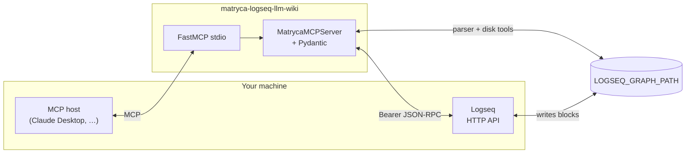
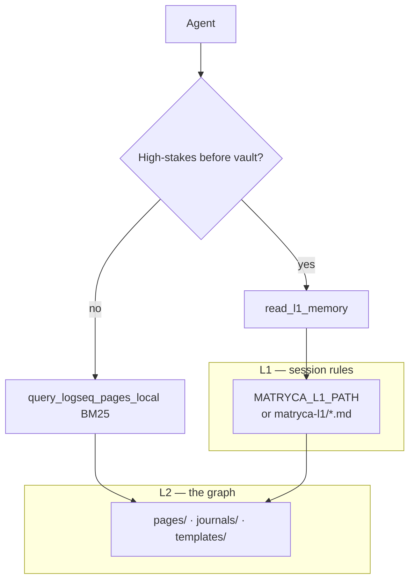
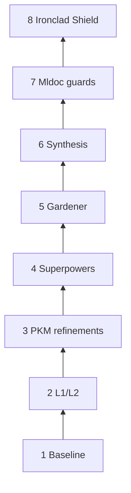

# Matryca Logseq LLM Wiki

> **The ultimate agentic knowledge manager for Logseq OG** — MCP tools that respect the **atomic outliner**, not flat text blobs. **Local-only**, **database-free**, built for humans and agents co-editing the same Markdown graph.

[](https://github.com/MarcoPorcellato/matryca-logseq-llm-wiki/actions/workflows/ci.yml)
[](https://github.com/MarcoPorcellato/matryca-logseq-llm-wiki/actions/workflows/ci.yml)
[](https://www.python.org/downloads/)
[](LICENSE)

[Logseq](https://logseq.com/) compiles a folder of Markdown into a **block graph**. [Model Context Protocol](https://modelcontextprotocol.io/) (MCP) hosts connect LLMs to tools — **matryca-logseq-llm-wiki** is the bridge that speaks **Logseq’s language**: bullets, `id::` UUIDs, `[[wikilinks]]`, `((block refs))`, journals, and **Advanced Query** (Datalog) blocks.

Inspired by Andrej Karpathy’s “LLM Wiki” vision and [llm-wiki](https://github.com/MehmetGoekce/llm-wiki)-style **L1/L2** routing, this server is **rebuilt for Logseq OG**: one graph on disk, **FastMCP** + **Pydantic** at the boundary, **no Postgres / Redis / SQLite / vector store** as system-of-record.

---

## Why Matryca (the value proposition)

| Typical “AI + notes” | Matryca |
|----------------------|--------|
| Treats each file as a blob of text | Treats the vault as a **tree of blocks** with stable `id::` |
| Static bullet lists that go stale | **`#+BEGIN_QUERY` … `#+END_QUERY`** blocks that **refresh inside Logseq** |
| Ignores journals and tasks | **`analyze_journal_tasks`** + **`append_logseq_journal_markdown`** for native `TODO` / `LATER` / `WAITING` + `SCHEDULED:` / `DEADLINE:` |
| Rewrites whole pages | **Depth-first** **`write_logseq_outline`** via Logseq’s API; **scoped** **`patch_logseq_block_property_lines`** for `key::` lines only |
| No rollback story | Optional **`MATRYCA_GIT_SNAPSHOT_ON_WRITE`**: **git commit** on your graph repo before risky writes |

### Zero-Corruption Transactional Architecture

Disk mutators do not open your page and shrink it in place. Every eligible write path funnels through **`atomic_write_bytes`** in **`src/graph/markdown_blocks.py`**: the new bytes land in a **hidden temp file in the same directory** as the target (so `os.replace` never crosses volumes), the handle is **flushed** and **`os.fsync`**’d to the storage device, and only then the kernel performs a **single atomic rename** (`os.replace`) onto the real `.md` path.

Until that swap succeeds, the original file remains **bit-for-bit intact**. There is no window where a crash or killed MCP process leaves a **half-written or truncated** page — the pattern is the same family of guarantees as **write-ahead logging** in SQLite or **safe ref updates** in Git: readers always see either the **previous** committed version or the **next** one, never garbage in between.

### Compiler-grade markdown & property awareness

Matryca treats whole pages like a compiler treats a translation unit. A **streaming global fence scanner** marks **dead zones** where prose tools must not operate: **Markdown fenced code** (triple-backtick regions), **HTML block comments** (`<!-- … -->`), Logseq **Advanced Query** blocks (`#+BEGIN_QUERY` … `#+END_QUERY`), and **Org-style drawers** such as **`:LOGBOOK:`** (plus `{{` macro opens), aligned with how Logseq’s **mldoc** layer reasons about block structure. Property surgery and tag unify use **mldoc-aligned** `key:: value` parsing — first `::` pair only, wikilink-depth-aware CSV splitting, and **double-quoted spans** so `#tags` inside `"…"` literals are never “fixed” by mistake. Together, these layers block destructive AI writes that would otherwise shred queries, code samples, or fragile property values.

**Strict localism:** Tools read **`LOGSEQ_GRAPH_PATH`** and call Logseq’s **localhost** JSON-RPC API. Lexical ranking (BM25), structural hops, and lint passes use **in-memory or line-scanned** data — nothing leaves your machine unless *you* send it.

Spatial structure (“what is a block on this page?”) is delegated to **[logseq-matryca-parser](https://github.com/MarcoPorcellato/logseq-matryca-parser)**. Vault-wide chores (broken `((uuid))` refs, hashtag unification, property-line surgery) use **bounded, reviewable** text passes — by design, not by accident ([`docs/ARCHITECTURE.md`](docs/ARCHITECTURE.md)).

Agent behavior is codified in **[`SYSTEM_PROMPT.md`](SYSTEM_PROMPT.md)** (outline-only output, Search → Scan → Update, dry-run-first mutators).

---

## Architecture at a glance



### L1 vs L2 (two-layer context)



---

## MCP tools by phase (feature matrix)

Each phase adds capabilities; newer phases assume you still use **read → plan → write** from the baseline.

| Phase | Theme | MCP tools (implemented) |
|:-----:|--------|-------------------------|
| **1** | **Baseline** — bridge, hygiene, outline writes | `read_logseq_page`, `write_logseq_outline` (`OutlineNode` + validators + shared quality gate), `lint_logseq_block_refs`, `render_logseq_dashboard` |
| **2** | **L1 / L2 cache** — fast rules vs deep vault | `read_l1_memory`; **routing hints** on relevant tool outputs (see `SYSTEM_PROMPT.md`) |
| **3** | **PKM refinements** — discover, structure, surgical disk | `query_logseq_pages_local` (default **BM25**; legacy `substring`), `traverse_logseq_structural_hops`, `report_structural_hubs_orphans`, `patch_logseq_block_property_lines`, `list_logseq_templates`, `read_logseq_template`, `lint_matryca_wiki_pages`, `list_logseq_namespace_index`; **optional git snapshot** on outline write and eligible mutators (`MATRYCA_GIT_SNAPSHOT_ON_WRITE`) |
| **4** | **Logseq superpowers** — Datalog queries, journals, entities | `inject_logseq_advanced_query`, `analyze_journal_tasks`, `append_logseq_journal_markdown`, `resolve_logseq_entity`, `append_logseq_page_alias` |
| **5** | **Graph gardener** — cards, tags, reparent | `generate_logseq_flashcards`, `lint_unify_logseq_tags`, `refactor_logseq_blocks` |
| **6** | **Synthesis engine** — linking, MOCs, atomic splits | `resolve_unlinked_mentions`, `generate_moc_page`, `refactor_large_blocks`, `snapshot_logseq_graph_git` |
| **7** | **Mldoc AST parsing & structural guards** — compiler-aligned `key::` rules, quote / `[[wikilink]]`-aware CSV tokenization, drawer & fence macro shields | Same MCP surface; **hardened internals** in `patch_logseq_block_property_lines`, `lint_unify_logseq_tags`, `append_logseq_page_alias`, `refactor_large_blocks` (property lines, tag unify, alias append, long-bullet split) via **`mldoc_properties`** + **`mldoc_guards`** |
| **8** | **Ironclad Shield** — global fence lexing, transactional atomic swaps, generational `mtime` caches | **Dead-zone lexing** (`compute_page_protected_line_indices`) wired into property edits, tag unify, reparent, unlinked mentions, large-block split; **ACID-style disk commits** (`atomic_write_bytes` / `atomic_write_file`) across graph mutators; **incremental BM25 + alias** rebuilds only when `st_mtime_ns` signatures change |

**Roadmaps:** [`ROADMAP_LLM_WIKI.md`](ROADMAP_LLM_WIKI.md), [`ROADMAP_LLM_WIKI_PHASE_3.md`](ROADMAP_LLM_WIKI_PHASE_3.md), [`ROADMAP_LOGSEQ_SUPERPOWERS.md`](ROADMAP_LOGSEQ_SUPERPOWERS.md), [`ROADMAP_PHASE_5_6.md`](ROADMAP_PHASE_5_6.md), [`ROADMAP_MLDOC_COMPLIANCE.md`](ROADMAP_MLDOC_COMPLIANCE.md), [`ROADMAP_IRONCLAD_SHIELD.md`](ROADMAP_IRONCLAD_SHIELD.md).

### Phases stacked (evolution)



### Agent loop (Search → quality gate)


---

## Quickstart

### Prerequisites

- **Python 3.12+** (`.python-version`)
- **[uv](https://docs.astral.sh/uv/)**
- **Logseq** with the **HTTP API** enabled and a **token** (see Logseq’s API / plugin docs)

### Install

```bash
git clone https://github.com/MarcoPorcellato/matryca-logseq-llm-wiki.git
cd matryca-logseq-llm-wiki
make install
```

### Zero-Install Execution (uvx)

Thanks to **[uv](https://docs.astral.sh/uv/)** integration, you do **not** need to clone this repository to run the MCP server entrypoint. **`uvx`** can install and run the published console script in an ephemeral environment.

Because the package currently declares a **direct `git+https` dependency** on [`logseq-matryca-parser`](https://github.com/MarcoPorcellato/logseq-matryca-parser) in `pyproject.toml`, the practical way to run the latest Matryca from source is still a **Git VCS URL** (not only PyPI). Use:

```bash
uvx --from git+https://github.com/MarcoPorcellato/matryca-logseq-llm-wiki.git matryca-logseq-llm-wiki
```

That pattern lets hosts such as **Claude Desktop** pull and run the latest revision with a single command (plus your usual `LOGSEQ_*` / `MATRYCA_*` environment variables in the MCP server block).

For **responsible disclosure** of security issues, see [`SECURITY.md`](SECURITY.md).

### Configure `.env`

```bash
cp .env.example .env
```

| Variable | Purpose |
|----------|---------|
| `LOGSEQ_API_TOKEN` | **Required.** Bearer token for the Logseq API |
| `LOGSEQ_API_URL` | Default `http://localhost:12315` |
| `LOGSEQ_GRAPH_PATH` | **Required for disk tools.** Absolute path to graph root (directory containing `pages/`) |
| `MATRYCA_L1_PATH` | Optional: file or directory of small Markdown “L1” session rules |
| `MATRYCA_WIKI_CONFIG` | Optional: path to `matryca-wiki.yml` (else `$LOGSEQ_GRAPH_PATH/matryca-wiki.yml`) |
| `MATRYCA_GIT_SNAPSHOT_ON_WRITE` | `true` or `false` — see below |

Optional graph orchestration: copy [`matryca-wiki.example.yml`](matryca-wiki.example.yml) to your graph as `matryca-wiki.yml` for namespaces, template subdir, wiki lint prefix, dashboard title.

#### Git snapshots (`MATRYCA_GIT_SNAPSHOT_ON_WRITE`) — safety first

When set to **`true`** and **`LOGSEQ_GRAPH_PATH`** is a **git repository**, Matryca can run **`git add -A` + `git commit`** before **`write_logseq_outline`** and before selected **on-disk** mutators (large refactors, tag unify apply, etc.). That gives you a **reversible checkpoint** (`git log` / `git revert`) without any proprietary snapshot service.

- **`false` (default):** No automatic commits; lowest surprise for graphs that are not under git.
- **`true`:** Best for operators who **intentionally** version the graph with git and want an AI safety net. Still **local** — commits stay on your repo.

Use **`snapshot_logseq_graph_git`** for a **manual** checkpoint before a big multi-step refactor (same opt-in flag applies).

### Verify the codebase

```bash
make check
```

Runs Ruff (format + lint), strict **mypy** on `src/` and `tests/`, and **pytest** (92 tests). CI on `main` enforces the same bar (see `.github/workflows/ci.yml`).

### Claude Desktop (MCP over stdio)

Add a server block with your **absolute** paths and secrets. Example fragment for **`claude_desktop_config.json`**:

```json
{
  "mcpServers": {
    "matryca-logseq-llm-wiki": {
      "command": "uv",
      "args": ["run", "python", "-m", "src.main"],
      "cwd": "/absolute/path/to/matryca-logseq-llm-wiki",
      "env": {
        "LOGSEQ_API_TOKEN": "your-token",
        "LOGSEQ_API_URL": "http://localhost:12315",
        "LOGSEQ_GRAPH_PATH": "/absolute/path/to/your/Logseq/graph",
        "MATRYCA_GIT_SNAPSHOT_ON_WRITE": "false"
      }
    }
  }
}
```

Restart the MCP host after editing config. Keep **Logseq running** when tools need live **`insertBlock`** / query injection.

---

## Docs & contributing

| Doc | Audience |
|-----|----------|
| [`SYSTEM_PROMPT.md`](SYSTEM_PROMPT.md) | Anyone configuring an agent on this graph |
| [`docs/ARCHITECTURE.md`](docs/ARCHITECTURE.md) | Engineers — philosophy, pipeline, modules |
| [`CONTRIBUTING.md`](CONTRIBUTING.md) | Contributors — `uv`, `make check`, testing MCP tools |
| [`CODE_OF_CONDUCT.md`](CODE_OF_CONDUCT.md) | Community standards (Contributor Covenant 2.1) |
| [`SECURITY.md`](SECURITY.md) | Responsible disclosure and security reporting |

---

## License

Apache-2.0 — see [LICENSE](LICENSE).
