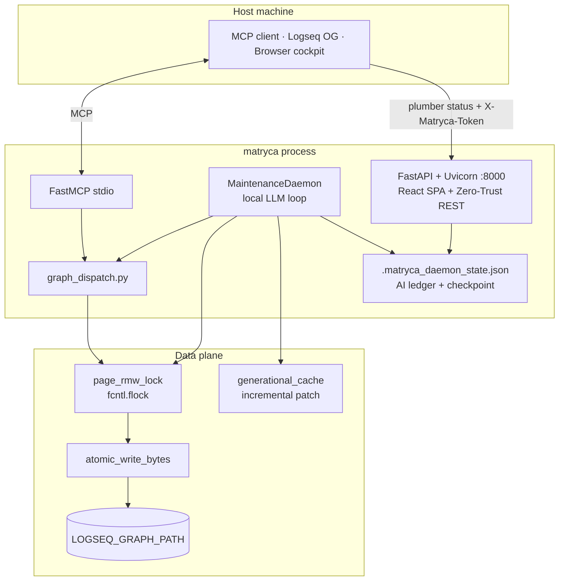

# Matryca Plumber

> **v1.5 — Ironclad Release.** Agentic Knowledge Management for Logseq OG. An **enterprise-grade, local-first background AI daemon** with a real-time **Sovereign UI** control room — plus a CLI and MCP server that turns your favorite AI into a spatial Knowledge Architect, heavily inspired by [Andrej Karpathy's LLM-Wiki vision](https://karpathy.ai/blog). It treats your vault as a tree of blocks, not a flat document store. **100% native Logseq AST parity**, optimistic concurrency safety, versioned AI authorship stamping, and zero auxiliary databases.

[](https://github.com/MarcoPorcellato/matryca-plumber/actions/workflows/ci.yml)
[](https://github.com/MarcoPorcellato/matryca-plumber/actions/workflows/ci.yml)
[](https://www.python.org/downloads/)
[](LICENSE)


Matryca is a **100% headless, sandboxed** MCP server and CLI that turns your local Logseq graph into a high token-density agentic workspace — **no network APIs and no background desktop app (Logseq OG) required**.

**Matryca Plumber** is not a one-shot script — it is an **enterprise-grade, local-first background AI daemon for Logseq**. It polls your graph on a duty cycle, calls a local LLM (LM Studio), appends semantic indexes, runs optional cognitive lint modules, and logs every token transaction — **while you edit the same `.md` files in Logseq or via MCP**. Every write path mirrors Logseq's on-disk AST contract: page frontmatter at line 0, block properties contiguous to their parent bullet, namespace filenames encoded exactly like Logseq's Clojure Datalog layer, and **optimistic concurrency control** that aborts stale writes when you type during inference.

The **v1.4.0 Headless Revolution** removed HTTP JSON-RPC; **v1.5 Ironclad** adds the production-hardened Plumber plane — the **Sovereign UI** React cockpit (`:8000`) with **Zero-Trust Bearer authentication**, **dynamic Human-vs-AI graph telemetry**, Ermes context compression, `JSON_SCHEMA` grammar sampling, structural quarantine, GraphRAG Louvain clustering, outliner-native MapReduce chunking, the **Context Acceleration Shield** for deterministic KV-cache reuse on giant pages, strict AST serialization parity (`logseq-matryca-parser`), versioned `made-by::` authorship stamping, **first-class Windows daemon support** (no legacy `os.fork()`), and a **417-test** CI bar with zero Ruff/Mypy strict warnings.

Built for power-users who run local LLMs on real vaults — including the r/LocalLLaMA crowd — Matryca is **indestructible and secure by default**: loopback-only UI auth, SSRF-hardened LM proxy discovery, path-sandboxed graph I/O, and atomic ledger commits that survive sudden power loss.

> **Brand note:** **Matryca Brain** is reserved exclusively for the Nuitka-compiled Pro enterprise ingestion suite. The open-source maintenance daemon, linter, and indexing subsystem is **Matryca Plumber**.

---

## ✨ Core Features

* 🎛️ **Sovereign UI Cockpit:** local React dashboard at **`http://127.0.0.1:8000`** with Light/Dark mode, live graph telemetry, token economics, and Trust & Safety toggles — polls daemon state at **1 Hz** without memory leaks. Every REST call requires a **Bearer token** via the `X-Matryca-Token` header (Zero-Trust API — no anonymous cockpit access).
* 🔑 **Zero-Trust UI API:** the React SPA and FastAPI backend communicate over a strictly authenticated local API. Tokens come from `MATRYCA_UI_TOKEN` or are auto-generated at runtime via `GET /api/auth/session`; unauthenticated requests receive **401**.
* 🪟 **Windows First-Class Support:** the Plumber daemon runs safely in the background on **Windows, macOS, and Linux** via a cross-platform `subprocess` launcher — no UNIX-only `os.fork()`. Exclusive **`.matryca_plumber_daemon.lock`** prevents dual-daemon race conditions on every platform.
* 📈 **Dynamic Impact Telemetry:** the dashboard mathematically separates **Organic Human Mind** (your notes) from **Plumber Agent Cognition** (AI enhancements) in real time via live graph scans plus the per-graph incremental ledger.
* 🌌 **AST Spatial Intelligence:** `logseq-matryca-parser` owns block hierarchy, frontmatter planes, and multiline outliner serialization — strict Logseq Datalog parity.
* 🤖 **100% Headless & Local-First:** atomic file I/O on `.md` sources — Logseq desktop optional.
* 🔧 **Matryca Plumber Daemon:** progressive semantic indexing + safe micro-lint via local LLM (LM Studio).
* 🩻 **X-Ray Token Economy:** UUID aliases (`[0]`, `[1]`) — up to ~35× less context noise.
* 🔒 **Sandboxed Privacy:** path traversal and symlink escape blocked at `path_sandbox.py`; L1 memory reads confined to `$HOME` or system temp; SSRF guards block cloud metadata IPs on LM proxy discovery.
* 🧱 **Ironclad Stability (v1.5):** **417** passing tests, `fcntl.flock` RMW locks (with graceful cloud-sync degradation opt-in), atomic swaps with parent-directory `fsync`, malformed-`((uuid))` quarantine, and **Windows CRLF (`\r`) immunity** on all fence and property scanners.
* 🔐 **Optimistic Concurrency Control:** `st_mtime` snapshot before LLM inference; write aborted if you edited the page in Logseq during those seconds — **no silent data loss**.
* 📐 **Exact Logseq AST Compliance:** true line-0 page frontmatter, block properties at **+2 indent** before children, namespace encoding, foldable `- ###` headings — the graph re-indexes cleanly; third-party tools break it, Matryca does not.
* 🗂️ **Zero-Config Multi-Graph:** point `LOGSEQ_GRAPH_PATH` at any Logseq graph; each graph carries its own hidden **`.matryca_daemon_state.json`** ledger — historical AI telemetry travels with the vault, no central database.
* 📊 **Zero-DB Lexical Engine:** in-memory Okapi BM25 + generational cache patching.
* ⚡ **Context Acceleration Shield:** deterministic prompt prefix alignment + Phase 1 summary substitution + semantic skeleton compression — obliterates LM Studio prefill latency on 5,000+ block pages while preserving entity topology.

---

## 🛡️ Trust & Safety UI Drawer

The React control room (`matryca plumber status` → **Settings**) exposes a **Trust & Safety** drawer that maps every cognitive lint toggle to a visible risk tier. Operators opt in deliberately — nothing mutates your prose unless you enable it.

| Mode | Risk | What it allows |
|------|------|----------------|
| 🟢 **Safe Mode** | Read-only & metadata | Semantic routing cache, Ermes context compression (memory-only), entity consolidation (`alias::`), property hygiene (`key::` inference), MARPA domain taxonomy — **never edits your bullet text** |
| 🟠 **Augmented Mode** | Side-blocks & new pages | **Heal Dangling Links** (isolated seed pages for broken `[[WikiLinks]]`), **Backpropagate Links** (appends foldable `- ### Matryca Backlink Context` sections on target pages) — your original bullets stay intact |
| 🔴 **Surgeon Mode** | Inline & structural edits | **Inline Semantic Corrections** (wraps concepts in `[[WikiLinks]]` inside your bullets; stamps `matryca-plumber:: true` for audit — **strictly opt-in**), **Auto-Split Dense Blocks** (extracts oversized subtrees to child pages, replaces them with `- {{embed [[Page]]}}` stubs) |

Each toggle writes to `.env` and hot-reloads on the next daemon cycle via `reload_plumber_dotenv()` — no restart required.

### Key differentiators

Why Matryca Plumber over generic Markdown LLM tools:

- **Optimistic Concurrency Control** — records `st_mtime` before inference, aborts the write if you edited the page in Logseq during those seconds. Combined with `fcntl.flock` RMW locks: **no torn writes, no silent data loss**.
- **Exact Logseq AST compliance** — page frontmatter at line 0, block properties at +2 indent before children, namespace filenames encoded like Logseq's Datalog layer (`/` → `___` + percent-encoding). The graph **re-indexes cleanly**; other tools break block identity and spawn ghost pages.

---

## 🪠 Matryca Plumber: Local Semantic Infrastructure

Matryca Plumber is a high-performance, deterministic, asynchronous maintenance engine designed to index, connect, and optimize large local Logseq knowledge graphs (3,000+ pages). Powered by strict phase separation and a zero-token-cost native GraphRAG engine, the system eliminates UI rendering lag and prevents LLM KV-cache saturation on consumer hardware.

### 🌟 Enterprise-Grade Key Capabilities

- **High-Velocity Stateless Ingestion (Phase 1):** Parallel initial scan of Markdown files. Computes protected code-block fences to avoid false positives, extracts synthetic summaries via local LLM (Gemma 4), and resets rolling memory between pages — cutting Prompt Prefill latency from ~25 s to under 2 s per file.
- **Native GraphRAG Engine (Phase 2 Clustering):** Deterministic partitioning of pages into isolated semantic neighborhoods (5–35 pages) via the Louvain modularity algorithm, computed in RAM in under one second using hybrid TF-IDF matrices (with stopword filters) and Jaccard tag similarity.
- **Context Isolation (Ermes Thermal Shield):** During Phase 2 cognitive analysis, message history is rigorously confined to the single geographic cluster, injecting a central anchor node (*Cluster Hub Anchor*), maximizing coherence and zeroing generative hallucinations.
- **Context Acceleration Shield (Phase 2 KV-cache hardening):** For pages exceeding `mapreduce_trigger_chars`, Phase 2 cognitive lint substitutes pre-computed Phase 1 hierarchical summaries (or a regex semantic skeleton) instead of raw megabyte-class outliner text. All LLM prompts follow a cache-aligned layout — stable page content first, dynamic task instructions last — so consecutive operations on the same file hit LM Studio / llama.cpp prompt caching and drop sequential prefill to near zero.
- **Fault Tolerance and Self-Healing:** Universal Unicode resilience (`errors="replace"`), graceful degradation when cloud sync drivers (iCloud, Dropbox) block `flock`, automatic recovery from corrupted state files, and Error Backoff to prevent infinite CPU loops on unchanged corrupted files.

**Prerequisites:** LM Studio (or any OpenAI-compatible local server) at `MATRYCA_LM_BASE_URL`, model loaded matching `MATRYCA_LM_MODEL`.

### 🚀 Sovereign UI — the local control room

Matryca Plumber no longer ships a legacy Rich text-canvas dashboard. **`matryca plumber status`** (alias **`matryca plumber ui`**) is the unified operational entry point: it spins up a lightweight async **FastAPI + Uvicorn** server on **`http://127.0.0.1:8000`** — the **Sovereign UI** — that transparently serves:

1. **Structured REST API** — `/api/state` (daemon checkpoint + live graph analytics), `/api/logs`, `/api/config` (OpenAPI at `/docs`). All endpoints except `/api/auth/session` require the **`X-Matryca-Token`** Bearer header.
2. **Compiled React SPA** — Light/Dark themed control room from `frontend/dist/` (`GraphInsightsCard` Human-vs-AI telemetry, cognitive progress, token counters, Trust & Safety drawer, live JSONL console). On first load, the SPA bootstraps its token from **`GET /api/auth/session`** and attaches it to every poll and control action.

**Zero-Trust local API:** even though the server binds to loopback (`127.0.0.1`), Matryca treats the cockpit as an untrusted client surface — any other process on your machine cannot drive daemon start/stop or read telemetry without the shared secret. Set **`MATRYCA_UI_TOKEN`** for a fixed operator secret, or let the server generate one per process (returned once via `/api/auth/session`).

The daemon continues indexing in the background; the cockpit polls checkpoint state at **1 Hz** via `usePlumberPolling` without blocking inference or leaking memory on long sessions. Build the frontend once, then operate from a single interface:

```bash
cd frontend && npm install && npm run build   # one-time (or after UI changes)
matryca plumber start                         # background daemon
matryca plumber status                        # opens the control room in your browser
```

### 🛠️ Command-Line Interface (CLI)

```bash
# Start the Plumber daemon in background (overnight production runs)
matryca plumber start

# Start ingestion in foreground (ideal for initial monitoring)
matryca plumber start --foreground

# Open the web control room (FastAPI + React SPA on :8000)
matryca plumber status

# Force synchronized, controlled daemon shutdown (Graceful Evacuation)
matryca plumber stop

# Run an analytical graph X-ray and emit metrics as JSON
matryca plumber audit

# Compute and inspect semantic graph neighborhoods manually
matryca plumber cluster
```

Ops log default: `logs/matryca_plumber_ops.log` (override with `MATRYCA_PLUMBER_LOG_PATH`). **Incremental AI ledger + daemon checkpoint:** `.matryca_daemon_state.json` at graph root (tracks `ai_pages_created`, `ai_links_injected`, `ai_blocks_healed`, per-file processing state) with a hot **`.bak`** recovery sibling. Process exclusivity: **`.matryca_plumber_daemon.lock`** (cross-platform) plus `.matryca_plumber_daemon.pid`.

### On-disk index formats

**Semantic index** (successful inference):

```markdown
### Matryca Semantic Index
- indexed-at:: 2026-05-21 14:30 UTC
- summary:: Concise page summary in the document's native language
- suggested-tags:: #project #idea
- moc-pointers::
  - [[Maps of Content]]
- cross-references::
  - related concept (see_also) → [[Other Page]]
- semantic-lint-applied::
  - auto_wikilink:aaaaaaaa-…:Linked canonical term
- semantic-lint-warnings::
  - Possible duplicate (block aaaaaaaa…)
```

**Structural lint** (malformed `((uuid))` quarantine — daemon skips LLM processing):

```markdown
### Matryca Structural Lint
- malformed-block-refs::
  - ((aaaaaaaa-bbbb-4ccc-8ddd-eeeeeeeeeee))
- todo:: #todo [[Matryca Broken Reference]] — fix ((uuid)) typos in Logseq
```

**MARPA validation** (when `MATRYCA_LINT_MARPA_FRAMEWORK=true`):

```markdown
### Matryca MARPA Validation
- assigned-domain:: progetto
- detected-tags:: #project
- ssot-warnings::
  - ssot_duplicate:pages/Duplicate.md (prefer ((block-uuid)) transclusion)
```

---

## ⚙️ Configuration

Copy **`.env.example`** → **`.env`**. The only **required** variable for MCP + Plumber is:

| Variable | Default | Role |
|----------|---------|------|
| `LOGSEQ_GRAPH_PATH` | — | **Required.** Absolute graph root (`pages/`, `journals/`) |

### Core MCP & graph plane

| Variable | Default | Role |
|----------|---------|------|
| `MATRYCA_GIT_SNAPSHOT_ON_WRITE` | `false` | Opt-in `git commit` before selected writes |
| `MATRYCA_DEBUG` | `false` | Disable MCP log privacy masking |
| `MATRYCA_L1_PATH` | — | Optional L1 session rules (file or directory) |
| `MATRYCA_WIKI_CONFIG` | `$GRAPH/matryca-wiki.yml` | Wiki orchestration YAML |

### Local LLM (Plumber + Instructor)

| Variable | Default | Role |
|----------|---------|------|
| `MATRYCA_LM_BASE_URL` | `http://localhost:1234/v1` | LM Studio OpenAI-compatible endpoint |
| `MATRYCA_LM_MODEL` | `qwen2.5-coder-7b` | Exact loaded model id (must match LM Studio) |
| `MATRYCA_LM_INSTRUCTOR_MODE` | `JSON_SCHEMA` | Primary grammar-based structured output mode |
| `MATRYCA_LM_INSTRUCTOR_FALLBACK` | `MD_JSON` | Fallback when schema binding fails |

### Daemon timing & logging

| Variable | Default | Role |
|----------|---------|------|
| `MATRYCA_PLUMBER_POLL_SECONDS` | `30` | Seconds between graph scan cycles |
| `MATRYCA_PLUMBER_LOG_PATH` | `logs/matryca_plumber_ops.log` | JSONL ops log path |

### Security & cross-platform hardening (v1.5 Ironclad)

| Variable | Default | Role |
|----------|---------|------|
| `MATRYCA_UI_TOKEN` | *(auto-generated)* | Shared secret for Sovereign UI ↔ FastAPI auth. Set a custom value for a stable token across restarts; otherwise the server generates one at runtime and exposes it once via **`GET /api/auth/session`**. The React SPA sends it on every request as **`X-Matryca-Token`**. |
| `MATRYCA_ALLOW_FLOCK_DEGRADATION` | `false` | **At-your-own-risk** flag for vaults on strict cloud-sync drives (iCloud, Dropbox, OneDrive) that block OS-level `flock`. When `true`, Matryca falls back to in-process thread locking only — **weaker cross-process safety**. Leave `false` on local disks; enable only if page locks fail persistently on a synced graph. |

### Thermal pacing (hardware protection)

Duty-cycle modulation after each local LLM inference event. Set to **`0`** to disable. Loaded by `load_plumber_lint_config()` in `src/agent/plumber_config.py`:

| Variable | Default | Role |
|----------|---------|------|
| `MATRYCA_THERMAL_DELAY_BOOTSTRAP` | `2.0` | Cooling pause (seconds) after each Phase 1 bootstrap page summary |
| `MATRYCA_THERMAL_DELAY_COGNITIVE` | `2.0` | Cooling pause (seconds) after each Phase 2 file iteration (indexing + cognitive lint) |

### Low-Impact Antivirus Mode (Sympathetic Background Scheduling)

When enabled (default **`true`**), the detached Plumber daemon sets POSIX **niceness** to **19** at bootstrap — the lowest scheduling tier the kernel allows. The OS CPU scheduler then yields cycles to interactive apps (Logseq, IDE, browser) whenever the user is active, and allocates spare capacity to background indexing during idle gaps. No mouse/window tracking or polling overhead: the kernel’s own scheduler handles the handoff. Set **`MATRYCA_PLUMBER_LOW_PRIORITY_MODE=false`** to run the daemon at normal process priority (useful for dedicated inference workstations).

| Variable | Default | Role |
|----------|---------|------|
| `MATRYCA_PLUMBER_LOW_PRIORITY_MODE` | `true` | Max niceness (19) for detached daemon — invisible background indexing |

### Context compression (Ermes mode)

Loaded by `load_plumber_lint_config()` in `src/agent/plumber_config.py`:

| Variable | Default | Role |
|----------|---------|------|
| `MATRYCA_PLUMBER_CONTEXT_COMPRESSION` | `false` | Enable rolling history condensation |
| `MATRYCA_PLUMBER_COMPRESSION_TRIGGER_TOKENS` | `100000` | Token threshold to trigger compression |
| `MATRYCA_PLUMBER_COMPRESSION_TARGET_TOKENS` | `30000` | Target size after condensation |

### Cognitive lint modules (open-source tier)

All default **`false`** unless noted. See `src/agent/plumber_config.py`.

| Variable | Default | Role |
|----------|---------|------|
| `MATRYCA_LINT_MARPA_FRAMEWORK` | `false` | MARPA domain taxonomy (Mappa/Area/Risorsa/Progetto/Archivio) |
| `MATRYCA_LINT_HEAL_DANGLING` | `false` | Seed pages for unresolved wikilinks |
| `MATRYCA_LINT_DANGLING_MAX_WORDS` | `50` | Max words in generated seed definitions |
| `MATRYCA_LINT_ENTITY_CONSOLIDATION` | `false` | Semantic overlap → alias properties |
| `MATRYCA_LINT_SIMILARITY_THRESHOLD` | `0.85` | Overlap score threshold for merge suggestions |
| `MATRYCA_LINT_AUTO_SPLIT` | `false` | Extract dense subtrees to child pages |
| `MATRYCA_LINT_SPLIT_BLOCK_THRESHOLD` | `15` | Child count triggering auto-split |
| `MATRYCA_LINT_PROPERTY_HYGIENE` | `false` | Infer missing tag properties |
| `MATRYCA_LINT_INFER_MISSING_PROPERTIES` | `true` | Allow LLM property inference when hygiene enabled |
| `MATRYCA_LINT_PROPERTY_RULES` | `$GRAPH/matryca-plumber-rules.yml` | Optional YAML rules path |
| `MATRYCA_LINT_BACKPROPAGATE_LINKS` | `false` | Propagate wikilink corrections to backlink pages |
| `MATRYCA_LINT_SEMANTIC_ROUTING` | `false` | Filesystem-backed LLM inference cache |

> **Commercial tier (Matryca Brain — not wired in OSS):** Twin Ingestion and Epistemic Guardian are reserved for the Nuitka-compiled **Matryca Brain** edition. Pavlyshyn bipartite validation is proprietary — not present in open source.

### Claude Desktop (MCP only)

```json
{
  "mcpServers": {
    "matryca-plumber": {
      "command": "uvx",
      "args": ["--from", "matryca-plumber", "matryca-plumber"],
      "env": {
        "LOGSEQ_GRAPH_PATH": "/absolute/path/to/your/Logseq/graph"
      }
    }
  }
}
```

Requires [uv](https://docs.astral.sh/uv/) on `PATH`. Restart the MCP host after edits.

---

## 🧪 Stability Markers

* **417 passing tests** (2 skipped), **0 Mypy strict issues**, **0 Ruff warnings**.
* **Ruff** format + lint clean on `src/` and `tests/`.
* Enforced on `main` in [`.github/workflows/ci.yml`](.github/workflows/ci.yml) — run locally:

```bash
make check
```

---

## Architecture stack



Deep dive: [`docs/ARCHITECTURE.md`](docs/ARCHITECTURE.md) — RMW locking rationale, Ermes compression, quarantine flow, IP separation.

Lifecycle log: [`docs/PROJECT_DIARY.md`](docs/PROJECT_DIARY.md) — Phases 1–8, crushed bottlenecks.

---

## Feature matrix: architectural phases

| Phase | Core capabilities |
|:-----:|-------------------|
| **1–8** | MCP bridge → Ironclad data plane (fences, atomic writes, generational cache) |
| **9–13** | Trust plane, delivery CI, Fortress sandbox, Headless Revolution, service installer |
| **14 — Plumber OS** | Local LLM daemon, cognitive lint modules, Ermes compression, Louvain GraphRAG clustering, outliner MapReduce chunking, **Context Acceleration Shield** (prefix-aligned caching + semantic compression), **Sovereign UI** (FastAPI + React cockpit), **dynamic Human-vs-AI graph telemetry**, intra-turn telemetry sync, POSIX atomic checkpoints, **`json_repair.py`**, **`reload_plumber_dotenv()`** hot-reload, **`patch_generational_caches_for_paths`** on Plumber writes |
| **15 — Ironclad Logseq-Native Shield** | Logseq Datalog parity (namespace encoding, true frontmatter vs block properties, multiline block padding), optimistic concurrency (`st_mtime` guard), versioned **`made-by:: matryca plumber vX.X.X`** authorship stamping, alias-aware case-insensitive resolution, ghost-clone prevention (`logseq/bak/`, `.recycle/` exclusion), code-block immunity, UTF-8 / CRLF I/O hardening, **Trust & Safety** UI drawer |
| **16 — Enterprise Security & Concurrency** | **Zero-Trust UI API** (`X-Matryca-Token`, `MATRYCA_UI_TOKEN`), cross-platform **`subprocess`** daemon launch (Windows-first), **`.matryca_plumber_daemon.lock`** exclusivity, paranoia-level ledger pipeline (`mkstemp` → `fsync` → `os.replace` → `.bak`), SSRF guards on LM proxy discovery, strict path sandbox + L1 `$HOME` isolation, **`PageLockUnavailableError`** lock-skip protocol, **`MATRYCA_ALLOW_FLOCK_DEGRADATION`**, **417** tests |

Full MCP tool matrix: [`docs/ARCHITECTURE.md`](docs/ARCHITECTURE.md) § Complete phase evolution history.

---

## Zero-install execution (`uvx`)

```bash
uvx --from matryca-plumber matryca-plumber
```

Bleeding edge from `main`:

```bash
uvx --from git+https://github.com/MarcoPorcellato/matryca-plumber.git matryca-plumber
```

### Background MCP service (`matryca service`)

Install a stable binary first — **not** via ephemeral `uvx`:

```bash
uv tool install matryca-plumber
matryca service install
```

---

## Safe testing on a copy of your graph

Point `LOGSEQ_GRAPH_PATH` at a **dedicated test graph** before enabling Plumber or agent mutators. Optional: `MATRYCA_GIT_SNAPSHOT_ON_WRITE=true` for revertible experiments.

<details>
<summary><b>🛠️ Logseq Sync — clean transplant for test graphs</b></summary>

<ol>
  <li>Create an empty folder and add it as a new graph in Logseq.</li>
  <li>Close Logseq; copy only <code>pages/</code>, <code>journals/</code>, <code>assets/</code> from production.</li>
  <li>Reopen and <b>Re-index</b>.</li>
</ol>
</details>

---

## Quickstart (clone and develop)

### Prerequisites

- Python **3.12+**
- **[uv](https://docs.astral.sh/uv/)**
- **Node.js 20+** (to build the Plumber React cockpit once)
- Logseq OG graph on disk
- LM Studio (for Plumber daemon)

### Install

```bash
git clone https://github.com/MarcoPorcellato/matryca-plumber.git
cd matryca-plumber
make install
cp .env.example .env   # edit LOGSEQ_GRAPH_PATH + LM settings
cd frontend && npm install && npm run build && cd ..
```

### Verify

```bash
make check    # Ruff + Mypy strict + 417 tests
matryca plumber start --foreground   # optional smoke test
matryca plumber status               # optional — opens :8000 control room
```

---

## Documentation map

| Document | Audience |
|----------|----------|
| [`SYSTEM_PROMPT.md`](SYSTEM_PROMPT.md) | Agent operators — outline discipline, `made-by::` authorship, OCC, persist-first UUIDs |
| [`docs/ARCHITECTURE.md`](docs/ARCHITECTURE.md) | Engineers — data planes, Plumber lifecycle, hardening |
| [`docs/PROJECT_DIARY.md`](docs/PROJECT_DIARY.md) | Maintainers — phase history, ADRs, bug archaeology |
| [`CONTRIBUTING.md`](CONTRIBUTING.md) | Contributors — `uv`, `make check` |
| [`SECURITY.md`](SECURITY.md) | Vulnerability reporting |

---

## License

Apache-2.0 — see [LICENSE](LICENSE).
