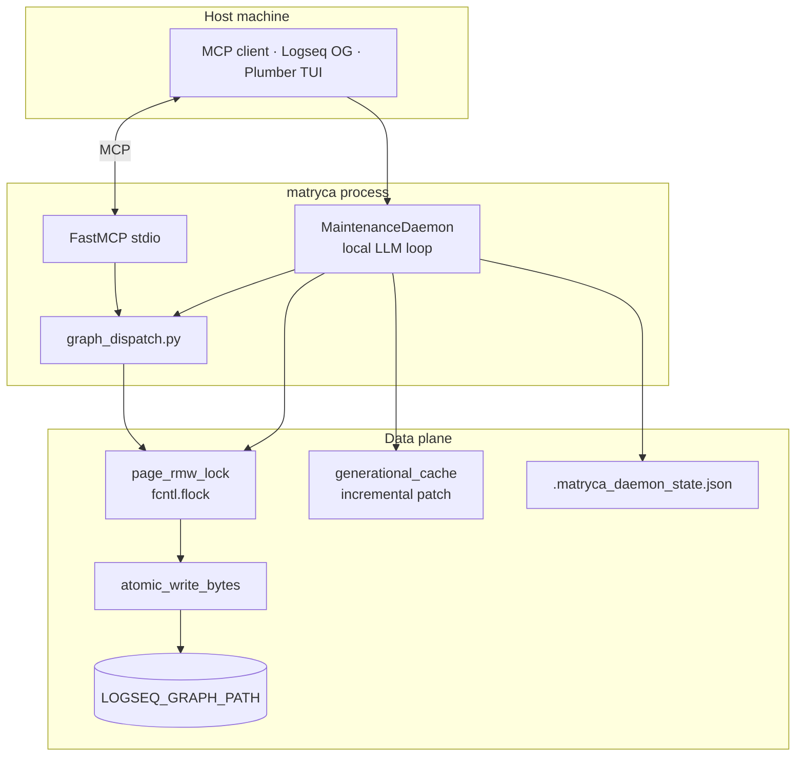

# Matryca Logseq LLM Wiki (v1.5 — Plumber Edition)

> Agentic Knowledge Management for Logseq OG. An MCP server and **local cognitive maintenance daemon** that turns your favorite AI into a spatial Knowledge Architect — heavily inspired by [Andrej Karpathy's LLM-Wiki vision](https://karpathy.ai/blog). It treats your vault as a tree of blocks, not a flat document store. Local-first, database-free, and Markdown-purist.

[](https://github.com/MarcoPorcellato/matryca-logseq-llm-wiki/actions/workflows/ci.yml)
[](https://github.com/MarcoPorcellato/matryca-logseq-llm-wiki/actions/workflows/ci.yml)
[](https://www.python.org/downloads/)
[](LICENSE)


Matryca is a **100% headless, sandboxed** MCP server and CLI that turns your local Logseq graph into a high token-density agentic workspace — **no network APIs and no background desktop app required**.

**Matryca Plumber** extends this with a **sovereign, local-first background daemon**: it polls your graph, repairs broken block references, flushes context loops via Ermes compression, calls a local LLM (LM Studio), appends semantic indexes, runs optional cognitive lint modules, and logs every token transaction — while you edit the same files in Logseq or via MCP.

The **v1.4.0 Headless Revolution** removed HTTP JSON-RPC; **v1.5** adds the production-hardened Plumber plane (Ermes context compression, `JSON_SCHEMA` grammar sampling, structural quarantine, GraphRAG Louvain clustering, 262-test CI bar).

> **Brand note:** **Matryca Brain** is reserved exclusively for the Nuitka-compiled Pro enterprise ingestion suite. The open-source maintenance daemon, linter, and indexing subsystem is **Matryca Plumber**.

---

## ✨ Core Features

* 🌌 **AST Spatial Intelligence:** deterministic parser understands Logseq parent-child block structure.
* 🤖 **100% Headless & Local-First:** atomic file I/O on `.md` sources — Logseq desktop optional.
* 🔧 **Matryca Plumber Daemon:** progressive semantic indexing + safe micro-lint via local LLM (LM Studio).
* 🩻 **X-Ray Token Economy:** UUID aliases (`[0]`, `[1]`) — up to ~35× less context noise.
* 🔒 **Sandboxed Privacy:** path traversal blocked at `path_sandbox.py`.
* 🧱 **Ironclad Data Plane:** `fcntl.flock` RMW locks, atomic swaps, malformed-`((uuid))` quarantine.
* 📊 **Zero-DB Lexical Engine:** in-memory Okapi BM25 + generational cache patching.

---

## 🪠 Matryca Plumber: L'Infrastruttura Semantica Locale

Matryca Plumber è un motore di manutenzione asincrono, deterministico e ad alte prestazioni progettato per indicizzare, connettere e ottimizzare grandi grafi di conoscenza Logseq (3.000+ pagine) in locale. Sfruttando un'architettura a separazione rigorosa di fase e un motore GraphRAG nativo a costo token zero, il sistema elimina il lag di rendering della UI e previene la saturazione della memoria dei modelli linguistici (KV-Cache) su macchine consumer.

### 🌟 Funzionalità Chiave di Grado Industriale

- **Ingestione Stateless ad Alta Velocità (Phase 1):** Scansione iniziale parallela dei file Markdown. Calcola i blocchi di codice protetti (fences) per evitare falsi positivi, estrae riassunti sintetici via LLM locale (Gemma 4) azzerando la memoria rolling tra una pagina e l'altra per abbattere i tempi di Prompt Prefill da 25 a meno di 2 secondi per file.
- **Motore GraphRAG Nativo (Phase 2 Clustering):** Partizionamento deterministico delle pagine in "quartieri semantici" isolati (5-35 pagine) tramite l'algoritmo di modularità di Louvain, calcolato in RAM in meno di un secondo tramite matrici ibride TF-IDF (con filtri Stopwords) e somiglianza di Jaccard sui tag.
- **Isolamento del Contesto (Scudo Termico Ermes):** Durante l'analisi cognitiva di Phase 2, la cronologia dei messaggi viene confinata rigorosamente all'interno del singolo cluster geografico, iniettando un nodo ancora centrale (*Cluster Hub Anchor*), massimizzando la coerenza e azzerando le allucinazioni generative.
- **Tolleranza ai Guasti e Self-Healing:** Immunità Unicode universale (`errors="replace"`), resilienza ai blocchi dei driver cloud (iCloud, Dropbox) tramite degradazione elegante di `flock`, auto-riparazione da corruzione dei file di stato, ed Error Backoff per evitare loop infiniti di CPU su file corrotti non modificati.
- **Monitoraggio Constante $O(1)$:** Rich TUI Dashboard sincronizzata che legge i flussi di log JSONL al contrario a blocchi di buffer da 8KB, azzerando i picchi di allocazione RAM indipendentemente dalla dimensione dello storico dei log.

**Prerequisites:** LM Studio (or any OpenAI-compatible local server) at `MATRYCA_LM_BASE_URL`, model loaded matching `MATRYCA_LM_MODEL`.

### 🛠️ Interfaccia a Riga di Comando (CLI)

```bash
# Avvia il demone Plumber in background (produzione notturna)
matryca plumber start

# Avvia l'ingestione in primo piano (ideale per il monitoraggio iniziale)
matryca plumber start --foreground

# Sblocca la dashboard TUI interattiva in tempo reale
matryca plumber status

# Forza l'arresto sincronizzato e controllato del demone (Graceful Evacuation)
matryca plumber stop

# Esegue una radiografia analitica del grafo spuando metriche in formato JSON
matryca plumber audit

# Calcola e ispeziona manualmente i quartieri semantici del grafo
matryca plumber cluster
```

Ops log default: `logs/matryca_plumber_ops.log` (override with `MATRYCA_PLUMBER_LOG_PATH`). Daemon state: `.matryca_daemon_state.json` at graph root. PID lock: `.matryca_plumber_daemon.pid`.

### On-disk index formats

**Semantic index** (successful inference):

```markdown
### Matryca Semantic Index
- indexed-at:: 2026-05-21 14:30 UTC
- summary:: Concise page summary in the document's native language
- suggested-tags:: #project #idea
- moc-pointers::
  - [[Maps of Content]]
- cross-references::
  - related concept (see_also) → [[Other Page]]
- semantic-lint-applied::
  - auto_wikilink:aaaaaaaa-…:Linked canonical term
- semantic-lint-warnings::
  - Possible duplicate (block aaaaaaaa…)
```

**Structural lint** (malformed `((uuid))` quarantine — daemon skips LLM processing):

```markdown
### Matryca Structural Lint
- malformed-block-refs::
  - ((aaaaaaaa-bbbb-4ccc-8ddd-eeeeeeeeeee))
- todo:: #todo [[Matryca Broken Reference]] — fix ((uuid)) typos in Logseq
```

**MARPA validation** (when `MATRYCA_LINT_MARPA_FRAMEWORK=true`):

```markdown
### Matryca MARPA Validation
- assigned-domain:: progetto
- detected-tags:: #project
- ssot-warnings::
  - ssot_duplicate:pages/Duplicate.md (prefer ((block-uuid)) transclusion)
```

---

## ⚙️ Configuration

Copy **`.env.example`** → **`.env`**. The only **required** variable for MCP + Plumber is:

| Variable | Default | Role |
|----------|---------|------|
| `LOGSEQ_GRAPH_PATH` | — | **Required.** Absolute graph root (`pages/`, `journals/`) |

### Core MCP & graph plane

| Variable | Default | Role |
|----------|---------|------|
| `MATRYCA_GIT_SNAPSHOT_ON_WRITE` | `false` | Opt-in `git commit` before selected writes |
| `MATRYCA_DEBUG` | `false` | Disable MCP log privacy masking |
| `MATRYCA_L1_PATH` | — | Optional L1 session rules (file or directory) |
| `MATRYCA_WIKI_CONFIG` | `$GRAPH/matryca-wiki.yml` | Wiki orchestration YAML |

### Local LLM (Plumber + Instructor)

| Variable | Default | Role |
|----------|---------|------|
| `MATRYCA_LM_BASE_URL` | `http://localhost:1234/v1` | LM Studio OpenAI-compatible endpoint |
| `MATRYCA_LM_MODEL` | `qwen2.5-coder-7b` | Exact loaded model id (must match LM Studio) |
| `MATRYCA_LM_INSTRUCTOR_MODE` | `JSON_SCHEMA` | Primary grammar-based structured output mode |
| `MATRYCA_LM_INSTRUCTOR_FALLBACK` | `MD_JSON` | Fallback when schema binding fails |

### Daemon timing & logging

| Variable | Default | Role |
|----------|---------|------|
| `MATRYCA_PLUMBER_POLL_SECONDS` | `30` | Seconds between graph scan cycles |
| `MATRYCA_PLUMBER_LOG_PATH` | `logs/matryca_plumber_ops.log` | JSONL ops log path |

### Thermal pacing (hardware protection)

Duty-cycle modulation after each local LLM inference event. Set to **`0`** to disable. Loaded by `load_plumber_lint_config()` in `src/agent/plumber_config.py`:

| Variable | Default | Role |
|----------|---------|------|
| `MATRYCA_THERMAL_DELAY_BOOTSTRAP` | `2.0` | Cooling pause (seconds) after each Phase 1 bootstrap page summary |
| `MATRYCA_THERMAL_DELAY_COGNITIVE` | `2.0` | Cooling pause (seconds) after each Phase 2 file iteration (indexing + cognitive lint) |

### Context compression (Ermes mode)

Loaded by `load_plumber_lint_config()` in `src/agent/plumber_config.py`:

| Variable | Default | Role |
|----------|---------|------|
| `MATRYCA_PLUMBER_CONTEXT_COMPRESSION` | `false` | Enable rolling history condensation |
| `MATRYCA_PLUMBER_COMPRESSION_TRIGGER_TOKENS` | `100000` | Token threshold to trigger compression |
| `MATRYCA_PLUMBER_COMPRESSION_TARGET_TOKENS` | `30000` | Target size after condensation |

### Cognitive lint modules (open-source tier)

All default **`false`** unless noted. See `src/agent/plumber_config.py`.

| Variable | Default | Role |
|----------|---------|------|
| `MATRYCA_LINT_MARPA_FRAMEWORK` | `false` | MARPA domain taxonomy (Mappa/Area/Risorsa/Progetto/Archivio) |
| `MATRYCA_LINT_HEAL_DANGLING` | `false` | Seed pages for unresolved wikilinks |
| `MATRYCA_LINT_DANGLING_MAX_WORDS` | `50` | Max words in generated seed definitions |
| `MATRYCA_LINT_ENTITY_CONSOLIDATION` | `false` | Semantic overlap → alias properties |
| `MATRYCA_LINT_SIMILARITY_THRESHOLD` | `0.85` | Overlap score threshold for merge suggestions |
| `MATRYCA_LINT_AUTO_SPLIT` | `false` | Extract dense subtrees to child pages |
| `MATRYCA_LINT_SPLIT_BLOCK_THRESHOLD` | `15` | Child count triggering auto-split |
| `MATRYCA_LINT_PROPERTY_HYGIENE` | `false` | Infer missing tag properties |
| `MATRYCA_LINT_INFER_MISSING_PROPERTIES` | `true` | Allow LLM property inference when hygiene enabled |
| `MATRYCA_LINT_PROPERTY_RULES` | `$GRAPH/matryca-plumber-rules.yml` | Optional YAML rules path |
| `MATRYCA_LINT_BACKPROPAGATE_LINKS` | `false` | Propagate wikilink corrections to backlink pages |
| `MATRYCA_LINT_SEMANTIC_ROUTING` | `false` | Filesystem-backed LLM inference cache |

> **Commercial tier (Matryca Brain — not wired in OSS):** Twin Ingestion and Epistemic Guardian are reserved for the Nuitka-compiled **Matryca Brain** edition. Pavlyshyn bipartite validation is proprietary — not present in open source.

### Claude Desktop (MCP only)

```json
{
  "mcpServers": {
    "matryca-logseq": {
      "command": "uvx",
      "args": ["--from", "matryca-logseq", "matryca-logseq-llm-wiki"],
      "env": {
        "LOGSEQ_GRAPH_PATH": "/absolute/path/to/your/Logseq/graph"
      }
    }
  }
}
```

Requires [uv](https://docs.astral.sh/uv/) on `PATH`. Restart the MCP host after edits.

---

## 🧪 Stability Markers

* **262 passing tests**, **0 Mypy strict issues**.
* **Ruff** format + lint clean on `src/` and `tests/`.
* Enforced on `main` in [`.github/workflows/ci.yml`](.github/workflows/ci.yml) — run locally:

```bash
make check
```

---

## Architecture stack



Deep dive: [`docs/ARCHITECTURE.md`](docs/ARCHITECTURE.md) — RMW locking rationale, Ermes compression, quarantine flow, IP separation.

Lifecycle log: [`docs/PROJECT_DIARY.md`](docs/PROJECT_DIARY.md) — Phases 1–8, crushed bottlenecks.

---

## Feature matrix: architectural phases

| Phase | Core capabilities |
|:-----:|-------------------|
| **1–8** | MCP bridge → Ironclad data plane (fences, atomic writes, generational cache) |
| **9–13** | Trust plane, delivery CI, Fortress sandbox, Headless Revolution, service installer |
| **14 — Plumber OS** | Local LLM daemon, cognitive lint modules, Ermes compression, Louvain GraphRAG clustering, structural quarantine, `JSON_SCHEMA` inference |

Full MCP tool matrix: [`docs/ARCHITECTURE.md`](docs/ARCHITECTURE.md) § Complete phase evolution history.

---

## Zero-install execution (`uvx`)

```bash
uvx --from matryca-logseq matryca-logseq-llm-wiki
```

Bleeding edge from `main`:

```bash
uvx --from git+https://github.com/MarcoPorcellato/matryca-logseq-llm-wiki.git matryca-logseq-llm-wiki
```

### Background MCP service (`matryca service`)

Install a stable binary first — **not** via ephemeral `uvx`:

```bash
uv tool install matryca-logseq
matryca service install
```

---

## Safe testing on a copy of your graph

Point `LOGSEQ_GRAPH_PATH` at a **dedicated test graph** before enabling Plumber or agent mutators. Optional: `MATRYCA_GIT_SNAPSHOT_ON_WRITE=true` for revertible experiments.

<details>
<summary><b>🛠️ Logseq Sync — clean transplant for test graphs</b></summary>

<ol>
  <li>Create an empty folder and add it as a new graph in Logseq.</li>
  <li>Close Logseq; copy only <code>pages/</code>, <code>journals/</code>, <code>assets/</code> from production.</li>
  <li>Reopen and <b>Re-index</b>.</li>
</ol>
</details>

---

## Quickstart (clone and develop)

### Prerequisites

- Python **3.12+**
- **[uv](https://docs.astral.sh/uv/)**
- Logseq OG graph on disk
- LM Studio (for Plumber daemon)

### Install

```bash
git clone https://github.com/MarcoPorcellato/matryca-logseq-llm-wiki.git
cd matryca-logseq-llm-wiki
make install
cp .env.example .env   # edit LOGSEQ_GRAPH_PATH + LM settings
```

### Verify

```bash
make check    # Ruff + Mypy strict + 262 tests
matryca plumber start --foreground   # optional smoke test
```

---

## Documentation map

| Document | Audience |
|----------|----------|
| [`SYSTEM_PROMPT.md`](SYSTEM_PROMPT.md) | Agent operators — outline discipline, persist-first UUIDs |
| [`docs/ARCHITECTURE.md`](docs/ARCHITECTURE.md) | Engineers — data planes, Plumber lifecycle, hardening |
| [`docs/PROJECT_DIARY.md`](docs/PROJECT_DIARY.md) | Maintainers — phase history, ADRs, bug archaeology |
| [`CONTRIBUTING.md`](CONTRIBUTING.md) | Contributors — `uv`, `make check` |
| [`SECURITY.md`](SECURITY.md) | Vulnerability reporting |

---

## License

Apache-2.0 — see [LICENSE](LICENSE).
