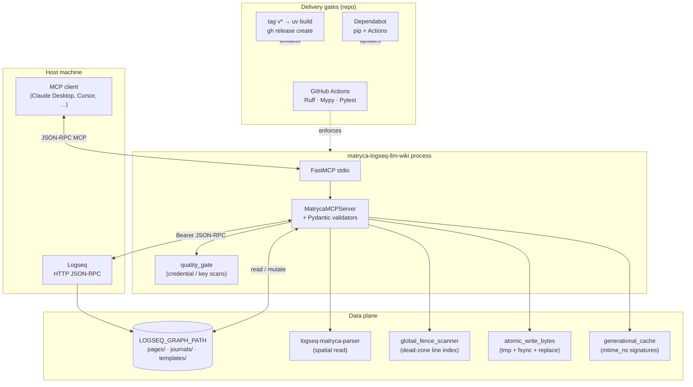
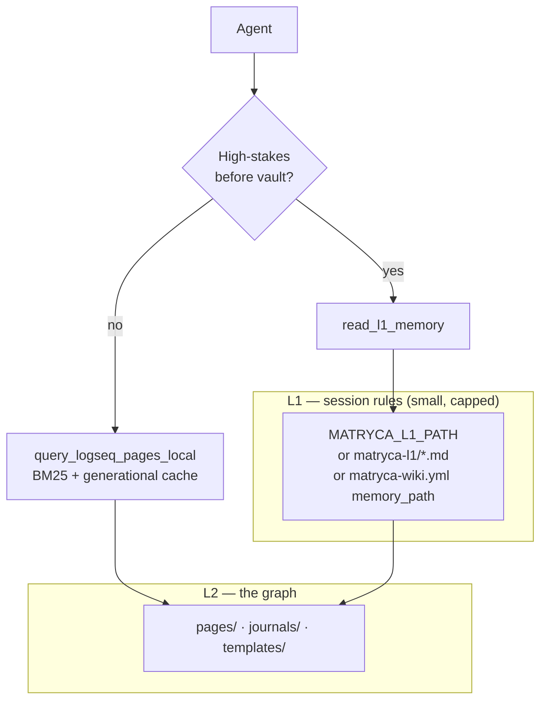
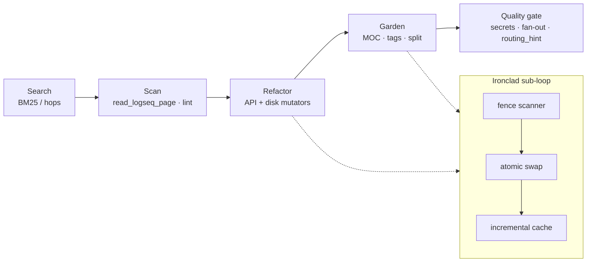

# Matryca Logseq LLM Wiki

> Agentic Knowledge Management for Logseq OG. An MCP server that turns your favorite AI into a spatial Knowledge Architect. It treats your vault as a tree of blocks, not a flat document store. Local-first, database-free, and Markdown-purist.

[](https://github.com/MarcoPorcellato/matryca-logseq-llm-wiki/actions/workflows/ci.yml)
[](https://github.com/MarcoPorcellato/matryca-logseq-llm-wiki/actions/workflows/ci.yml)
[](https://www.python.org/downloads/)
[](LICENSE)

As the PKM ecosystem pivots heavily toward opaque SQLite databases to accommodate AI, many of us want to keep our Second Brain in pure, local Markdown. But standard LLM RAG pipelines destroy Markdown: they blindly chunk files, severing the crucial parent-child relationship of your bullet points.

Matryca solves the context-fragmentation problem. Powered by the [Logseq Matryca Parser](https://github.com/MarcoPorcellato/logseq-matryca-parser) and [Model Context Protocol](https://modelcontextprotocol.io/) (MCP), this architecture allows agents like Claude Desktop or Cursor to read the exact Abstract Syntax Tree (AST) of your thoughts. It understands nested bullets, `id::` UUIDs, and `[[wikilinks]]`, allowing the AI to organically grow, synthesize, and garden your graph alongside you.

---

## 🧠 Why this is different

**Compiler-Grade AST Awareness:** The agent reads the exact spatial indentation of your blocks. It knows if a bullet is a root project, a task, or a sub-note.

**Zero-DB / In-Memory Lexical Engine:** No bloated vector databases. It uses instantaneous in-memory Okapi BM25 and structural BFS graph traversals directly over your `pages/` directory.

**Ironclad Data Plane:** AI agents can be destructive. Matryca features ACID-inspired transactional file swaps, dead-zone fence scanning (to protect code blocks), and automated Git snapshots before mutating your graph.

---

## Architecture stack



### L1 versus L2 (two-layer context)



### Runtime agent loop (search → gate)



---

## Feature matrix: ten architectural phases

Each phase adds capabilities; later phases **harden** earlier tools without necessarily renaming the MCP surface. **Phase** is the product narrative; **modules** are what you grep in `src/`.

| Phase | Core capabilities | MCP tools (exposed names) |
|:-----:|-------------------|---------------------------|
| **1 — Baseline bridge** | FastMCP server, async Logseq JSON-RPC client, **`OutlineNode`** validation, DFS **`write_logseq_outline`**, spatial **`read_logseq_page`**, block-ref integrity scan, dashboard aggregation | `read_logseq_page`, `write_logseq_outline`, `lint_logseq_block_refs`, `render_logseq_dashboard` |
| **2 — L1 / L2 routing** | Capped **`read_l1_memory`** from configurable paths; **routing hints** on read/write responses for traceability (`routing_hint.py`) | `read_l1_memory` *(hints on other tools’ payloads)* |
| **3 — PKM refinements** | BM25 and substring local query; structural BFS hops and hub/orphan reports; surgical **`key::`** property edits; templates; wiki-prefix lint; namespace index; optional **git snapshot** on outline and heavy mutators | `query_logseq_pages_local`, `traverse_logseq_structural_hops`, `report_structural_hubs_orphans`, `patch_logseq_block_property_lines`, `list_logseq_templates`, `read_logseq_template`, `lint_matryca_wiki_pages`, `list_logseq_namespace_index`, `snapshot_logseq_graph_git` |
| **4 — Logseq superpowers** | Advanced Query injection with preset or raw EDN; journal task mining; entity resolution via alias index; page alias append | `inject_logseq_advanced_query`, `analyze_journal_tasks`, `append_logseq_journal_markdown`, `resolve_logseq_entity`, `append_logseq_page_alias` |
| **5 — Graph gardener** | SRS-style flashcards from `::` pairs; vault-wide tag unify; same-page reparent refactor | `generate_logseq_flashcards`, `lint_unify_logseq_tags`, `refactor_logseq_blocks` |
| **6 — Synthesis engine** | Unlinked mention discovery; MOC generation; long-bullet split; manual git snapshot | `resolve_unlinked_mentions`, `generate_moc_page`, `refactor_large_blocks`, `snapshot_logseq_graph_git` |
| **7 — Mldoc guards** | **`mldoc_properties`** (property grammar, CSV / wikilink / quote semantics); **`mldoc_guards`** (drawers, fences, macros) wired into property edit, tag unify, alias append, large-block split | *Same tool names as phases 3–6; strengthened internals* |
| **8 — Ironclad data plane** | **`compute_page_protected_line_indices`** (global fence lexer); **`atomic_write_bytes`** on mutators; **`generational_cache`** (`st_mtime_ns` keyed alias + BM25 corpus reuse, Salsa-style invalidation) | *Same tool names; dead-zone and cache behavior upgraded* |
| **9 — Trust and policy plane** | **`quality_gate`**: blocks credential-like outline properties and raw query EDN; **`lint_matryca_wiki_pages`** for configurable wiki discipline; structured dry-run / apply responses | Enforcement inside `write_logseq_outline`, `inject_logseq_advanced_query`; governance tools listed in phase 3 |
| **10 — Delivery and community** | **GitHub Actions** (`ci.yml`): `uv sync --locked`, Ruff lint + format check, **Mypy** on `src` and `tests`, Pytest; **Dependabot** (pip + Actions); **`release.yml`** on `v*` tags (`uv build`, `gh release create`); **`SECURITY.md`**; **Contributor Covenant** (`CODE_OF_CONDUCT.md`); issue and PR templates | *Repository operations — no additional MCP tools* |

**Roadmaps and design history:** [`docs/roadmaps/`](docs/roadmaps/) (LLM Wiki, Phase 3, Logseq superpowers, Phase 5–6, mldoc compliance, Ironclad Shield).

---

## Zero-install execution (`uvx`)

You do **not** need to clone this repository to run the published console script. **[uv](https://docs.astral.sh/uv/)** can materialize an ephemeral environment from the Git VCS URL (the package depends on **`logseq-matryca-parser`** via `git+https` in `pyproject.toml`, so the practical install path remains VCS-backed).

```bash
uvx --from git+https://github.com/MarcoPorcellato/matryca-logseq-llm-wiki.git matryca-logseq-llm-wiki
```

Configure **`LOGSEQ_API_TOKEN`**, **`LOGSEQ_GRAPH_PATH`**, and related variables in your MCP host’s server definition alongside this command. For **responsible vulnerability disclosure**, see [`SECURITY.md`](SECURITY.md).

---

## Quickstart (clone and develop)

### Prerequisites

- **Python 3.12+**
- **[uv](https://docs.astral.sh/uv/)**
- **Logseq** with the **HTTP API** enabled and a **Bearer token**

### Install

```bash
git clone https://github.com/MarcoPorcellato/matryca-logseq-llm-wiki.git
cd matryca-logseq-llm-wiki
make install
```

### Environment

Copy **`.env.example`** to **`.env`** and set at minimum:

| Variable | Role |
|----------|------|
| `LOGSEQ_API_TOKEN` | **Required.** Bearer token for Logseq’s HTTP API |
| `LOGSEQ_API_URL` | Default `http://localhost:12315` |
| `LOGSEQ_GRAPH_PATH` | **Required for disk tools.** Absolute graph root (directory containing `pages/`) |
| `MATRYCA_L1_PATH` | Optional: file or directory of small Markdown “L1” session rules |
| `MATRYCA_WIKI_CONFIG` | Optional: path to `matryca-wiki.yml` (else `$LOGSEQ_GRAPH_PATH/matryca-wiki.yml`) |
| `MATRYCA_GIT_SNAPSHOT_ON_WRITE` | `true` or `false` — opt-in automatic **`git add -A` + `git commit`** before selected writes when the graph is a git checkout |

Optional graph orchestration: copy [`matryca-wiki.example.yml`](matryca-wiki.example.yml) to your graph as **`matryca-wiki.yml`** for namespaces, template subdirectory, wiki lint prefix, and dashboard title.

### Verify

```bash
make check
```

Runs Ruff (format + lint), **strict Mypy** on `src/` and `tests/`, and **pytest** (92 tests). The same bar is enforced on **`main`** in [`.github/workflows/ci.yml`](.github/workflows/ci.yml).

### Claude Desktop (stdio MCP)

Example fragment for **`claude_desktop_config.json`**:

```json
{
  "mcpServers": {
    "matryca-logseq-llm-wiki": {
      "command": "uv",
      "args": ["run", "python", "-m", "src.main"],
      "cwd": "/absolute/path/to/matryca-logseq-llm-wiki",
      "env": {
        "LOGSEQ_API_TOKEN": "your-token",
        "LOGSEQ_API_URL": "http://localhost:12315",
        "LOGSEQ_GRAPH_PATH": "/absolute/path/to/your/Logseq/graph",
        "MATRYCA_GIT_SNAPSHOT_ON_WRITE": "false"
      }
    }
  }
}
```

Restart the MCP host after edits. Keep **Logseq running** when tools call live **`insertBlock`** or query injection.

---

## Documentation map

| Document | Audience |
|----------|----------|
| [`SYSTEM_PROMPT.md`](SYSTEM_PROMPT.md) | Agent operators — outline discipline, Search → Scan → Update, dry-run-first mutators |
| [`docs/ARCHITECTURE.md`](docs/ARCHITECTURE.md) | Engineers — bounded-work parsing, Ironclad data plane, phase history |
| [`CONTRIBUTING.md`](CONTRIBUTING.md) | Contributors — `uv`, `make check`, MCP testing notes |
| [`CODE_OF_CONDUCT.md`](CODE_OF_CONDUCT.md) | Community standards (Contributor Covenant 2.1) |
| [`SECURITY.md`](SECURITY.md) | Private reporting via GitHub Security Advisories |

---

## License

Apache-2.0 — see [LICENSE](LICENSE).
