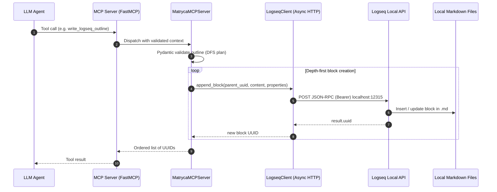
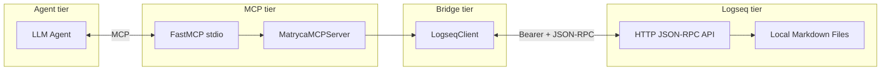

# System Architecture

This document describes how **matryca-logseq-llm-wiki** connects an LLM agent to Logseq OG through the Model Context Protocol (MCP), the local Logseq HTTP JSON-RPC API, and the on-disk Markdown graph.

## End-to-end data flow

At runtime, the agent invokes MCP tools exposed by a **FastMCP** server. Those tools validate payloads, call an async **LogseqClient** that speaks JSON-RPC over HTTP to Logseq’s local API, and Logseq persists changes as **indented bullet blocks** inside repository Markdown files.

The same components appear in the layered view below: the agent never touches the filesystem directly; Logseq remains the authority for graph structure and block identity.

---

## 1. The Bridge (Agent to Logseq)

The bridge between the agent and Logseq lives in `src/agent/mcp_server.py`. **`MatrycaMCPServer`** is responsible for turning tool-level JSON into durable Logseq blocks while respecting the outliner model: every child block must be created under a parent that already exists in the graph.

### Pydantic validation

Incoming outlines are modeled by **`OutlineNode`**, a Pydantic `BaseModel` with:

- **`text`**: block body (Markdown / outliner content).
- **`properties`**: optional string key–value pairs aligned with Logseq block properties.
- **`children`**: a nested list of child `OutlineNode` instances.

A **`field_validator`** on `children` normalizes `null` or missing children to an empty list so partially specified JSON from agents still validates cleanly. The server then calls **`OutlineNode.model_validate(outline)`** so malformed shapes fail fast before any HTTP traffic.

### Depth-first creation and parent UUID chaining

Method **`write_logseq_outline`** walks the tree with an inner async **`walk`** function:

1. Append the current node under the known **`parent_uuid`** via **`LogseqClient.append_block`**, which returns the new block’s **`uuid`**.
2. Record that UUID in order for the caller.
3. For each child, **`await walk(child, new_uuid)`** so the child’s parent is always the UUID just returned by Logseq.

This **depth-first, await-between-levels** strategy guarantees that Logseq receives **`insertBlock`** calls only when the parent UUID is real and resolvable—eliminating races where children were requested before their parents existed (historically surfaced as **`UNRESOLVED_PARENT_UUID`**-class failures when creation order was optimistic or parallelized without ordering).

---

## 2. The Client (JSON-RPC)

`src/bridge/logseq_client.py` implements **`LogseqClient`**, a thin **async** wrapper over Logseq’s **local HTTP JSON-RPC** surface.

### Transport and security

- The client is constructed with **`api_url`** (defaulting in application wiring to **`http://localhost:12315`**) and **`token`**.
- It uses **`httpx.AsyncClient`** with a normalized base URL and an **`Authorization: Bearer <token>`** header so only holders of the Logseq API token can mutate the graph.

### Protocol envelope

Requests are shaped as **`JsonRpcRequest`** Pydantic models: **`jsonrpc`**, **`id`**, **`method`**, and **`params`**. **`append_block`** builds a call to **`logseq.Editor.insertBlock`** with the parent UUID, content, and options (including **`sibling: False`** so new blocks nest as children).

### Response handling

The client posts the serialized envelope, checks HTTP status, requires a JSON **object** body, and inspects the JSON-RPC **`error`** field when present. On success it reads **`result`**, verifies it is an object, extracts **`uuid`**, and validates that it is a non-empty **string** before returning it to **`MatrycaMCPServer`**. Failures are raised as **`RuntimeError`** with structured logging for operations teams.

---

## 3. Spatial RAG (External parser)

Retrieval over Logseq OG cannot treat pages as unstructured prose: hierarchy (indentation), block boundaries, and properties such as **`id::`** carry meaning.

**This repository does not host the spatial parsing implementation.** Parsing (indentation stack, AST, UUID and reference semantics) lives in the standalone **`logseq-matryca-parser`** package, installed here as a Git dependency and **on the roadmap for a PyPI release** so other tools can depend on it without vendoring.

**`src/rag/matryca_hooks.py`** is a **lightweight adapter**: **`get_spatial_context(file_path)`** delegates to the external parser and returns its graph-native page model (for example a **`LogseqPage`** from **`LogosParser.parse_page_file`**). **matryca-logseq-llm-wiki** remains the **orchestrator** (MCP bridge, agent tools, RAG wiring); the parser remains the **single source of truth** for how Logseq Markdown becomes structured context.

---

## Related entry points

- **`src/main.py`**: FastMCP application, **`app_lifespan`** wiring of **`LogseqClient`** and **`MatrycaMCPServer`**, and the **`write_logseq_outline`** tool registration for stdio transport.

For day-to-day development decisions and rationale, see **`PROJECT_DIARY.md`** in the repository root.
