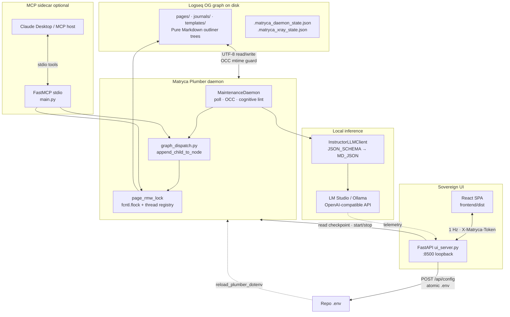
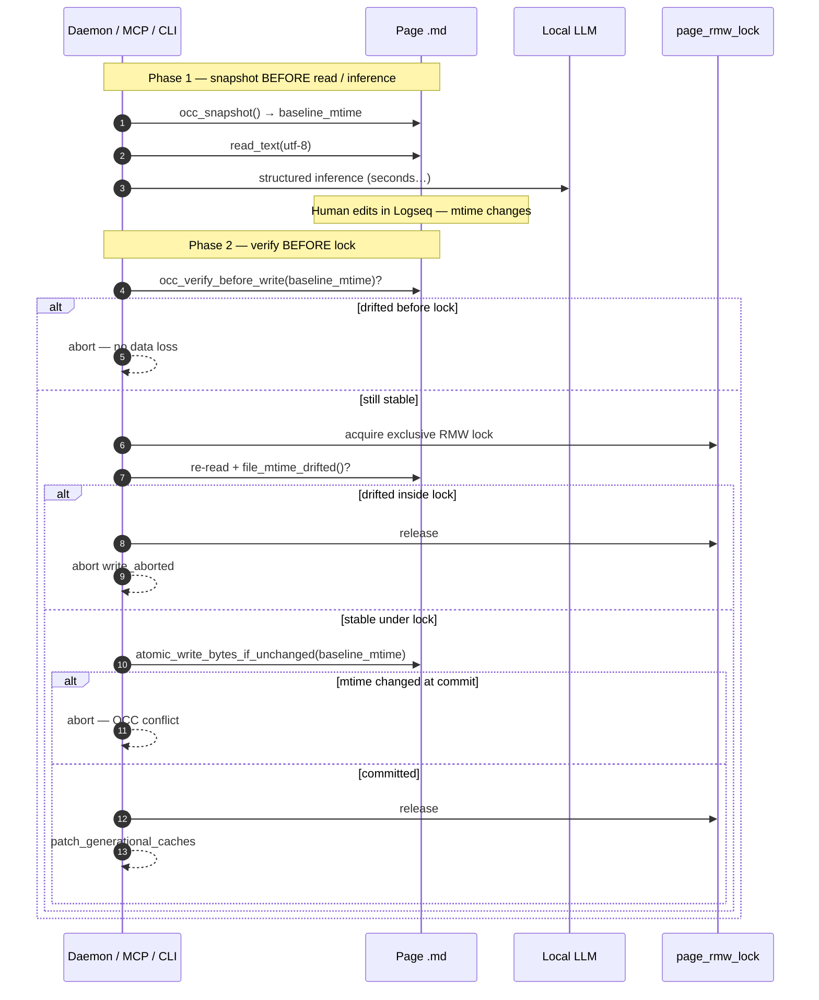
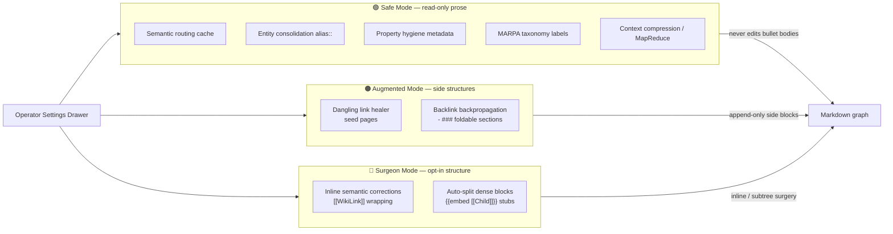

# Matryca Plumber — System Architecture

**Version:** 1.5.17 (Ironclad)  
**Package:** `matryca-plumber` on PyPI  
**Audience:** maintainers, contributors, and operators integrating Logseq OG with local LLMs

This document is the engineering contract for **Matryca Plumber**: an enterprise-grade, **local-first background AI daemon** that mutates Logseq OG Markdown on disk. It is not a Logseq plugin, not a cloud service, and not dependent on Logseq HTTP JSON-RPC. Humans and the daemon co-edit the same `.md` trees; safety is enforced through **AST parity**, **optimistic concurrency control (OCC)**, **path sandboxing**, and operator-visible **Trust & Safety** tiers.

For the maintainer timeline and crushed bottlenecks, see [`PROJECT_DIARY.md`](PROJECT_DIARY.md). For agent discipline at inference time, see [`SYSTEM_PROMPT.md`](../SYSTEM_PROMPT.md).

---

## Executive summary

Matryca Plumber evolved from an MCP-first bridge into a **three-surface runtime** that shares one headless mutation plane:

| Surface | Technology | Primary role |
|---------|------------|--------------|
| **Maintenance daemon** | Python (`MaintenanceDaemon`) | Autonomous duty-cycle scans, semantic indexing, cognitive lint, ledger checkpoints |
| **Sovereign UI** | React SPA + FastAPI (`ui_server.py`) | Loopback control room: telemetry, Trust & Safety toggles, daemon lifecycle, `.env` hot-swap |
| **MCP sidecar** | FastMCP stdio (`main.py`) | Optional tool host for Claude Desktop and other MCP clients — **same `graph_dispatch` contract** |

**FastMCP is auxiliary.** The product’s center of gravity is `matryca plumber start` plus the Sovereign UI. MCP attaches the identical read/write path when an external host spawns `matryca-plumber` without CLI-shaped arguments.

**Quality bar (v1.5.17):** **453** pytest targets passing, **Mypy strict** on `src` and `tests`, Ruff lint/format clean via `make check`.

---

## Separation of concerns

### 1. Maintenance daemon (Python background engine)

**Entry:** `matryca plumber start` → `src/agent/maintenance_daemon.py`

The daemon polls `pages/` and `journals/` under `LOGSEQ_GRAPH_PATH`, calls a local OpenAI-compatible endpoint (LM Studio, Ollama), and commits structured results through:

- **`graph_dispatch.py`** — headless outline appends via `logseq_matryca_parser.agent_writer.append_child_to_node`
- **Cognitive modules** — `src/agent/plumber_modules/` (env-gated: MARPA, dangling healer, property hygiene, auto-split, …)
- **OCC + `page_rmw_lock`** — lost-update prevention and cross-process serialization per page file

Persistent artifacts at the graph root include `.matryca_daemon_state.json` (checkpoint + AI impact ledger), `.matryca_plumber_daemon.lock` / `.pid`, and optional `.matryca_semantic_cache/`.

### 2. Sovereign UI (React + FastAPI control room)

**Entry:** `matryca plumber status` / `matryca plumber ui` → `src/cli/ui_server.py` on `http://127.0.0.1:8500`

A **monolithic** Uvicorn process serves:

- **REST API** — `/api/state`, `/api/logs`, `/api/config`, daemon control, LM model discovery (SSRF-hardened)
- **Static SPA** — `frontend/dist/` built from Vite; polls at **1 Hz** via `usePlumberPolling`
- **Zero-Trust auth** — `X-Matryca-Token` on protected routes (`ui_auth.py`)

The UI never becomes a second source of truth: it reads daemon checkpoints and live graph scans; configuration writes go to the repo **`.env`** atomically and are picked up by `reload_plumber_dotenv()` on the next daemon sync cycle.

### 3. MCP server sidecar (FastMCP stdio)

**Entry:** `matryca-plumber` with **no** CLI-shaped argv → `src/main.py` (lazy-imported from `plumber_entry.py`)

`register_mcp_tools` exposes the same mega-tools (`write_logseq_outline`, `read_graph_data`, `mutate_graph_data`, …) to external orchestrators. **`guard_mcp_tool`** maps domain errors to LLM-safe strings; **`mcp_telemetry`** bridges Loguru INFO+ lines to `Context.info` during tool calls.

**Routing fix (`plumber_entry.py`):** the `matryca-plumber` console script inspects `sys.argv`. Known CLI commands (`plumber`, `read`, `search`, shorthand `start`/`status`/…) route to `cli.main` **without** importing FastMCP. Bare invocations (typical MCP host stdio spawn) fall through to `main.main()`. This disentangles **operator CLI stdout** from **MCP JSON-RPC on stdio** — a class of integration bugs that plagued single-entrypoint packages.

---

## System topology



**Invariant:** one **system of record** — `LOGSEQ_GRAPH_PATH`. No auxiliary database, no Logseq Electron dependency, no split-brain HTTP API for background work.

---

## Headless mutation plane (shared by all surfaces)

### Parser-backed spatial truth

**[logseq-matryca-parser](https://github.com/MarcoPorcellato/logseq-matryca-parser)** (`>=0.3.3`) owns block hierarchy, indentation, and `id::` semantics. **`src/rag/matryca_hooks.py`** adapts `read_logseq_page` for agent consumption.

Disk mutators that perform line surgery (`property_line_edit`, `tag_unify`, `reparent_blocks`, …) combine:

- **`global_fence_scanner.py`** — dead zones (fenced code, HTML comments, Advanced Query blocks)
- **`mldoc_properties.py` / `mldoc_guards.py`** — Logseq-aligned property grammar
- **`path_sandbox.py`** — `is_relative_to(graph_root)` before every read/write
- **`atomic_write_bytes`** — `mkstemp` → write → `fsync` → `os.replace` (+ optional `((uuid))` pre-flight in `logseq_uuid.py`)

### Logseq AST parity (non-negotiable)

| Rule | On-disk shape | Module |
|------|---------------|--------|
| **Page properties** | Raw `key:: value` at **line 0 region**, no `- ` bullet; blank line before first bullet | `page_properties.py` |
| **Block properties** | `id::`, `matryca-plumber::`, … at **+2 spaces** under parent bullet, before children | `mldoc_properties.py`, `property_line_edit.py` |
| **Namespaces** | Semantic `Domain/Topic` → `Domain___Topic.md` + percent-encoding | `page_path.py` |
| **Authorship** | `made-by:: matryca plumber v{version}` in frontmatter | `stamp_plumber_authored_page()` |

Third-party tools that treat pages as flat CommonMark routinely corrupt Logseq indexes; Plumber’s write paths preserve the outliner contract end-to-end.

---

## Optimistic concurrency control (OCC)

Local LLM inference is **slow** (seconds to minutes). Logseq users keep editing during that window. OCC prevents **silent overwrites** of human edits without replacing the need for **RMW locks** (which prevent torn writes between concurrent writers).

### Two-layer concurrency model

| Layer | Mechanism | Prevents |
|-------|-----------|----------|
| **Serialization** | `page_rmw_lock(path)` — in-process `threading.Lock` registry + cross-process `fcntl.flock` sidecar | Torn interleaved RMW from daemon + MCP + second daemon |
| **Lost-update detection** | `baseline_mtime` via `st_mtime` — snapshot → work → verify → atomic commit | Stale LLM output overwriting fresher human bytes |

### OCC lifecycle (canonical order)

1. **`occ_snapshot(page_path)`** — capture `baseline_mtime` **before** reading content or calling the LLM (Phase 1).
2. **Inference / payload assembly** — human may edit in Logseq; `st_mtime` advances.
3. **`occ_verify_before_write(path, baseline_mtime)`** — fast reject **before** acquiring `page_rmw_lock` when already stale.
4. **`with page_rmw_lock(path):`** — enter exclusive RMW scope.
5. **Re-read** page bytes; **`file_mtime_drifted()`** again inside the lock.
6. **`atomic_write_bytes_if_unchanged(..., baseline_mtime=...)`** — final mtime check immediately before `os.replace`; abort with `write_aborted` if conflict.

Cognitive modules (`apply_semantic_page_result`, `property_hygiene`, `auto_split`, `append_page_alias_line`, …) thread `baseline_mtime` through this gate. After Plumber’s **own** intermediate write in the same request, callers may **`OCCSnapshot.refresh_after_own_write()`** to re-baseline multi-step edits.



**Complement, not duplicate:** `fcntl.flock` stops two writers from corrupting the same file mid-splice; OCC stops one writer from promoting a payload computed on obsolete bytes.

---

## Trust & Safety levels

Operators control invasiveness from the Sovereign UI **Settings drawer** (`SettingsDrawer.tsx`). Toggles map to `MATRYCA_LINT_*` / `MATRYCA_PLUMBER_*` keys in `.env`; `reload_plumber_dotenv()` applies them on the next daemon `_sync_runtime_config()` without restart.



| Tier | Risk | Prose impact |
|------|------|----------------|
| **Safe Mode** | Lowest | Metadata, indexes, `alias::`, routing cache — **no inline bullet rewrites** |
| **Augmented Mode** | Medium | New foldable `- ###` sections and isolated seed pages; original bullets preserved |
| **Surgeon Mode** | Highest | Inline wikilink corrections and embed-based subtree extraction — **strictly opt-in** |

---

## Sandboxing and safety

### Strict AST parity and Line-0 frontmatter preservation

All page-level metadata mutations route through **`page_properties.py`**, which computes the **frontmatter span** at the top of the file and injects raw `key:: value` lines **without** promoting them to bullets. Block-level surgery uses **`property_line_edit.py`** scoped to subtrees anchored at `id::`, intersecting **`compute_page_protected_line_indices`** so fenced code and query blocks are never touched.

The adapter and writer stack delegate tree shape to **`logseq-matryca-parser`**; Matryca does not maintain a competing full-file Markdown AST.

### Atomic `.env` writes (Sovereign UI)

Settings persistence uses **`_atomic_write_text`** in `ui_server.py`: `mkstemp` beside the target → UTF-8 write → `flush` + `fsync` → `os.replace`. Partial writes cannot leave the Plumber configuration torn while the React drawer saves thermal delays, lint flags, or `LOGSEQ_GRAPH_PATH`.

### Page-lock registry with LRU eviction

**`page_write_lock.py`** keeps an in-process `OrderedDict` of `threading.Lock` instances keyed by normalized absolute paths (cap **`_MAX_PAGE_LOCK_REGISTRY = 4096`**). When the cap is reached, **unlocked** entries are evicted LRU-style instead of clearing the entire registry — preserving hot-path lock stability on large vaults without unbounded memory growth.

Cross-process exclusivity uses a `.matryca.lock` sidecar with retried non-blocking `flock`. **`MATRYCA_ALLOW_FLOCK_DEGRADATION=true`** permits thread-only locking on iCloud/Dropbox filesystems that reject `flock` (at operator risk). **`PageLockUnavailableError`** causes the daemon to **skip** the file without marking it processed — no false success, no torn write.

### Thread-safe Loguru → MCP logging bridge

**Problem:** Loguru’s `enqueue=True` sink runs on a worker thread and **pickles** log records. Embedding live FastMCP `Context` objects in `record["extra"]` caused multiprocessing/pickling failures and flaky telemetry.

**Solution (`mcp_telemetry.py`):**

1. On the emitting thread, stamp **`record["extra"]["matryca_mcp_session"] = id(ctx)`** — an integer key only.
2. Store **`(ctx, event_loop)`** in module-level **`_mcp_sessions[id(ctx)]`** for the tool call duration (`mcp_tool_session` context manager).
3. The sink resolves the session, sanitizes the message (`sanitize_log_message`), and schedules `ctx.info` on the correct loop via `call_soon_threadsafe`.
4. Tests await **`await logger.complete()`** instead of brittle `sleep` polling — deterministic drain of the async queue under `pytest-asyncio`.

Unless **`MATRYCA_DEBUG=true`**, UUIDs and payload-like markers are redacted before MCP clients display logs.

### Additional hardening (summary)

| Concern | Implementation |
|---------|----------------|
| Path traversal | `path_sandbox.assert_path_within_graph` |
| Credential leakage into graph | `quality_gate.outline_security_violations` |
| L1 rules path escape | `l1_memory.py` — reads only under `$HOME` or temp |
| LLM egress / SSRF | `utils/llm_url_policy.validate_llm_proxy_url` — UI **and** daemon |
| UI graph path hijack | `validate_logseq_graph_path_for_config` + `config_paths.graph_config_allowed_roots` |
| UI loopback exfiltration | SSRF on `/api/lm-models` + `POST /api/config`; `X-Matryca-Token` gate |
| UI abuse / probing | Split rate limits (`MATRYCA_UI_RATE_LIMIT_*`); session route loopback-only |
| MCP stdio exposure | `MATRYCA_MCP_ENABLED` gate in `plumber_entry.py` (default off) |
| MCP error leakage | `mcp_tool_guard._public_tool_error_message` unless `MATRYCA_DEBUG` |
| Daemon exclusivity | `.matryca_plumber_daemon.lock` (POSIX flock / Windows `msvcrt`) |
| Ledger durability | `save_daemon_state` tmp + fsync + replace + `.bak` + `json_flock` |

---

## Sovereign UI and telemetry (condensed)

**Dynamic Human vs Agent metrics** (`graph_analytics.py`):

$$\text{Human} = \max(0,\ \text{Scanned absolute} - \text{AI impact})$$

- **Pages:** live scan minus pages with `made-by:: matryca plumber v*` frontmatter.
- **Links:** absolute wikilink count minus `ai_links_injected` from `.matryca_daemon_state.json`.

No telemetry database — the vault **is** the audit trail.

**Context Acceleration Shield** (TRIZ-driven): `llm_context_payload.py` substitutes Phase 1 summaries for megabyte pages; `prompt_layout.py` places stable content before dynamic task tails so llama.cpp KV-cache prefixes reuse across consecutive lint operations on the same file.

---

## Distribution and entry points

### Zero-install and global install

```bash
uvx --from matryca-plumber matryca-plumber status   # CLI shorthand → plumber status
uv tool install matryca-plumber                      # matryca-plumber on PATH
```

Console scripts (`pyproject.toml`):

| Script | Target | Role |
|--------|--------|------|
| `matryca-plumber` | `plumber_entry:main` | CLI/MCP router |
| `matryca` | `cli:main` | Full `matryca` command tree |
| `matryca-logseq-llm-wiki` | `main:main` | Legacy MCP-only alias |

Background service: `matryca service install` → LaunchAgent / systemd user unit pointing at a **stable** `matryca-plumber` binary (not ephemeral `uvx` cache paths).

### Key modules

| Path | Role |
|------|------|
| `src/plumber_entry.py` | CLI vs MCP stdio disambiguation |
| `src/agent/maintenance_daemon.py` | Autonomous poll loop, ledger, detached spawn |
| `src/cli/ui_server.py` | FastAPI monolith + static SPA + daemon control |
| `src/cli/ui_auth.py` | Bearer token resolution and verification |
| `src/agent/graph_dispatch.py` | Headless writes, OCC-aware block resolution |
| `src/graph/page_write_lock.py` | Per-page RMW lock + LRU registry |
| `src/graph/markdown_blocks.py` | `atomic_write_bytes*`, OCC helpers |
| `src/agent/mcp_server.py` | `@mcp.tool()` handlers |
| `src/agent/mcp_telemetry.py` | Loguru bridge, `id(ctx)` session map |
| `src/agent/mcp_tool_guard.py` | Tool error boundary (sanitized client messages) |
| `src/utils/llm_url_policy.py` | Shared SSRF policy for inference base URLs |
| `src/utils/config_paths.py` | Graph/log path allowlists for config writes |
| `src/graph/path_sandbox.py` | Graph-root confinement |
| `src/graph/graph_path_validate.py` | `pages/` validation + config allowlist wrapper |
| `frontend/` | Sovereign UI React sources → `frontend/dist/` |

---

## Phase evolution (mental map)

| Phase | Milestone | Architectural outcome |
|:-----:|-----------|------------------------|
| **1–3** | Headless plane + optional MCP | Parser-backed reads; DFS `write_logseq_outline`; BM25 local query |
| **7–8** | Mldoc + Ironclad Shield | Fence scanner, atomic writes, generational cache |
| **12** | Headless Revolution (v1.4) | Removed Logseq HTTP client; `graph_dispatch` only |
| **14** | Matryca Plumber OS | `MaintenanceDaemon`, Louvain GraphRAG, React cockpit |
| **15** | Logseq-native parity | Namespace encoding, OCC, frontmatter discipline, Trust UI |
| **16** | Enterprise Ironclad | Zero-Trust UI, subprocess daemon, SSRF guards, cross-platform lock |
| **1.5.15** | Ironclad consolidation | `plumber_entry` routing, MCP log bridge pickling fix, OCC ordering, atomic `.env`, UI launch validation, LRU page locks |
| **1.5.17** | Security depth pass | Shared LLM SSRF, graph path allowlist, MCP gate, split UI rate limits, **453** tests |

---

## Related reading

- [`PROJECT_DIARY.md`](PROJECT_DIARY.md) — chronological decisions and release notes
- [`SYSTEM_PROMPT.md`](../SYSTEM_PROMPT.md) — agent OCC and persist-first `id::` policy
- [`../README.md`](../README.md) — operator quick start
- [`../CONTRIBUTING.md`](../CONTRIBUTING.md) — `make check`, dev setup
- [`roadmaps/`](roadmaps/) — phased delivery checklists
- [`../SECURITY.md`](../SECURITY.md) — vulnerability reporting
