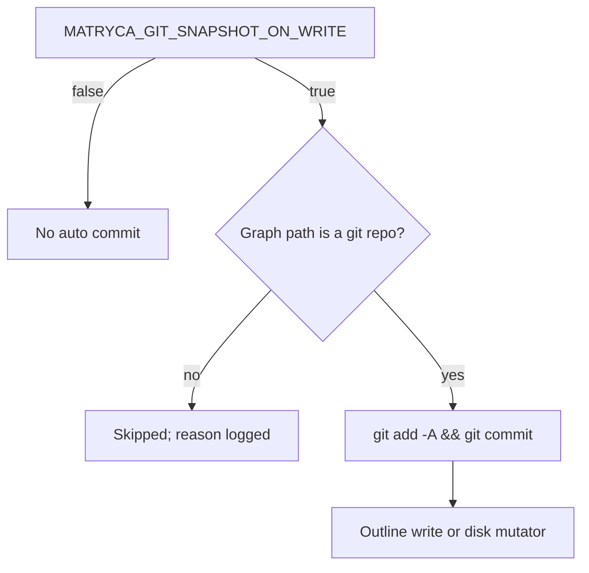
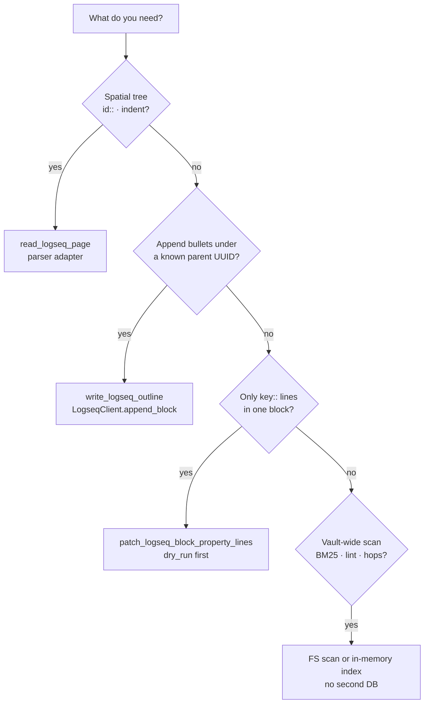
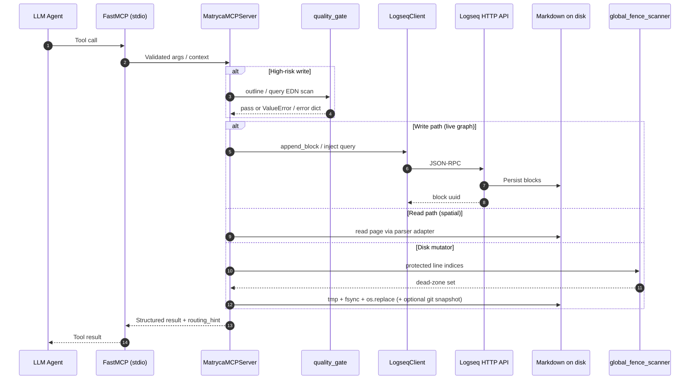
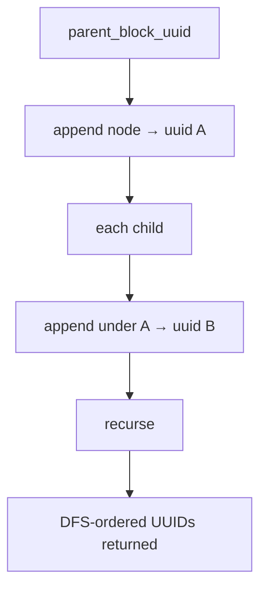
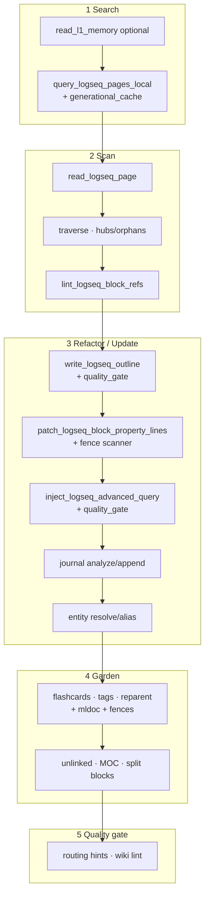
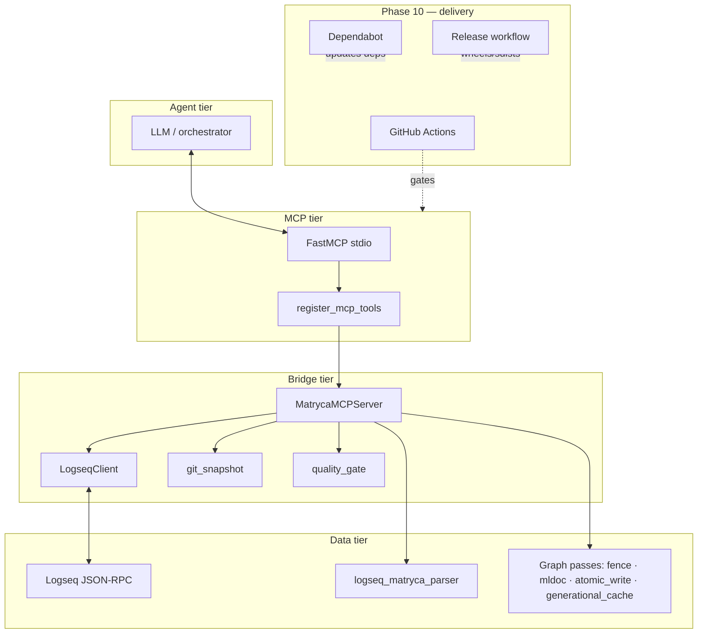

# Architecture

**matryca-logseq-llm-wiki** connects an LLM agent to **Logseq OG** (pure local Markdown) through **FastMCP**, **Pydantic**, and an async **Logseq HTTP JSON-RPC** client (`httpx`). This document is the engineering contract: **bounded-work parsing**, **where spatial truth lives**, **how the Ironclad data plane commits mutations**, and **how the repository’s delivery gates stay aligned with runtime behavior**.

---

## Core philosophy

### Single system of record (no auxiliary database)

The only durable source of truth is the tree under **`LOGSEQ_GRAPH_PATH`**: `pages/`, `journals/`, `templates/`, and the rest of the Logseq graph on disk.

The project deliberately does **not** introduce Postgres, SQLite, Redis, embedding indices, or document stores that could fork truth away from Logseq’s files.

1. **One artifact for humans and agents** — Diffs, `git blame`, ripgrep, and backup tools observe exactly what Logseq observes.
2. **No invalidation labyrinth** — A secondary index would require correctness proofs every time a human edits outside the agent.
3. **Forces block-shaped thinking** — Tools steer toward API appends and scoped file surgery instead of destructive whole-file rewrites.

When the codebase needs **ranking** (Okapi BM25), **adjacency** (wikilink and tag BFS), or **aggregates** (dashboard counts), it computes them **inside the MCP process** for that request. **Generational caches** (`st_mtime_ns` signatures) reuse in-memory structures across calls when the underlying files are quiescent — that is **memoization**, not a competing database.

---

## The bounded-work paradigm (parser versus streaming passes)

### When delegation to `logseq-matryca-parser` is mandatory

**[logseq-matryca-parser](https://github.com/MarcoPorcellato/logseq-matryca-parser)** owns **spatial truth**: indentation, block boundaries, parent/child relationships, and a faithful view of a page consistent with Logseq’s outliner model. The adapter **`src/rag/matryca_hooks.py`** feeds **`read_logseq_page`** so agents receive the same block-tree semantics the editor uses.

Use the parser whenever the question is **“what is a block on this page?”** — hierarchy, `id::` placement, or evidence gathering before proposing edits.

### When targeted line-by-line streaming passes execute

This repository **does not** reimplement a second full-file Markdown AST for vault-wide chores. Instead it runs **narrow, auditable** passes on raw text — regex-bounded, directory-scoped, and often **dry-run first** — where the parser is the wrong abstraction or graph-wide coverage is required:

| Class of work | Modules / tools | Mechanism |
|---------------|-------------------|-----------|
| **Scoped `key::` surgery** | `patch_logseq_block_property_lines` — `property_line_edit.py` | Lines inside a subtree anchored at `id:: <uuid>`; only true property lines per **`is_logseq_block_property_line`**; intersection with **`compute_page_protected_line_indices`** |
| **Graph-wide ref integrity** | `lint_logseq_block_refs` — `block_ref_lint.py` | Two-pass scan: collect all `id::` UUIDs, validate each `((uuid))` reference |
| **Lexical discovery** | `query_logseq_pages_local` — `local_query.py` | Token bags + Okapi BM25 in memory; corpus memoized in **`generational_cache`** keyed by page `st_mtime_ns` sets |
| **Structural hops** | `traverse_logseq_structural_hops`, hub/orphan reports — `link_tag_hop.py` | Wikilinks, `#tags` / `tags::`, light `type::` / `domain::` edges over `pages/**/*.md` |
| **Hashtag normalization** | `lint_unify_logseq_tags` — `tag_unify.py` | Token-level `#tag` detection with **mldoc quoted-span** awareness and **global fence** guards |
| **Journals and aliases** | `journal_task_scan.py`, `alias_index.py` | Line- and property-oriented scans; alias index rebuilt through **`cached_build_alias_index`** |

**Design principle:** parser for **hierarchy and identity**; streaming passes for **surgical edits**, **graph-wide invariants**, and **diff-friendly** transformations that must remain reviewable in Python.

---

## FastMCP, Pydantic, and the trust boundary

`src/main.py` constructs **FastMCP** with a lifespan that wires **`LogseqClient`** and **`MatrycaWikiConfig`**. **`register_mcp_tools`** in **`src/agent/mcp_server.py`** registers every `@mcp.tool()` handler.

Incoming outline payloads validate as **`OutlineNode`** (`page_type`, `domain`, `entity_type` invariants, normalized `children`) before any HTTP mutation. **`outline_security_violations`** and **`advanced_query_security_violations`** in **`src/agent/quality_gate.py`** reject credential-shaped property names and OpenAI-style key material from reaching Logseq via **`write_logseq_outline`** or **`inject_logseq_advanced_query`**.

**`routing_hint.py`** attaches machine-readable hints to high-signal responses so orchestrators can preserve **L1/L2** traceability without re-parsing natural-language tool output.

### Git snapshots as opt-in rollback

**`MATRYCA_GIT_SNAPSHOT_ON_WRITE`** (`src/agent/git_snapshot.py`) optionally runs **`git add -A`** + **`git commit`** on **`LOGSEQ_GRAPH_PATH`** when it is a git checkout. **`snapshot_logseq_graph_git`** exposes the same primitive for manual checkpoints.

### Choosing read versus write paths

---

## End-to-end data flow

The MCP host spawns this process on **stdio**. Tool calls flow through FastMCP into **`MatrycaMCPServer`** and graph helpers: **live** block creation uses **`LogseqClient`** → Logseq’s local API → disk; **spatial reads** use the parser adapter; **disk mutators** use **`atomic_write_bytes`** (and often a **`.bak`** copy immediately before swap for property-style edits).

### Outline write ordering (depth-first)

`write_logseq_outline` walks **`OutlineNode`** depth-first: each **`append_block`** returns a **real** UUID before children are created, so Logseq never receives unresolved parent placeholders.

---

## The agentic pipeline

Operational prompting lives in **`SYSTEM_PROMPT.md`**. At a high level:

1. **Search** — Prefer **`query_logseq_pages_local`** with **`mode=bm25`**. Optionally **`read_l1_memory`** when mistakes would be costly before touching L2.
2. **Scan** — **`read_logseq_page`** for ground truth; **`traverse_logseq_structural_hops`** / **`report_structural_hubs_orphans`**; **`lint_logseq_block_refs`** when editing many `((uuid))` refs.
3. **Refactor / update** — **`write_logseq_outline`**; **`patch_logseq_block_property_lines`**; **`inject_logseq_advanced_query`**; journal and alias tools as needed.
4. **Garden** — Flashcards, tag unify, reparent, unlinked mentions, MOC generation, large-block split — almost always **`dry_run=true`** first.
5. **Quality gate** — Re-lint refs after large edits; respect **`protected_fence`** when a mutation would cross fenced code, HTML comments, Advanced Query blocks, or drawer regions.

---

## Ironclad data plane (Phases 7 and 8)

Phases **7** and **8** are **engineering pillars** under the existing MCP tool names: **compiler-aligned** parsing, **whole-page dead zones**, **transactional durability**, and **incremental** vault indexes.

### Global fence lexers (dead zones across full files)

**`src/graph/global_fence_scanner.py`** exports **`compute_page_protected_line_indices(file_content) -> set[int]`**: one **O(n)** streaming pass over lines, returning **0-based** indices of every line that must be treated as **immutable** for mutators and certain lexical tools.

Mechanics:

1. **Markdown fenced code** — Opening fences (up to three leading spaces, run of ≥ three backticks); closing fence must match tick count. **Every line inside** an open fence is protected, including the opener (including empty fences).
2. **HTML block comments** — `<!--` / `-->` with **`in_comment`** state carried across lines.
3. **Advanced Query blocks** — `#+BEGIN_QUERY` / `#+END_QUERY` after leading whitespace.

**Critical invariant:** While **inside a Markdown fence**, HTML and Advanced Query detectors are **masked**. A line containing `#+BEGIN_QUERY` or `<!--` **inside a code block** does **not** flip global query or HTML state — preventing pasted examples from corrupting the scanner.

**Consumers:** `property_line_edit`, `tag_unify`, `reparent_blocks`, `split_large_blocks`, and `unlinked_mentions` intersect edit or match spans with the protected set and **fail closed** (`protected_fence` or skip) when a mutation would cross a dead zone. **`tests/test_ironclad_phase8.py`** covers nested fences, masked markers, and multiline HTML.

### ACID-inspired file swaps

**`atomic_write_bytes`** / **`atomic_write_file`** in **`src/graph/markdown_blocks.py`** implement a **commit** discipline for each `.md` artifact:

1. **`tempfile.mkstemp`** in the **target directory** with prefix `.<basename>.` and suffix `.tmp` — guarantees `os.replace` stays on one filesystem volume.
2. **Write full payload**, **`flush`**, then **`os.fsync(fileno)`** — pushes data through the kernel toward durable media before any live path references the new bytes.
3. **`os.replace(tmp, final)`** — POSIX **atomic** rename over the destination.

On **any** exception before `replace` completes, the temp file is **unlinked** and the original path is unchanged. There is **no in-place truncation** window. Disk mutators across **`property_line_edit`**, **`tag_unify`**, **`reparent_blocks`**, **`split_large_blocks`**, **`journal_task_scan`**, **`flashcards`**, and **`moc_page`** route through this helper. Property-line apply additionally uses **`shutil.copy2`** to a **`.bak`** sibling before swap for a second, human-visible rollback lever.

### Incremental computation caches (Salsa-style invalidation)

**`src/graph/generational_cache.py`** provides **process-lifetime**, **thread-safe** (`threading.Lock`) memoization keyed by **`frozenset[(relative_path, st_mtime_ns)]`** over participating files — the same **“inputs changed?”** contract as **Salsa**-style incremental compilers (famously **rust-analyzer**): if no participating file’s nanosecond mtime moved, the prior in-memory artifact is **reused**.

- **`cached_build_alias_index`** — Wraps **`build_alias_index`**: **`resolve_logseq_entity`** avoids rebuilding the vault-wide alias map on every call when `pages/**/*.md` mtimes are stable.
- **BM25 corpus** — Pre-tokenized document bags and collection statistics; **`local_query.py`** consumes the cache so ranking over large graphs avoids re-reading and re-tokenizing the world per query.

**`clear_generational_caches()`** exists for tests and hot reload. **`tests/test_ironclad_phase8.py`** asserts alias cache **invalidation** after an mtime bump and BM25 cache identity plus scoring.

---

### Layered property grammar and structural guards (Phase 7)

**`src/graph/mldoc_properties.py`** encodes **line-level invariants** aligned with Logseq’s Markdown outliner (and the upstream **`logseq/mldoc`** grammar family), without embedding the Clojure/Rust compiler:

- **`parse_logseq_property_line`** — True **`key:: value`** property lines: rejects list bullets, rejects `#`-first heading noise, requires a colon-free key segment, uses the **first `::` pair only** so values may contain `::` inside `[[wikilinks]]`.
- **`split_logseq_property_list_values`** — Splits comma-separated lists **without** splitting inside **double-quoted** spans (with `\` escapes) or **nested `[[` … `]]`** wikilink depth.
- **`double_quoted_spans_in_value`** — Absolute character intervals for quoted runs so downstream tools (e.g. tag unify) **skip** hashtag normalization inside string literals.

**`src/graph/mldoc_guards.py`** adds **structural predicates** for bullet surgery: fenced code markers, **Org-style drawers** (`:LOGBOOK:`, `:END:`, general `:Name:` tokens), and **`{{` macro** opens. Helpers such as **`pre_id_block_lines_protected`** and **`block_span_has_code_fence_or_drawer`** gate sentence-level splits so indivisible subtrees are never torn apart.

**Integration:** `property_line_edit`, `tag_unify`, `alias_index` flows, and **`split_large_blocks`** consult these modules. **`tests/test_mldoc_phase7.py`** locks wikilink and quote edge cases.

---

## Complete ten-phase evolution history

Use this table as a **mental map** for `src/` and `.github/` — phases are narrative; modules and workflows are what you grep.

| Phase | What shipped | Core architectural reason |
|:-----:|--------------|---------------------------|
| **1 — Baseline** | MCP server (`FastMCP`, `register_mcp_tools`), **`OutlineNode`**, **`write_logseq_outline`** (DFS `append_block`), **`read_logseq_page`** via parser adapter, **`lint_logseq_block_refs`**, **`render_logseq_dashboard`** | Prove the bridge: agents **read spatially** and **write block-by-block** with validation before touching production graphs |
| **2 — L1 / L2** | **`read_l1_memory`**, **`routing_hint`** attachments on tool outputs | Session-critical rules and traceability without loading the entire vault into context |
| **3 — PKM refinements** | BM25 and substring **`query_logseq_pages_local`**, structural hops + hubs/orphans, **`patch_logseq_block_property_lines`**, templates list/read, **`lint_matryca_wiki_pages`**, namespace index, **`MATRYCA_GIT_SNAPSHOT_ON_WRITE`** integration | Discovery, **surgical** disk edits, house-style templates, and optional **reversible** checkpoints |
| **4 — Logseq superpowers** | **`inject_logseq_advanced_query`**, journal task scan + append, **`resolve_logseq_entity`**, **`append_logseq_page_alias`** | First-class Logseq primitives (Datalog, journals, entity graph) instead of static Markdown-only approximations |
| **5 — Graph gardener** | **`generate_logseq_flashcards`**, **`lint_unify_logseq_tags`**, **`refactor_logseq_blocks`** | Hygiene at scale: SRS cards, tag normalization, structural reparenting |
| **6 — Synthesis engine** | **`resolve_unlinked_mentions`**, **`generate_moc_page`**, **`refactor_large_blocks`**, **`snapshot_logseq_graph_git`** | Graph “thickening,” long-bullet repair, and **manual** operator checkpoints |
| **7 — Mldoc compliance** | **`mldoc_properties.py`**, **`mldoc_guards.py`** integrated into property, tag, alias, and split flows | Eliminate **false positives** on `key::` lines and **destructive edits** inside fragile bodies — auditable Python mirroring **mldoc** intent |
| **8 — Ironclad Shield** | **`global_fence_scanner.py`**, **`atomic_write_bytes`** across disk mutators, **`generational_cache.py`** | **Global** awareness of code, comments, and queries; **no torn writes**; **sub-millisecond** hot paths when signatures are stable |
| **9 — Trust plane** | **`quality_gate.py`** (outline and Advanced Query EDN secret scans), wiki lint under **`MatrycaWikiConfig`**, structured dry-run / apply payloads | Prevent **credential leakage into L2** via API paths; enforce **policy** without a second datastore |
| **10 — Delivery and community** | **`.github/workflows/ci.yml`** (`uv sync --locked`, Ruff lint + format check, Mypy on `src` + `tests`, Pytest), **`.github/dependabot.yml`** (weekly pip and GitHub Actions bumps), **`.github/workflows/release.yml`** (push tag `v*` → `uv build` → `gh release create`), **`SECURITY.md`**, **`CODE_OF_CONDUCT.md`**, issue and PR templates | **Reproducible quality bar**, **supply-chain hygiene**, **tag-driven artifacts**, and **clear vulnerability and community process** |

**Cross-cutting:** **`src/config.py`**, **`matryca-wiki.yml`**, **`docs/openspec/`**, **`PROJECT_DIARY.md`**, roadmap documents under **`docs/roadmaps/`**.

---

## Component layers

---

## Key entry points

| Path | Role |
|------|------|
| `src/main.py` | FastMCP app, lifespan, `register_mcp_tools` |
| `src/agent/mcp_server.py` | All `@mcp.tool()` handlers, `OutlineNode`, `MatrycaMCPServer` |
| `src/bridge/logseq_client.py` | Async JSON-RPC over HTTP |
| `src/agent/git_snapshot.py` | Optional commits on graph root |
| `src/agent/quality_gate.py` | Outline and Advanced Query EDN pre-flight scans |
| `src/rag/matryca_hooks.py` | Parser adapter for spatial reads |
| `src/graph/markdown_blocks.py` | `atomic_write_bytes` / `atomic_write_file`, block line helpers, `graph_safe_page_path` |
| `src/graph/global_fence_scanner.py` | Whole-page dead-zone line index |
| `src/graph/mldoc_properties.py` / `mldoc_guards.py` | Phase 7 property grammar + structural shields |
| `src/graph/generational_cache.py` | Phase 8 mtime-keyed alias + BM25 corpus memoization |
| `src/rag/local_query.py` | BM25 query path (cached corpus when graph root is set) |
| `.github/workflows/ci.yml` | Ruff, Mypy, Pytest on `main` |
| `.github/workflows/release.yml` | Tag-driven build and GitHub Release |
| `.github/dependabot.yml` | Automated dependency PRs |

---

## Related reading

- **[`SYSTEM_PROMPT.md`](../SYSTEM_PROMPT.md)** — agent rules (outlines, dry-runs, L1/L2)
- **[`docs/roadmaps/`](../docs/roadmaps/)** — phased delivery checklists
- **[`docs/openspec/README.md`](openspec/README.md)** — trimmed internal specifications
- **[`SECURITY.md`](../SECURITY.md)** — private vulnerability reporting
- **[`CODE_OF_CONDUCT.md`](../CODE_OF_CONDUCT.md)** — community standards
