# Matryca Plumber — System Architecture

**Version:** 1.9.5 (LLM OS agent contract + bootstrap_status + Journey Log + live telemetry + agent DX)  
**Package:** `matryca-plumber` on PyPI  
**Audience:** maintainers, contributors, and operators integrating Logseq OG with local LLMs

This document is the engineering contract for **Matryca Plumber**: an enterprise-grade, **local-first background AI daemon** that mutates Logseq OG Markdown on disk. It is not a Logseq plugin, not a cloud service, and not dependent on Logseq HTTP JSON-RPC. Humans and the daemon co-edit the same `.md` trees; safety is enforced through **AST parity**, **optimistic concurrency control (OCC)**, **path sandboxing**, and operator-visible **Trust & Safety** tiers.

For the maintainer timeline and crushed bottlenecks, see [`PROJECT_DIARY.md`](PROJECT_DIARY.md). For agent discipline at inference time, see [`SYSTEM_PROMPT.md`](../SYSTEM_PROMPT.md).

---

## Executive summary

Matryca Plumber evolved from an MCP-first bridge into a **three-surface runtime** that shares one headless mutation plane:

| Surface | Technology | Primary role |
|---------|------------|--------------|
| **Maintenance daemon** | Python (`MaintenanceDaemon`) | Autonomous duty-cycle scans, semantic indexing, cognitive lint, ledger checkpoints |
| **Sovereign UI** | React SPA + FastAPI (`ui_server.py`) | Loopback control room: telemetry, Trust & Safety toggles, daemon lifecycle, `.env` hot-swap |
| **MCP sidecar** | FastMCP stdio (`main.py`) | Optional tool host for Claude Desktop, Cursor, **Hermes Agent**, and other MCP clients — **same `graph_dispatch` contract** |

**FastMCP is auxiliary.** The product’s center of gravity is `matryca plumber start` plus the Sovereign UI. MCP attaches the identical read/write path when an external host spawns `matryca-plumber` without CLI-shaped arguments.

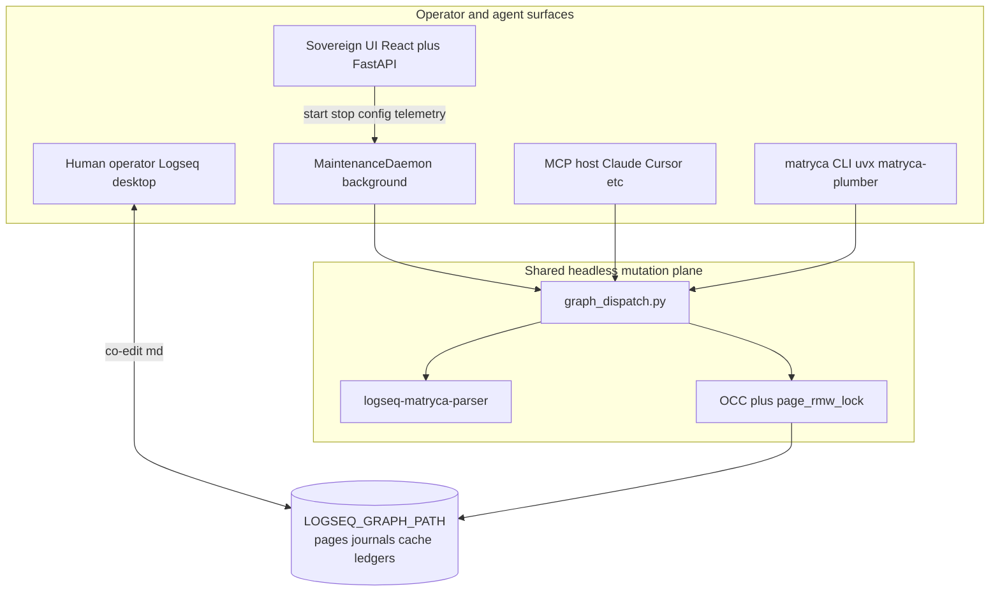

**Quality bar:** **712+** pytest targets passing (70% coverage gate on `src`), **Mypy strict** on `src` and `tests` with **zero `# type: ignore` in `src/`** ([#60](https://github.com/MarcoPorcellato/matryca-plumber/issues/60)), Ruff lint/format clean via `make check`; slow perf tests via `make perf` (`pytest -m slow`).

**v1.8 focus:** Run indefinitely on a **16 GB CPU-only laptop** with **≤10k pages** — KV-cache-aligned prompts, bounded RAM, cooperative bootstrap I/O. See [Edge computing & performance (v1.8)](#edge-computing--performance-v18).

**v1.9 focus:** **Structural graph hygiene** without new LLM cognitive modules — zero-LLM link rot detection, OCC-safe `dead-link::` / `missing-asset::` flags, agent-native CLI (`--json`, `context load`, `read subtree`), and Journey Log visibility in today's journal. See [Structural link verification (v1.9)](#structural-link-verification-v19) and [Agent-centric DX (v1.9)](#agent-centric-dx-v19).

**v1.9.2 focus:** **Agent-zero-friction distribution** — canonical [`llms.txt`](../llms.txt) / [`.well-known/llms.txt`](../.well-known/llms.txt) for external LLM hosts, PyPI `uvx` execution contract, lockfile security refresh (`aiohttp` ≥3.14.0), and Dependabot `uv.lock` auto-sync in CI. See [Agent onboarding (v1.9.2)](#agent-onboarding-v192) and [Release engineering](#release-engineering).

**v1.9.3 focus:** **Live telemetry** for the Sovereign UI — 5s HTTP polling, daemon heartbeat checkpoints under `threading.Lock` + immutable JSON snapshots, API merge of ops-log token totals, `daemon_pid` auto-unfreeze. Spec: [`openspec/live-telemetry-ui.md`](openspec/live-telemetry-ui.md).

**v1.9.4 focus:** **Journey Log consolidation** — one cumulative `- 🤖 Matryca Activity` bullet per calendar day (`DaemonState.journey_day` ledger + `upsert_matryca_activity_block`); idle cycles skip journal writes; legacy `##` sections stripped on first upsert. Spec: [`openspec/agent-dx.md`](openspec/agent-dx.md) §4.

**v1.9.5 focus:** **LLM OS agent contract** — two-tier Gardener vs Cognitive Agent discipline, Master Index **Soft Gate** (Human-in-the-Loop), `read_graph_data` / `bootstrap_status` Phase 1 semaphore, Safe-Sync read/write rules. Spec: [`openspec/llm-os-instructions.md`](openspec/llm-os-instructions.md); cognitive law in [`SYSTEM_PROMPT.md`](../SYSTEM_PROMPT.md) § "LLM OS".

**Unreleased (v1.9.x perfection track):** **Journal Phase-2 bypass** — daily notes under `journals/` receive structural indexing only (AST cache, link registry, OCC `mtime` ledger); semantic LLM indexing and dual embeddings are skipped. **Mypy strictness (#60)** — all `# type: ignore` suppressions removed from `src/`; strict typing via Protocols, `cast()`, and runtime narrowing. See [Journal pages — structural-only indexing](#journal-pages--structural-only-indexing) and [`CONTRIBUTING.md`](../CONTRIBUTING.md#strict-typing-zero-mypy-suppressions-in-src).

---

## Separation of concerns

### 1. Maintenance daemon (Python background engine)

**Entry:** `matryca plumber start` → `src/agent/maintenance_daemon.py`

The daemon polls `pages/` and `journals/` under `LOGSEQ_GRAPH_PATH`, calls a local OpenAI-compatible endpoint (LM Studio, Ollama), and commits structured results through:

- **`graph_dispatch.py`** — headless outline appends via `logseq_matryca_parser.agent_writer.append_child_to_node`
- **Cognitive modules** — `src/agent/plumber_modules/` (env-gated: MARPA, dangling healer, property hygiene, auto-split, …)
- **OCC + `page_rmw_lock`** — lost-update prevention and cross-process serialization per page file

Persistent artifacts at the graph root include `.matryca_daemon_state.json` (checkpoint + AI impact ledger), `.matryca_plumber_daemon.lock` / `.pid`, and `.matryca_semantic_cache/`. **Before** the first harvest or lint cycle, `prepare_matryca_runtime()` (see [Runtime bootstrap](#runtime-bootstrap)) ensures log directories, the sibling `matryca-l1/` folder, cache/templates paths, and an optional seeded `matryca-wiki.yml` exist.

#### Reactive graph stack (daemon)

| Component | Module | Role |
|-----------|--------|------|
| File watcher | `src/daemon/file_watcher.py` | Debounced `watchdog` on `pages/` + `journals/`; wakes duty cycle on external edits |
| AST RAM cache | `src/daemon/ast_cache.py` | `LogseqGraph` full load + per-page `invalidate_and_reload_page` |
| Identity store | `src/daemon/config_layer.py` | Telos / AI Constraints from config page; LLM + MCP injection |
| Post-write hooks | `src/daemon/post_write_hooks.py` | After atomic markdown writes: cache delta, identity refresh, robot git commit |

Spec: [`docs/openspec/identity-config.md`](openspec/identity-config.md).

#### Atomic ingestion (MCP)

| Component | Module | Role |
|-----------|--------|------|
| Ingest pipeline | `src/agent/ingestion.py` | Parse external Markdown via OS temp file; stamp UUIDs; append ingest / `LOG` / `GLOSSARY` |
| MCP surface | `src/agent/mcp_server.py` | `ingest_document(source_name, raw_text)` |

Destination: daily `Ingest/YYYY-MM-DD` or `MATRYCA_INGEST_PAGE`. Parse scratch files **must not** live under `pages/` (avoids `file_watcher` + AST churn). Spec: [`docs/openspec/ingest.md`](openspec/ingest.md).

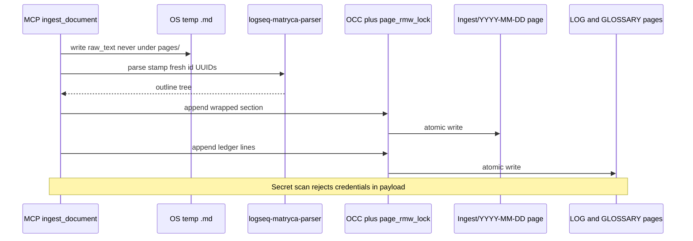

#### Dual embedding (optional MCP semantic search)

| Component | Module | Role |
|-----------|--------|------|
| Block vectors | `src/semantic/store.py` | `block_vectors.json` — `vec_content` + `vec_applicability` per UUID |
| Indexer | `src/semantic/indexer.py` | Daemon sidecar after semantic writes when `MATRYCA_DUAL_EMBEDDING_ENABLED` |
| Retrieval | `src/semantic/search.py` | `search_graph` / `method=semantic` hybrid cosine |

Does not replace BM25 or TF-IDF page clustering. Spec: [`docs/openspec/dual-embedding.md`](openspec/dual-embedding.md).

#### Structural link verification (v1.9)

| Component | Module | Role |
|-----------|--------|------|
| Extract + registry | `src/graph/link_verification.py` | Passive URL/asset harvest → `.matryca_link_registry.json` |
| Verify + flag | same | Async `httpx` HEAD + filesystem checks; OCC property stamps |
| Cycle hook | `MaintenanceDaemon._finalize_link_and_journey_pass` | End-of-cycle batch + Journey Log stats |

Spec: [`docs/openspec/link-verification.md`](openspec/link-verification.md).

#### Agent-centric DX (v1.9)

| Component | Module | Role |
|-----------|--------|------|
| JSON CLI | `src/cli/__init__.py` | Global `--json` stdout envelope |
| Context macro | `src/agent/context_load.py` | `matryca context load` |
| Subtree reads | `src/agent/graph_tool_helpers.py` | `read_subtree_markdown` + MCP `target_type=subtree` |
| Journey Log | `src/agent/journey_log.py` | Upsert one cumulative `- 🤖 Matryca Activity` bullet in today's journal |

Spec: [`docs/openspec/agent-dx.md`](openspec/agent-dx.md).

#### Agent Experience robustness (v1.9.7+)

| Component | Module | Role |
|-----------|--------|------|
| Page input normalizer | `src/agent/page_input_normalizer.py` | Lenient page title resolution at MCP entrypoints (`/` ↔ `___`, casing, traversal guard) |
| Write target resolver | `src/agent/graph_dispatch.py` | `_resolve_write_parent_target` — safe append fallback for invalid block refs |
| Empty-page outline writer | `src/agent/graph_dispatch.py` | `_headless_write_outline_empty_page` — EOF append when page has no blocks |
| Outline validation | `src/agent/outline_models.py` | `heading_level` int→str coercion; strip before disk write |

Spec: [`docs/openspec/agent-ax-robustness.md`](openspec/agent-ax-robustness.md). Tests: `tests/test_agent_experience_robustness.py`.

### 2. Sovereign UI (React + FastAPI control room)

**Entry:** `matryca plumber status` / `matryca plumber ui` → `src/cli/ui_server.py` on `http://127.0.0.1:8500`

These commands start the **control room only** — not the maintenance daemon. Operators launch graph work via **Start Engine** in the UI (`POST /api/daemon/start`) or separately with `matryca plumber start`. Shorthand: `matryca-plumber status` → `plumber status`.

A **monolithic** Uvicorn process serves:

- **REST API** — `/api/state`, `/api/logs`, `/api/config`, daemon control, LM model discovery (SSRF-hardened)
- **Static SPA** — `frontend/dist/` built from Vite; polls on a **5s distributed cycle** via `usePlumberPolling` (`/api/state` every cycle — including a background **5s** poll when `daemon_pid` is live but logs are frozen; `/api/logs` staggered; `/api/graph-analytics` ~every 20s)
- **Zero-Trust auth** — `X-Matryca-Token` on protected routes (`ui_auth.py`)

The UI never becomes a second source of truth: it reads daemon checkpoints and live graph scans; configuration writes go to the repo **`.env`** atomically and are picked up by `reload_plumber_dotenv()` on the next daemon sync cycle.

**Daemon launch (post-v1.9.11):** `POST /api/daemon/start` spawns `plumber start --foreground` in a fresh interpreter (`start_new_session=True`). Success is verified by a **live PID** in `.matryca_plumber_daemon.pid` (`is_plumber_process`), not by the launcher subprocess staying alive. Stale PID files referencing a live non-Plumber process return `foreign_pid`; dead PIDs are removed before retry. The foreground worker publishes its PID immediately after acquiring `.matryca_plumber_daemon.lock`, registers bootstrap `SIGINT`/`SIGTERM` cleanup handlers, and removes PID/lock files on startup failure.

### 3. MCP server sidecar (FastMCP stdio)

**Entry:** `matryca-plumber` with **no** CLI-shaped argv → `src/main.py` (lazy-imported from `plumber_entry.py`)

`register_mcp_tools` exposes five polymorphic mega-tools (`read_graph_data`, `search_graph`, `mutate_graph`, `refactor_blocks`, `run_linter`) plus **`store_fact`** (identity) and **`ingest_document`** (atomic external markdown → ingest page + `LOG`/`GLOSSARY`, parse via OS temp files only). **`guard_mcp_tool`** maps domain errors to LLM-safe strings and appends Telos/Constraints context to successful responses (except `store_fact`); **`mcp_telemetry`** bridges Loguru INFO+ lines to `Context.info` during tool calls.

**Lazy AST bootstrap (v1.9.6+):** MCP `app_lifespan` and the **Sovereign UI** FastAPI lifespan call `prepare_matryca_runtime(..., eager_graph=False)` so stdio handshakes and `:8500` bind in seconds on large vaults. **v1.9.11** extends lazy bootstrap to UI `POST /api/config`, graph-path save, L1 provision, and `POST /api/daemon/start` (spawn only — the child `plumber start` process still loads the AST eagerly). The **maintenance daemon** and agent **`matryca read` / `search` / …** paths remain **eager** (`eager_graph=True`). Deferred surfaces load the AST on the first call to `get_graph_ast_cache().get_graph()` (e.g. MCP graph tools, UI `/api/graph-analytics`); stderr logs `AST cache bootstrap started|complete` with `markdown_files`, `duration_s`, `pages_indexed`. See [`integrations/hermes-agent.md`](integrations/hermes-agent.md).

**Routing fix (`plumber_entry.py`):** the `matryca-plumber` console script inspects `sys.argv`. Known CLI commands (`plumber`, `read`, `search`, shorthand `start`/`status`/…) route to `cli.main` **without** importing FastMCP. Bare invocations (typical MCP host stdio spawn) fall through to `main.main()`. This disentangles **operator CLI stdout** from **MCP JSON-RPC on stdio** — a class of integration bugs that plagued single-entrypoint packages.

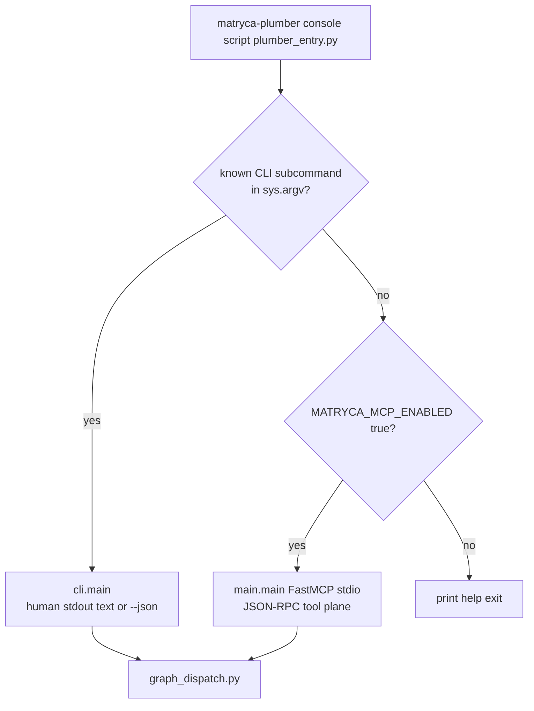

---

## System topology

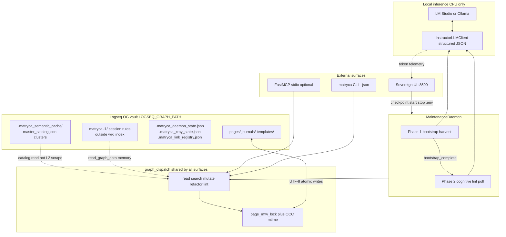

**Invariant:** one **system of record** — `LOGSEQ_GRAPH_PATH`. No auxiliary database, no Logseq Electron dependency, no split-brain HTTP API for background work.

### Daemon lifecycle: Phase 1 → Phase 2

The maintenance daemon enforces **strict phase separation**. Phase 2 cognitive lint and cluster scheduling stay disabled until bootstrap harvest completes and `bootstrap_complete` is persisted.

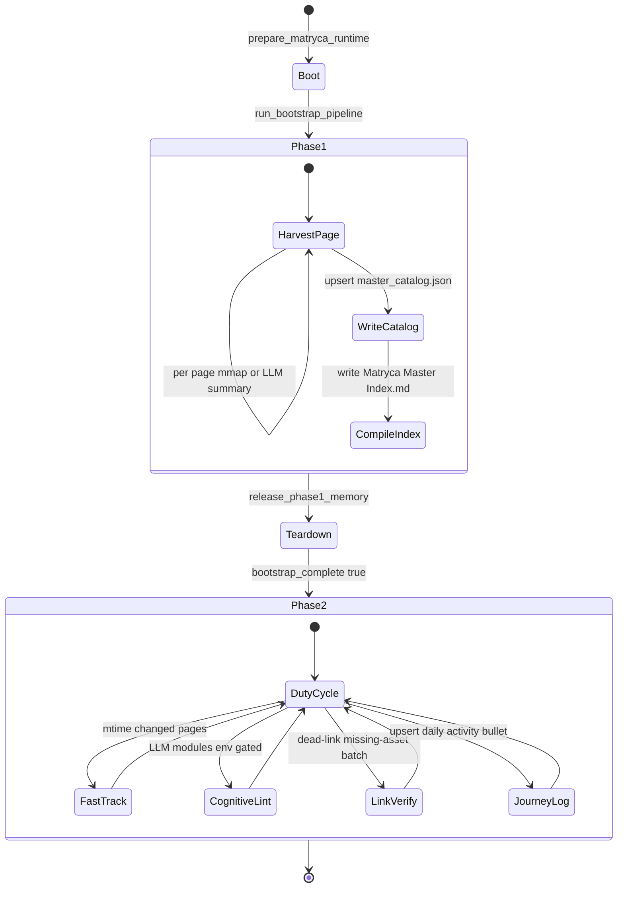

### Journal pages — structural-only indexing

Daily fleeting notes live under **`journals/`** (Logseq daily pages). The daemon and Journey Log mutate these files frequently; running full Phase-2 cognitive lint and semantic embeddings on every journal edit wastes local LLM tokens and GPU prefill time without improving long-horizon knowledge structure.

| Path | Phase-1 (structural) | Phase-2 (semantic / LLM) |
|------|----------------------|---------------------------|
| **`pages/**/*.md`** | Bootstrap catalog, fast-track structural checks, AST cache on watchdog events | Cognitive lint modules, `index_page`, semantic index append, optional dual embeddings |
| **`journals/**/*.md`** | `_settle_journal_structural_cycle_file`: read content, merge link registry, `get_graph_ast_cache().apply_file_event`, persist `FileState` with current `mtime` | **Skipped** — no `run_cognitive_lint_pipeline`, `index_page`, `apply_semantic_page_result`, or `run_dual_embedding_after_semantic_write` |

**Detection:** `is_journal_page_path(graph_root, page_path)` — first path segment under the graph root is `journals` (`src/agent/plumber_modules/_shared.py`).

**Queue semantics:** `page_needs_phase2_cognitive` returns `true` only while a journal lacks a matching ledger entry or `mtime` drift (structural settle pending). Once settled, journals never re-enter the semantic queue. `compute_phase2_progress_metrics` excludes `journals/` from the Phase-2 vault denominator.

**Preserved:** File watcher AST refresh on external edits; Journey Log upsert still uses `page_rmw_lock` + OCC on today's journal; link verification batch pass unchanged.

Spec detail: [`openspec/llm-performance.md`](openspec/llm-performance.md#journal-pages--phase-2-semantic-bypass).

---

## Headless mutation plane (shared by all surfaces)

### Parser-backed spatial truth

**[logseq-matryca-parser](https://github.com/MarcoPorcellato/logseq-matryca-parser)** (`>=1.1.1`) owns block hierarchy, indentation, and `id::` semantics. **`src/rag/matryca_hooks.py`** adapts `read_logseq_page` for agent consumption.

Disk mutators that perform line surgery (`property_line_edit`, `tag_unify`, `reparent_blocks`, …) combine:

- **`global_fence_scanner.py`** — dead zones (fenced code, HTML comments, Advanced Query blocks)
- **`mldoc_properties.py` / `mldoc_guards.py`** — Logseq-aligned property grammar
- **`path_sandbox.py`** — `is_relative_to(graph_root)` before every read/write
- **`atomic_write_bytes`** — `mkstemp` → write → `fsync` → `os.replace` (+ optional `((uuid))` pre-flight in `logseq_uuid.py`)

### Logseq AST parity (non-negotiable)

| Rule | On-disk shape | Module |
|------|---------------|--------|
| **Page properties** | Raw `key:: value` at **line 0 region**, no `- ` bullet; blank line before first bullet | `page_properties.py` |
| **Block properties** | `id::`, `matryca-plumber::`, … at **+2 spaces** under parent bullet, before children | `mldoc_properties.py`, `property_line_edit.py` |
| **Identity vs metadata** | `id::` is the block UUID anchor — **not** a mutable `key::` target for property hygiene or regex property tools (`parse_logseq_property_line` excludes normalized key `id`) | `mldoc_properties.py` |
| **Namespaces** | Semantic `Domain/Topic` → `Domain___Topic.md` + percent-encoding | `page_path.py` |
| **Authorship** | `made-by:: matryca plumber v{version}` in frontmatter | `stamp_plumber_authored_page()` |

Third-party tools that treat pages as flat CommonMark routinely corrupt Logseq indexes; Plumber’s write paths preserve the outliner contract end-to-end.

### Safe-Sync data paths (v1.9.5)

Tier-2 agents and operators share one contract: **read Markdown through Plumber tools**, **write through atomic mutators**, **never touch Logseq’s internal app database**.

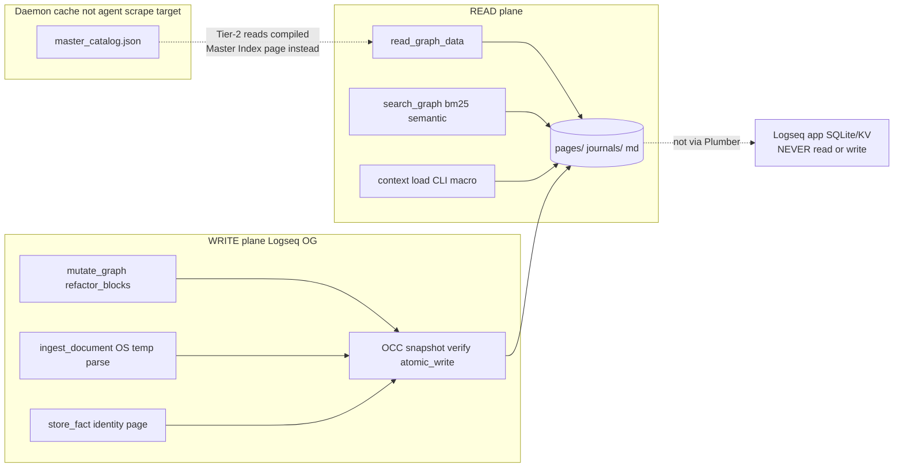

---

## Optimistic concurrency control (OCC)

Local LLM inference is **slow** (seconds to minutes). Logseq users keep editing during that window. OCC prevents **silent overwrites** of human edits without replacing the need for **RMW locks** (which prevent torn writes between concurrent writers).

### Two-layer concurrency model

| Layer | Mechanism | Prevents |
|-------|-----------|----------|
| **Serialization** | `page_rmw_lock(path)` — in-process `threading.Lock` registry + cross-process `fcntl.flock` sidecar | Torn interleaved RMW from daemon + MCP + second daemon |
| **Lost-update detection** | `baseline_mtime` via `st_mtime` — snapshot → work → verify → atomic commit | Stale LLM output overwriting fresher human bytes |

### OCC lifecycle (canonical order)

1. **`occ_snapshot(page_path)`** — capture `baseline_mtime` **before** reading content or calling the LLM (Phase 1).
2. **Inference / payload assembly** — human may edit in Logseq; `st_mtime` advances.
3. **`occ_verify_before_write(path, baseline_mtime)`** — fast reject **before** acquiring `page_rmw_lock` when already stale.
4. **`with page_rmw_lock(path):`** — enter exclusive RMW scope.
5. **Re-read** page bytes; **`file_mtime_drifted()`** again inside the lock.
6. **`atomic_write_bytes_if_unchanged(..., baseline_mtime=...)`** — final mtime check immediately before `os.replace`; abort with `write_aborted` if conflict.

Cognitive modules (`apply_semantic_page_result`, `property_hygiene`, `auto_split`, `append_page_alias_line`, …) thread `baseline_mtime` through this gate. After Plumber’s **own** intermediate write in the same request, callers may **`OCCSnapshot.refresh_after_own_write()`** to re-baseline multi-step edits.

**Phase 2 daemon (`_process_llm_cycle_file`):** For **`pages/`** only (not `journals/`), the maintenance daemon does **not** hold `page_rmw_lock` during cognitive lint or `index_page` LLM inference. It snapshots mtime, reads content, runs modules and the LLM (each cognitive write acquires its own short lock scope), re-checks drift, then commits only inside **`apply_semantic_page_result`** — matching the sequence diagram below. Journal paths delegate to `_settle_journal_structural_cycle_file` before any LLM work. Holding the page lock across multi-minute inference would block Logseq saves and other writers without adding OCC value.

**Semantic index prompts:** `_enumerate_blocks_for_prompt` caps the block UUID catalog at **8000 characters** (aligned with the page body cap in `_build_index_prompt`) so block-rich pages cannot blow the local context window; truncated catalogs include an explicit omission note for the model.

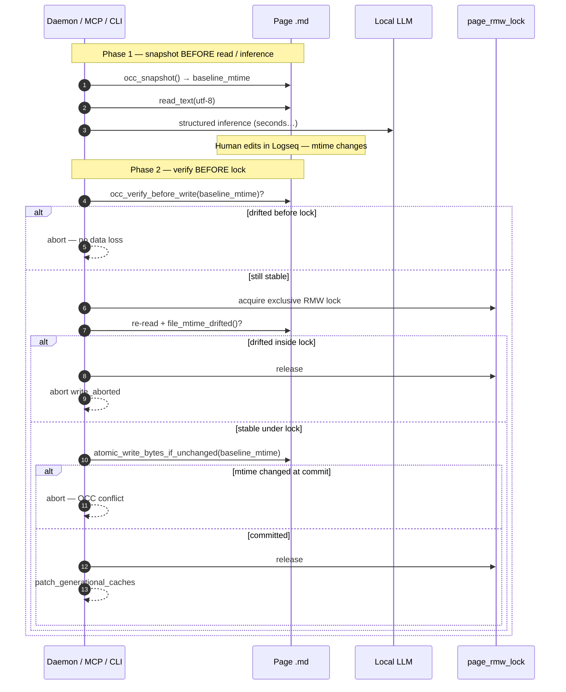

**Complement, not duplicate:** `fcntl.flock` stops two writers from corrupting the same file mid-splice; OCC stops one writer from promoting a payload computed on obsolete bytes.

---

## Trust & Safety levels

Operators control invasiveness from the Sovereign UI **Settings drawer** (`SettingsDrawer.tsx`). Toggles map to `MATRYCA_LINT_*` / `MATRYCA_PLUMBER_*` keys in `.env`; `reload_plumber_dotenv()` applies them on the next daemon `_sync_runtime_config()` without restart.

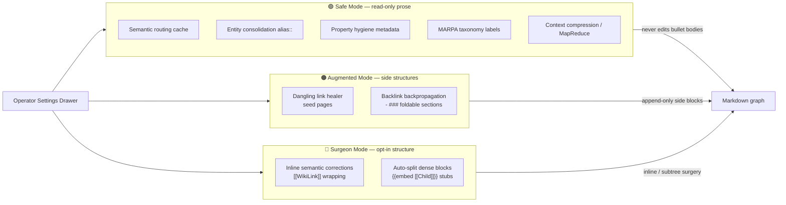

| Tier | Risk | Prose impact |
|------|------|----------------|
| **Safe Mode** | Lowest | Metadata, indexes, `alias::`, routing cache — **no inline bullet rewrites** |
| **Augmented Mode** | Medium | New foldable `- ###` sections and isolated seed pages; original bullets preserved |
| **Surgeon Mode** | Highest | Inline wikilink corrections and embed-based subtree extraction — **strictly opt-in** |

---

## Runtime bootstrap

Every Matryca Plumber surface calls **`prepare_matryca_runtime()`** in `src/utils/runtime_bootstrap.py` after environment load and **before** graph processing. The helper is idempotent. **`eager_graph=True`** (default) loads the AST index immediately — **daemon**, **`matryca read` / `search` / …** via `cli.main`. **`eager_graph=False`** — **MCP stdio** and **Sovereign UI** (lifespan plus config/save/start/L1 API, v1.9.11) — defers `LogseqGraph.load_directory` until the first graph read in that process.

| Provisioned at startup | Location | Motivation |
|------------------------|----------|------------|
| Ops + app log parent dirs | `MATRYCA_*_LOG_PATH` or repo `logs/` | First JSONL / Loguru write must not fail on missing folders |
| L1 memory | Default: `<parent-of-vault>/matryca-l1/` | Session rules outside L2 wiki index; shareable across vaults ([`docs/openspec/l1-l2-routing.md`](openspec/l1-l2-routing.md)) |
| Semantic cache dir | `<vault>/.matryca_semantic_cache/` | `master_catalog.json`, `backlink_counts.json`, `semantic_clusters.json`, per-inference `*.json`; excluded from `pages/` scans |
| Templates dir | `<vault>/templates/` (or YAML `templates_subdir`) | `read_logseq_template` |
| Wiki orchestration | `<vault>/matryca-wiki.yml` | Seeded from `matryca-wiki.example.yml` when missing |
| AST + identity RAM | `get_graph_ast_cache`, `get_identity_store` | **Eager:** daemon + agent CLI. **Lazy:** MCP + Sovereign UI — on first `get_graph()` (identity loads with first graph access) |

**Not** created at bootstrap: repo `.env`, `pages/` / `journals/` (vault must already be valid), identity config page (operator-created or seeded by `store_fact`), ingest / `LOG` / `GLOSSARY` pages (first `ingest_document`), daemon/X-Ray JSON ledgers, PID/lock files — those follow first-use or first-checkpoint semantics.

Full behavioral spec: [`docs/openspec/runtime-bootstrap.md`](openspec/runtime-bootstrap.md). Identity page format: [`docs/openspec/identity-config.md`](openspec/identity-config.md).

---

## Sandboxing and safety

### Strict AST parity and Line-0 frontmatter preservation

All page-level metadata mutations route through **`page_properties.py`**, which computes the **frontmatter span** at the top of the file and injects raw `key:: value` lines **without** promoting them to bullets. Block-level surgery uses **`property_line_edit.py`** scoped to subtrees anchored at `id::`, intersecting **`compute_page_protected_line_indices`** so fenced code and query blocks are never touched. Property-line matchers (`is_logseq_block_property_line` / `parse_logseq_property_line`) **exclude** `id::` so hygiene and MCP regex tools never treat Logseq UUID lines as editable metadata keys.

The adapter and writer stack delegate tree shape to **`logseq-matryca-parser`**; Matryca Plumber does not maintain a competing full-file Markdown AST.

### Atomic `.env` writes (Sovereign UI)

Settings persistence uses **`_atomic_write_text`** in `ui_server.py`: `mkstemp` beside the target → UTF-8 write → `flush` + `fsync` → `os.replace`. Partial writes cannot leave the Plumber configuration torn while the React drawer saves thermal delays, lint flags, or `LOGSEQ_GRAPH_PATH`.

### Page-lock registry with LRU eviction

**`page_write_lock.py`** keeps an in-process `OrderedDict` of `threading.Lock` instances keyed by normalized absolute paths (cap **`_MAX_PAGE_LOCK_REGISTRY = 4096`**). When the cap is reached, **unlocked** entries are evicted LRU-style instead of clearing the entire registry — preserving hot-path lock stability on large vaults without unbounded memory growth.

Cross-process exclusivity uses a `.matryca.lock` sidecar with retried non-blocking `flock`. **`MATRYCA_ALLOW_FLOCK_DEGRADATION=true`** permits thread-only locking on iCloud/Dropbox filesystems that reject `flock` (at operator risk). **`PageLockUnavailableError`** causes the daemon to **skip** the file without marking it processed — no false success, no torn write.

### Thread-safe Loguru → MCP logging bridge

**Problem:** Loguru’s `enqueue=True` sink runs on a worker thread and **pickles** log records. Embedding live FastMCP `Context` objects in `record["extra"]` caused multiprocessing/pickling failures and flaky telemetry.

**Solution (`mcp_telemetry.py`):**

1. On the emitting thread, stamp **`record["extra"]["matryca_mcp_session"] = id(ctx)`** — an integer key only.
2. Store **`(ctx, event_loop)`** in module-level **`_mcp_sessions[id(ctx)]`** for the tool call duration (`mcp_tool_session` context manager).
3. The sink resolves the session, sanitizes the message (`sanitize_log_message`), and schedules `ctx.info` on the correct loop via `call_soon_threadsafe`.
4. Tests await **`await logger.complete()`** instead of brittle `sleep` polling — deterministic drain of the async queue under `pytest-asyncio`.

Unless **`MATRYCA_DEBUG=true`**, UUIDs and payload-like markers are redacted before MCP clients display logs.

### Additional hardening (summary)

| Concern | Implementation |
|---------|----------------|
| Path traversal | `path_sandbox.assert_path_within_graph` |
| Graph UTF-8 reads | `read_graph_file_text()` — CI `sandbox-read-check` blocks raw `Path.read_text()` in graph/agent/rag (v1.9.9) |
| Bounded JSON sidecars | `read_bounded_json()` + `MATRYCA_JSON_MAX_BYTES` on catalog/registry/daemon/cache loaders (v1.9.9) |
| Link registry tamper | `link_verification` validates registry `page_relpath` and asset refs before read (v1.9.9) |
| LLM debug NDJSON | `agent_debug_log` path allowlist + secret redaction when `MATRYCA_LLM_DEBUG_*` enabled (v1.9.9) |
| Credential leakage into graph | `quality_gate.outline_security_violations` |
| L1 rules path escape | `l1_memory.py` — reads only under `$HOME` or temp; `README.md` excluded from LLM payload |
| Startup filesystem | `runtime_bootstrap.py` — logs, L1, cache, templates, optional `matryca-wiki.yml` before harvest |
| LLM egress / SSRF | `utils/llm_url_policy.validate_llm_proxy_url` — UI **and** daemon |
| UI graph path hijack | `validate_logseq_graph_path_for_config` + `config_paths.graph_config_allowed_roots` |
| UI loopback exfiltration | SSRF on `/api/lm-models` + `POST /api/config`; `X-Matryca-Token` gate |
| UI abuse / probing | Split rate limits (`MATRYCA_UI_RATE_LIMIT_*`); session route loopback-only |
| MCP stdio exposure | `MATRYCA_MCP_ENABLED` gate in `plumber_entry.py` (default off) |
| MCP error leakage | `mcp_tool_guard._public_tool_error_message` unless `MATRYCA_DEBUG` |
| Daemon exclusivity | `.matryca_plumber_daemon.lock` (POSIX flock / Windows `msvcrt`); PID sidecar published at lock acquisition; CI `# sandbox-read-ok` allowlist for pid/lock reads only |
| Ledger durability | `save_daemon_state` tmp + fsync + replace + `.bak` + `json_flock` |

---

## Sovereign UI and telemetry (condensed)

**Live control room (v1.9.3):**

| Layer | Contract |
|-------|----------|
| Daemon | `MATRYCA_TELEMETRY_HEARTBEAT_SECONDS` (default 5) — `_telemetry_heartbeat_scope` during `index_page`, idle sleep between cycles |
| Checkpoint | `save_daemon_state` after immutable snapshot under `_telemetry_lock` |
| API | `GET /api/state` — `max(checkpoint, ops_log)` token totals + `daemon_pid` |
| UI | `POLL_CYCLE_MS = 5000`; auto-unfreeze on PID / `running` / `idle` |

Spec: [`openspec/live-telemetry-ui.md`](openspec/live-telemetry-ui.md).

**Dynamic Human vs Agent metrics** (`graph_analytics.py`):

$$\text{Human} = \max(0,\ \text{Scanned absolute} - \text{AI impact})$$

- **Pages:** live scan minus pages with `made-by:: matryca plumber v*` frontmatter.
- **Links:** absolute wikilink count minus `ai_links_injected` from `.matryca_daemon_state.json`.

No telemetry database — the vault **is** the audit trail.

**Context Acceleration Shield** (TRIZ-driven): `llm_context_payload.py` substitutes Phase 1 summaries for megabyte pages; `prompt_layout.py` places stable content before dynamic task tails so llama.cpp KV-cache prefixes reuse across consecutive lint operations on the same file.

---

## Edge computing & performance (v1.8)

**Goal:** The maintenance daemon must remain **responsive to the host OS** while harvesting and linting vaults up to **~10,000** pages on **16 GB RAM** without a discrete GPU.

**Non-goal:** New cognitive capabilities, clustering algorithms, or Logseq semantic changes.

### Prompt stack (Zero-Prefill)

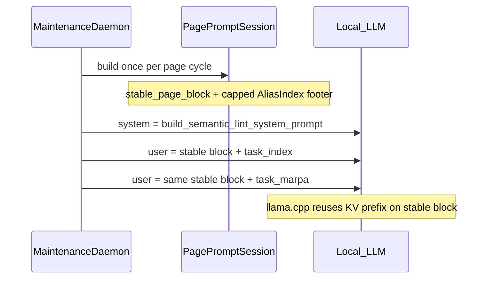

| Layer | Module | Contract |
|-------|--------|----------|
| System (stable) | `semantic_lint_prompts.py` | Compiler rules only — **no** per-page alias map |
| Stable user prefix | `page_prompt_session.py` | One block per file from `prepare_llm_context_payload` + optional alias footer |
| Task tail | `prompt_layout.py` | `build_cache_aligned_prompt` — content first, task last |
| Stateless turns | `InstructorLLMClient` | Per-page calls use `stateless=True` (`index_page`, bootstrap harvest, `generate_graph_insights`, …); cluster history optional via `MATRYCA_LLM_CLUSTER_HISTORY` |
| Compression hygiene | `context_compressor.py`, `llm_client.py` | Ermes history condensation prose is `sanitize_prose_llm_completion()` before append/persist |

Bootstrap **Phase 1** and **MapReduce** harvest paths use the same layout (fixing the pre-v1.8 bootstrap prompt that placed page text after the task).

### Memory governance

| Structure | v1.8 policy |
|-----------|-------------|
| **BM25 corpus** | Postings-lite `doc_term_freqs` (not full token lists); `release_bm25_corpus()` after Phase 1; `MATRYCA_BM25_MODE=ondemand` optional |
| **Semantic cache RAM** | LRU cap (`MATRYCA_SEMANTIC_CACHE_MEMORY_ENTRIES`); TTL purge **skips** `master_catalog.json`, `backlink_counts.json`, `semantic_clusters.json` |
| **Master catalog** | `unload_master_catalog()` during `release_phase1_memory()` |
| **Telemetry** | `memory_budget.snapshot()` — RSS vs `MATRYCA_RAM_BUDGET_MB` |

After Phase 1 completes, `run_bootstrap_pipeline` calls `release_phase1_memory()` (generational cache clear, BM25 release, semantic RAM trim, catalog unload, `gc.collect()`), precomputes semantic clusters, then Phase 2 polling continues.

### Software edge (KV integrity, adaptive LLM, mmap)

| Mechanism | Module | Contract |
|-----------|--------|----------|
| **Frozen KV prefix** | `page_prompt_session.py`, `prompt_layout.py` | `FrozenPromptPrefix` + SHA-256 `verify_unchanged()`; ops JSONL `kv_prefix_hash` |
| **Adaptive structured output** | `llm_client.py` | `probe_backend()` → Path A (strict `json_schema`) or Path B (3-try self-correction); `StructuredOutputExhaustedError` on failure |
| **Resilient JSON (TRIZ)** | `json_repair.py`, `llm_client.py` | `max_tokens` cap + first-delimiter balanced extract + string-aware trailing trim + stack-ordered bracket close + Gemma tail sanitizer — see [`resilience-llm-json-triz.md`](resilience-llm-json-triz.md) |
| **mmap Phase 1 reads** | `markdown_io.py`, `master_catalog.py` | `mmap_graph_page()` + `extract_catalog_fields_from_mmap()` when `MATRYCA_GRAPH_READ_MMAP=true` |
| **CPU sandbox** | `process_priority.py` | `apply_cpu_sandbox()` — affinity + idle I/O when `MATRYCA_CPU_SANDBOX=true` and `psutil` installed (`[edge]` extra) |

Detail: [`v1.8-SOFTWARE-EDGE-PLAN.md`](v1.8-SOFTWARE-EDGE-PLAN.md).

### Cooperative I/O

| Mechanism | When | Typical sleep |
|-----------|------|----------------|
| `cooperative_yield.yield_host()` | Every `MATRYCA_BOOTSTRAP_YIELD_EVERY` files during `run_bootstrap_harvest` | `MATRYCA_YIELD_SLEEP_MS` (often 0) |
| `io_batch_pause_seconds()` | Non-LLM harvest steps | ~2 ms (`MATRYCA_BOOTSTRAP_IO_BATCH_PAUSE_MS`) — **not** thermal |
| `load_incoming_backlinks()` | Bootstrap / cache patch | Disk read of `backlink_counts.json` |
| `apply_cpu_sandbox()` / `apply_plumber_priority()` | Daemon foreground start | `nice(19)` + optional ionice |
| **Thermal pauses** | After each bootstrap / cognitive **LLM** turn | ≥ 1 s (`MATRYCA_THERMAL_DELAY_*`) |

Tests that assert thermal behavior filter `time.sleep` with `s >= 1.0` so micro-yields are not false positives.

Full operator and env reference: [`openspec/llm-performance.md`](openspec/llm-performance.md), [`v1.8-OPTIMIZATION-PLAN.md`](v1.8-OPTIMIZATION-PLAN.md).

---

## Structural link verification (v1.9)

**Goal:** Surface **knowledge rot** (dead URLs, missing assets) without LLM cost or blocking the duty-cycle event loop.

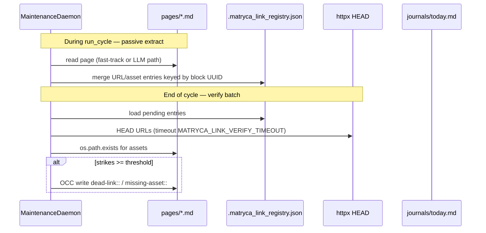

| Property | Meaning |
|----------|---------|
| `dead-link:: true` | External URL failed HEAD or returned ≥400 |
| `missing-asset:: true` | Resolved asset path not on disk |

**Not created at bootstrap:** the registry file appears on first extract. It is **not** indexed as graph content.

---

## Agent-centric DX (v1.9)

**Goal:** Make the headless daemon and CLI **legible to external LLM hosts** while preserving the single `graph_dispatch` mutation plane.

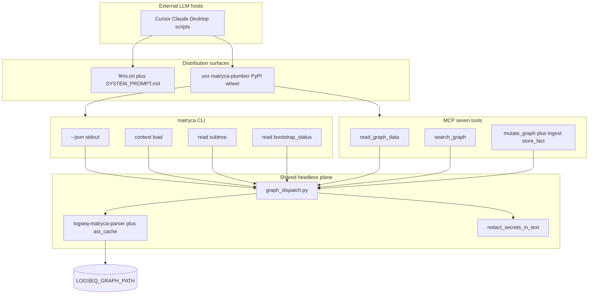

**Journey Log** closes the operator feedback loop: after each active duty cycle, the daemon upserts **one** top-level bullet in `journals/YYYY_MM_DD.md`:

```markdown
- 🤖 Matryca Activity — indexed 12 page(s); checked 340 link(s); flagged 2 block(s); 47 duty cycle(s)
```

Daily totals live in `DaemonState.journey_day` (`JourneyDayLedger`); the journal line is rewritten in place under `page_rmw_lock`. Idle cycles with no metrics skip the write. Legacy per-cycle `## 🤖 Matryca Activity` sections on today's file are removed on first upsert. Inspired by LogseqBrain-style journal auditing; spec in [`openspec/agent-dx.md`](openspec/agent-dx.md) §4.

---

## Agent onboarding (v1.9.2)

**Goal:** Give autonomous agents a **single, versioned instruction surface** that matches the shipped PyPI wheel — without requiring a git checkout.

| Artifact | Role |
|----------|------|
| [`llms.txt`](../llms.txt) | Repo-root agent guide; linked from README agent callout |
| [`.well-known/llms.txt`](../.well-known/llms.txt) | Canonical path for tools that resolve `.well-known/llms.txt` |
| [`openspec/agent-onboarding.md`](openspec/agent-onboarding.md) | Maintainer contract: discovery paths, anti-patterns, sync checklist |

**Execution rules encoded in `llms.txt`:**

1. Set **`LOGSEQ_GRAPH_PATH`** (no `--graph` flag).
2. Run **`uvx matryca-plumber`** — never `git clone` + editable install unless the user explicitly develops from source.
3. Prefer **`--json`** for structured stdout; CLI applies `redact_secrets_in_text` before emission.
4. Use **`read` / `search` / `context load`** (or MCP on the same `graph_dispatch` plane) — never scrape `pages/*.md` by hand.

When CLI surface changes, update both `llms.txt` files in the same PR and ship a patch release so `uvx` consumers receive accurate commands.

---

## LLM OS agent contract (v1.9.5)

**Goal:** Give Tier-2 MCP/CLI agents a **deterministic Phase 1 gate** and explicit two-tier boundaries — without scraping raw files or impersonating the Gardener daemon.

| Component | Module / artifact | Role |
|-----------|-------------------|------|
| Cognitive law | [`SYSTEM_PROMPT.md`](../SYSTEM_PROMPT.md) § "LLM OS" | Soft Gate, Safe-Sync, tool sequence |
| Distribution pointer | [`llms.txt`](../llms.txt) §6 | PyPI hosts → full contract |
| Maintainer spec | [`openspec/llm-os-instructions.md`](openspec/llm-os-instructions.md) | Single source + v2.0 SQLite migration trigger |
| Phase 1 semaphore | `src/graph/bootstrap_status.py` | `read_graph_data` / `bootstrap_status` and CLI `read bootstrap_status` |
| L1 overlay | `matryca-l1/llm-os-rules.md` | Operator session rules (loaded via `read_graph_data` / `memory`) |

**Tier-2 session open (encoded in prompts):** `memory` → `bootstrap_status` → `Matryca Master Index` (page) → narrow reads. If `soft_gate_active`, pause and offer Local Daemon / Blind Search / Cloud Indexing; wait for explicit authorization before blind `bm25`.

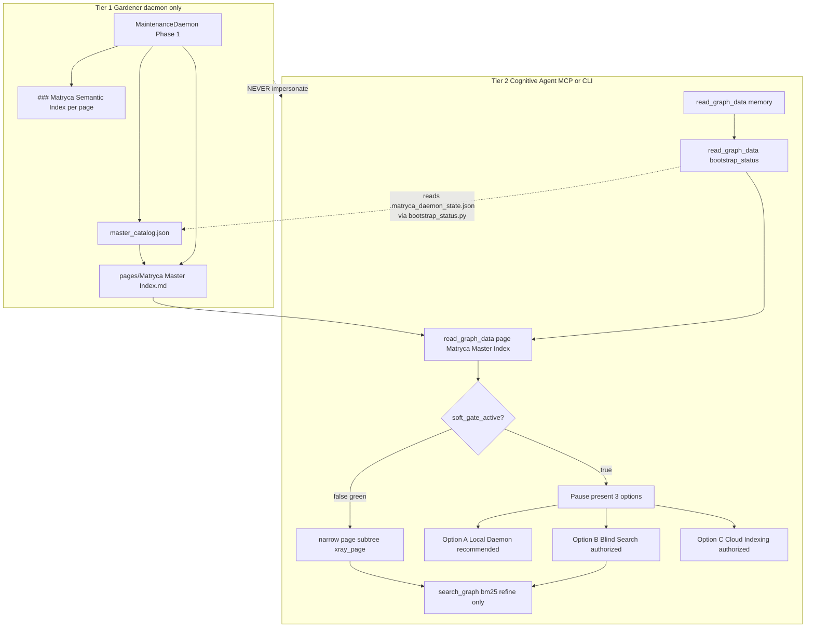

### `bootstrap_status` semaphore

`src/graph/bootstrap_status.py` merges daemon checkpoint fields with `is_bootstrap_catalog_complete()` so Tier-2 agents do not infer Phase 1 state from index existence alone.

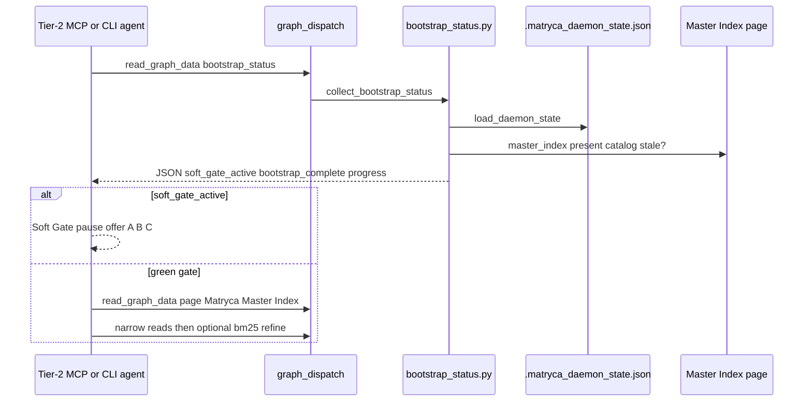

---

## Release engineering

| Workflow | Trigger | Purpose |
|----------|---------|---------|
| [`.github/workflows/release.yml`](../.github/workflows/release.yml) | Tag push `v*` | Build frontend + wheel, GitHub Release notes from `CHANGELOG.md`, PyPI publish |
| [`.github/workflows/dependabot-uv-fix.yml`](../.github/workflows/dependabot-uv-fix.yml) | Dependabot PR open/sync | Runs `uv lock` on the PR branch and commits lockfile fixes so CI stays green |

Release notes are extracted with [`scripts/extract_changelog.py`](../scripts/extract_changelog.py) — do not rely on GitHub auto-generated commit summaries. See [`RELEASE_PROCESS.md`](RELEASE_PROCESS.md).

---

## Distribution and entry points

### Zero-install and global install

```bash
uvx --from matryca-plumber matryca-plumber status   # CLI shorthand → plumber status
uv tool install matryca-plumber                      # matryca-plumber on PATH
```

Console scripts (`pyproject.toml`):

| Script | Target | Role |
|--------|--------|------|
| `matryca-plumber` | `plumber_entry:main` | CLI/MCP router |
| `matryca` | `cli:main` | Full `matryca` command tree |
| `matryca-logseq-llm-wiki` | `main:main` | Legacy MCP-only alias |

Background service: `matryca service install` → LaunchAgent / systemd user unit pointing at a **stable** `matryca-plumber` binary (not ephemeral `uvx` cache paths).

### Key modules

| Path | Role |
|------|------|
| `src/plumber_entry.py` | CLI vs MCP stdio disambiguation |
| `src/agent/maintenance_daemon.py` | Autonomous poll loop, ledger, detached spawn |
| `src/agent/page_prompt_session.py` | Per-page stable LLM prefix (v1.8 KV reuse) |
| `src/agent/semantic_lint_prompts.py` | Stable semantic-index system prompt |
| `src/agent/memory_budget.py` | RSS snapshots, Phase 1 memory teardown |
| `src/agent/cooperative_yield.py` | Bootstrap / scan cooperative scheduling |
| `src/agent/llm_client.py` | Adaptive structured output, `InstructorLLMClient`, backend probe |
| `src/agent/process_priority.py` | `apply_cpu_sandbox()`, `nice` / optional ionice |
| `src/graph/backlink_index.py` | Persisted incoming wikilink counts |
| `src/graph/markdown_io.py` | mmap graph page reads (Phase 1 catalog path) |
| `src/cli/ui_server.py` | FastAPI monolith + static SPA + daemon control |
| `src/cli/ui_auth.py` | Bearer token resolution and verification |
| `src/agent/graph_dispatch.py` | Headless writes, OCC-aware block resolution |
| `src/graph/page_write_lock.py` | Per-page RMW lock + LRU registry |
| `src/graph/markdown_blocks.py` | `atomic_write_bytes*`, OCC helpers |
| `src/agent/mcp_server.py` | `@mcp.tool()` handlers |
| `src/agent/ingestion.py` | `ingest_document` / `process_ingestion` |
| `src/agent/memory_tools.py` | `store_fact` |
| `src/graph/link_verification.py` | Link rot registry, async verify, hygiene properties |
| `src/agent/journey_log.py` | Journey Log ledger + upsert of cumulative daily activity bullet |
| `src/agent/context_load.py` | `context load` semantic macro |
| `src/semantic/` | Dual block embeddings + hybrid semantic search |
| `src/agent/mcp_telemetry.py` | Loguru bridge, `id(ctx)` session map |
| `src/agent/mcp_tool_guard.py` | Tool error boundary (sanitized client messages) |
| `src/utils/llm_url_policy.py` | Shared SSRF policy for inference base URLs |
| `src/utils/config_paths.py` | Graph/log path allowlists for config writes |
| `src/graph/path_sandbox.py` | Graph-root confinement |
| `src/graph/graph_path_validate.py` | `pages/` validation + config allowlist wrapper |
| `frontend/` | Sovereign UI React sources → `frontend/dist/` |

---

## Phase evolution (mental map)

| Phase | Milestone | Architectural outcome |
|:-----:|-----------|------------------------|
| **1–3** | Headless plane + optional MCP | Parser-backed reads; DFS `write_logseq_outline`; BM25 local query |
| **7–8** | Mldoc + Ironclad Shield | Fence scanner, atomic writes, generational cache |
| **12** | Headless Revolution (v1.4) | Removed Logseq HTTP client; `graph_dispatch` only |
| **14** | Matryca Plumber OS | `MaintenanceDaemon`, Louvain GraphRAG, React cockpit |
| **15** | Logseq-native parity | Namespace encoding, OCC, frontmatter discipline, Trust UI |
| **16** | Enterprise Ironclad | Zero-Trust UI, subprocess daemon, SSRF guards, cross-platform lock |
| **1.5.15** | Ironclad consolidation | `plumber_entry` routing, MCP log bridge pickling fix, OCC ordering, atomic `.env`, UI launch validation, LRU page locks |
| **1.5.17** | Security depth pass | Shared LLM SSRF, graph path allowlist, MCP gate, split UI rate limits, **453** tests |
| **1.7.x** | Zero-Touch onboarding | Sovereign UI pre-flight, decoupled UI state, lock-before-LLM |
| **1.8** | Edge computing & performance | PagePromptSession, adaptive `llm_client`, mmap reads, CPU sandbox, backlink index, BM25 slimming, cooperative harvest, memory teardown |
| **1.8 round 4** | Pre-release audit | Stateless graph insights, compression persist sanitize, 8k block catalog, Phase 2 lock-on-write-only, `id::` excluded from property matchers |
| **1.9** | Structural graph hygiene | Link verification sidecar, Journey Log, CLI `--json`, `context load`, `read subtree` |
| **1.9.9** | Security & Sandbox | `read_graph_file_text()` migration, bounded JSON, link-registry validation, CI `sandbox-read-check`, debug-log allowlist |
| **Unreleased** | Master RFC Phases 1–3 | Identity + ingest + optional dual embedding (`docs/openspec/identity-config.md`, `ingest.md`, `dual-embedding.md`) |

---

## Related reading

- [`PROJECT_DIARY.md`](PROJECT_DIARY.md) — chronological decisions and release notes
- [`resilience-llm-json-triz.md`](resilience-llm-json-triz.md) — TRIZ / local LLM JSON resilience (Gemma tail, compression hygiene, audit table)
- [`v1.8-OPTIMIZATION-PLAN.md`](v1.8-OPTIMIZATION-PLAN.md) — v1.8 scope, env vars, verification
- [`v1.8-SOFTWARE-EDGE-PLAN.md`](v1.8-SOFTWARE-EDGE-PLAN.md) — CPU sandbox, frozen prefix, adaptive LLM, mmap
- [`openspec/llm-performance.md`](openspec/llm-performance.md) — LLM performance engineering contract
- [`openspec/identity-config.md`](openspec/identity-config.md) — Telos / AI Constraints and `store_fact`
- [`openspec/ingest.md`](openspec/ingest.md) — atomic `ingest_document` pipeline
- [`openspec/link-verification.md`](openspec/link-verification.md) — URL/asset hygiene (v1.9)
- [`openspec/security-sandbox.md`](openspec/security-sandbox.md) — path sandbox, bounded JSON, CI read gate (v1.9.9)
- [`openspec/agent-dx.md`](openspec/agent-dx.md) — CLI JSON, context macro, Journey Log (v1.9)
- [`openspec/agent-onboarding.md`](openspec/agent-onboarding.md) — `llms.txt` / PyPI `uvx` agent contract (v1.9.2)
- [`openspec/llm-os-instructions.md`](openspec/llm-os-instructions.md) — two-tier LLM OS, Soft Gate, `bootstrap_status` (v1.9.5)
- [`openspec/live-telemetry-ui.md`](openspec/live-telemetry-ui.md) — Sovereign UI live telemetry (v1.9.3)
- [`../llms.txt`](../llms.txt) — agent execution guide (mirrored under `.well-known/`)
- [`SYSTEM_PROMPT.md`](../SYSTEM_PROMPT.md) — agent OCC and persist-first `id::` policy
- [`../README.md`](../README.md) — operator quick start
- [`../CONTRIBUTING.md`](../CONTRIBUTING.md) — `make check`, dev setup
- [`roadmaps/`](roadmaps/) — phased delivery checklists
- [`../SECURITY.md`](../SECURITY.md) — vulnerability reporting
