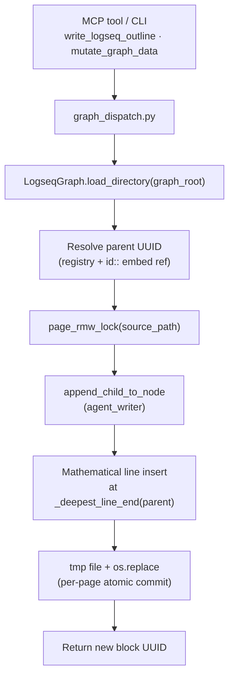
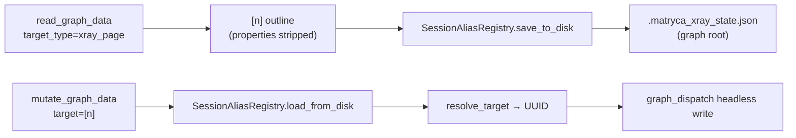
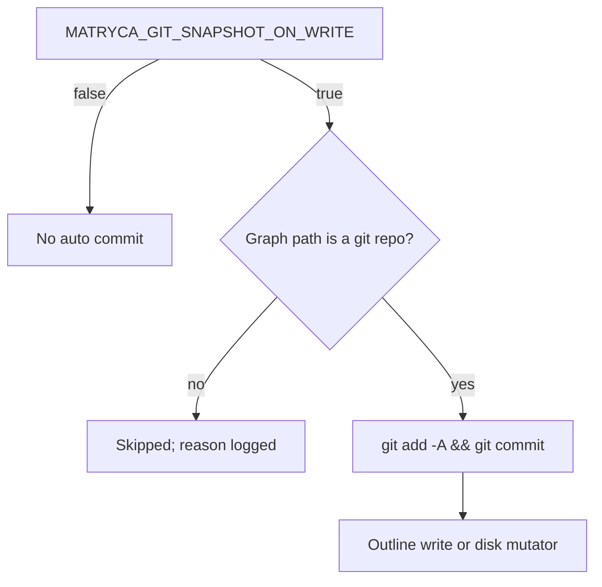
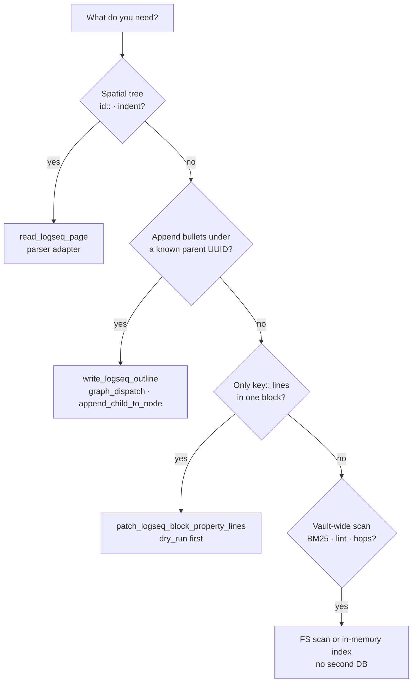
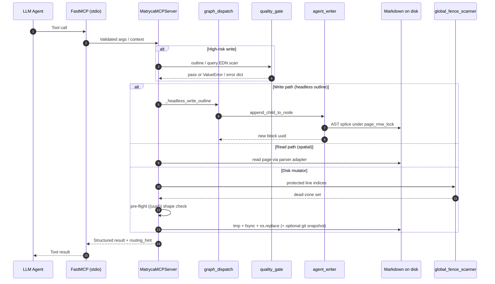
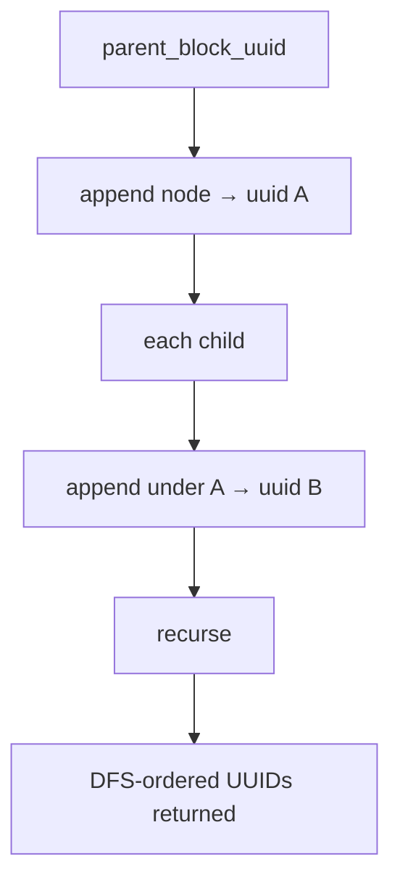
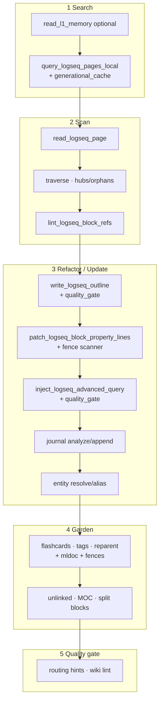
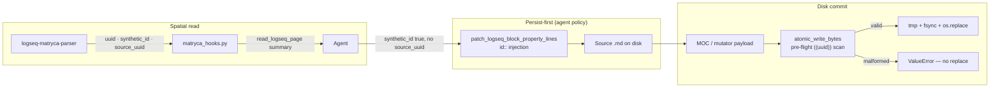
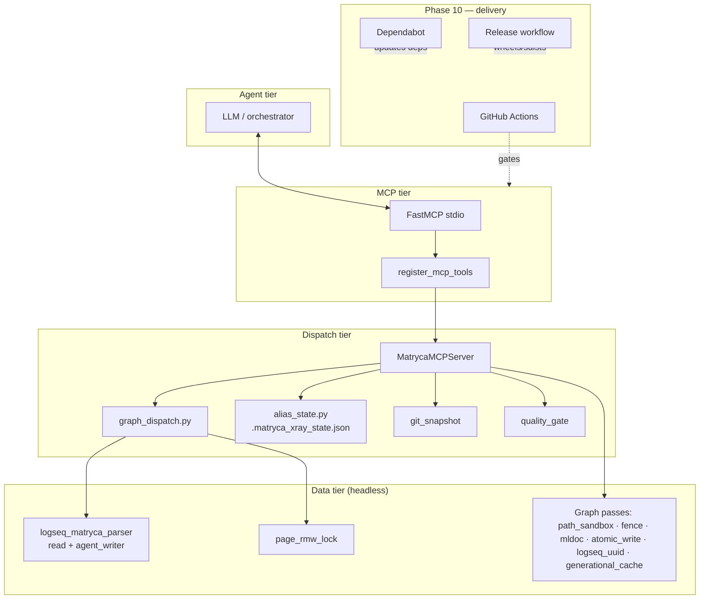
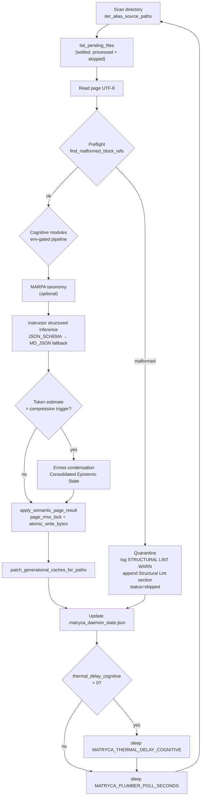

# Architecture

**matryca-logseq-llm-wiki** connects an LLM agent to **Logseq OG** (pure local Markdown) through **FastMCP**, **Pydantic**, and a **100% headless** data plane powered by **`logseq-matryca-parser==0.3.3`**. This document is the engineering contract: **bounded-work parsing**, **where spatial truth lives**, **how the Headless CRUD & Mutation Plane commits structural edits**, **how X-Ray state persists across stateless invocations**, and **how the repository’s delivery gates stay aligned with runtime behavior**.

---

## Core philosophy

### Single system of record (no auxiliary database)

The only durable source of truth is the tree under **`LOGSEQ_GRAPH_PATH`**: `pages/`, `journals/`, `templates/`, and the rest of the Logseq graph on disk.

The project deliberately does **not** introduce Postgres, SQLite, Redis, embedding indices, or document stores that could fork truth away from Logseq’s files. There is also **no** Logseq HTTP JSON-RPC client: the Logseq desktop application is **not** a runtime dependency.

1. **One artifact for humans and agents** — Diffs, `git blame`, ripgrep, and backup tools observe exactly what Logseq observes.
2. **No invalidation labyrinth** — A secondary index would require correctness proofs every time a human edits outside the agent.
3. **Forces block-shaped thinking** — Tools steer toward AST-guided appends and scoped file surgery instead of destructive whole-file rewrites.

When the codebase needs **ranking** (Okapi BM25), **adjacency** (wikilink and tag BFS), or **aggregates** (dashboard counts), it computes them **inside the MCP process** for that request. **Generational caches** (`st_mtime_ns` signatures) reuse in-memory structures across calls when the underlying files are quiescent — that is **memoization**, not a competing database.

---

## The bounded-work paradigm (parser versus streaming passes)

### When delegation to `logseq-matryca-parser` is mandatory

**[logseq-matryca-parser](https://github.com/MarcoPorcellato/logseq-matryca-parser)** (`==0.3.3`) owns **spatial truth**: indentation, block boundaries, parent/child relationships, and a faithful view of a page consistent with Logseq’s outliner model. The adapter **`src/rag/matryca_hooks.py`** feeds **`read_logseq_page`** so agents receive the same block-tree semantics the editor uses.

Use the parser whenever the question is **“what is a block on this page?”** — hierarchy, `id::` placement, or evidence gathering before proposing edits.

### When targeted line-by-line streaming passes execute

This repository **does not** reimplement a second full-file Markdown AST for vault-wide chores. Instead it runs **narrow, auditable** passes on raw text — regex-bounded, directory-scoped, and often **dry-run first** — where the parser is the wrong abstraction or graph-wide coverage is required:

| Class of work | Modules / tools | Mechanism |
|---------------|-------------------|-----------|
| **Scoped `key::` surgery** | `patch_logseq_block_property_lines` — `property_line_edit.py` | Lines inside a subtree anchored at `id:: <uuid>`; only true property lines per **`is_logseq_block_property_line`**; intersection with **`compute_page_protected_line_indices`** |
| **Graph-wide ref integrity** | `lint_logseq_block_refs` — `block_ref_lint.py` | **`LogseqGraph.load_directory`** + **`get_broken_references()`** — in-memory index over all `((uuid))` refs |
| **Lexical discovery** | `query_logseq_pages_local` — `local_query.py` | Token bags + Okapi BM25 in memory; corpus memoized in **`generational_cache`** keyed by page `st_mtime_ns` sets |
| **Structural hops** | `traverse_logseq_structural_hops`, hub/orphan reports — `link_tag_hop.py` | Wikilinks, `#tags` / `tags::`, light `type::` / `domain::` edges over `pages/**/*.md` |
| **Hashtag normalization** | `lint_unify_logseq_tags` — `tag_unify.py` | Token-level `#tag` detection with **mldoc quoted-span** awareness and **global fence** guards |
| **Journals and aliases** | `journal_task_scan.py`, `alias_index.py` | Line- and property-oriented scans; alias index rebuilt through **`cached_build_alias_index`** |

**Design principle:** parser for **hierarchy and identity**; streaming passes for **surgical edits**, **graph-wide invariants**, and **diff-friendly** transformations that must remain reviewable in Python.

---

## 5. Headless Mutation & State Plane (`v1.4.0`)

Starting with **v1.4.0**, Matryca fully abandons the local HTTP client-server model (Logseq JSON-RPC on ports 8080/12315) and becomes a **100% Headless** daemon engine. The transition from a **stateful, network-bounded** architecture (Electron app + API tokens) to a **local-first, zero-dependency** model is the milestone of this release: reads and writes converge on a single path — `LOGSEQ_GRAPH_PATH` — with no split-brain risk.

### 5.1 AST File Splicing Engine

The mutation flow no longer goes through Logseq APIs; it manipulates the abstract syntax tree (AST) of local Markdown files via **`logseq_matryca_parser.agent_writer`**.

Mutations (`write_logseq_outline`, `patch_logseq_block_property_lines`, `inject_logseq_advanced_query`, and the `mutate_graph_data` mega-tool) load the graph in memory (`LogseqGraph.load_directory`), compute spatial block hierarchy, and insert new bullets at the correct indentation (`indent_level + 1` × `tab_size`). The canonical operation is **`append_child_to_node`**, orchestrated by **`src/agent/graph_dispatch.py`**: mathematical insertion at line `_deepest_line_end(parent)`, atomic commit via `tmp` + `os.replace`. Every write is protected by the concurrent context manager **`page_rmw_lock(path)`** (`src/graph/page_write_lock.py`).



**`_headless_write_outline`** walks validated **`OutlineNode`** trees depth-first (DFS): each append waits for a real on-disk UUID before children, preserving ordering invariants without network round-trips.

`graph_dispatch.py` is the sole async dispatch layer for FastMCP and the **`matryca`** CLI. Mutators in `src/graph/` (property edit, tag unify, reparent, MOC, journal) use **`atomic_write_bytes`** and acquire **`page_rmw_lock`** where per-page RMW is required.

| Removed | Replaced by |
|---------|-------------|
| `src/bridge/logseq_client.py` | Deleted — no HTTP transport |
| `httpx` | Removed from `pyproject.toml` |
| `LOGSEQ_API_TOKEN` / `LOGSEQ_API_URL` | Obsolete — not read at runtime |
| Split-brain read/write risk | Single system of record: **`LOGSEQ_GRAPH_PATH`** |

### 5.2 Printing Press State Persistence (X-Ray)

To maximize LLM token efficiency, the system adopts **X-Ray** mode (Printing Press Mode). When an agent runs a dense scan (`read_graph_data` with `target_type="xray_page"`), 36-character UUIDs are replaced by short aliases like `[0]`, `[1]` — typically up to **~35×** less overhead than repeatedly echoing UUIDs in context.

Because the CLI and MCP server are **stateless** between invocations, the translation map is saved natively in the hidden file **`.matryca_xray_state.json`** at the graph root via **`SessionAliasRegistry`** (`src/agent/alias_state.py`). Subsequent mutation calls intercept aliases (`resolve_target`, `resolve_pipe_target`), read state from disk, resolve the real UUID, and perform atomic file I/O writes.



---

## FastMCP, Pydantic, and the trust boundary

`src/main.py` constructs **FastMCP** with a lifespan that wires **`MatrycaWikiConfig`** (no `LogseqClient`). **`register_mcp_tools`** in **`src/agent/mcp_server.py`** registers every `@mcp.tool()` handler.

Incoming outline payloads validate as **`OutlineNode`** (`page_type`, `domain`, `entity_type` invariants, normalized `children`) before any disk mutation. **`outline_security_violations`** and **`advanced_query_security_violations`** in **`src/agent/quality_gate.py`** reject credential-shaped property names and OpenAI-style key material from reaching the graph via **`write_logseq_outline`** or **`inject_logseq_advanced_query`**.

**`routing_hint.py`** attaches machine-readable hints to high-signal responses so orchestrators can preserve **L1/L2** traceability without re-parsing natural-language tool output.

### Git snapshots as opt-in rollback

**`MATRYCA_GIT_SNAPSHOT_ON_WRITE`** (`src/agent/git_snapshot.py`) optionally runs **`git add -A`** + **`git commit`** on **`LOGSEQ_GRAPH_PATH`** when it is a git checkout. **`snapshot_logseq_graph_git`** exposes the same primitive for manual checkpoints.



### Choosing read versus write paths



---

## End-to-end data flow

The MCP host spawns this process on **stdio**. Tool calls flow through FastMCP into **`MatrycaMCPServer`** and **`graph_dispatch`**: **structural writes** splice Markdown via **`append_child_to_node`** under **`page_rmw_lock`**; **spatial reads** use the parser adapter; **other disk mutators** use **`atomic_write_bytes`** (and often a **`.bak`** copy immediately before swap for property-style edits).



### Outline write ordering (depth-first)

`write_logseq_outline` walks **`OutlineNode`** depth-first: each headless append returns a **real** UUID before children are created, so the graph never receives unresolved parent placeholders.



---

## The agentic pipeline

Operational prompting lives in **`SYSTEM_PROMPT.md`**. At a high level:

1. **Search** — Prefer **`query_logseq_pages_local`** with **`mode=bm25`**. Optionally **`read_l1_memory`** when mistakes would be costly before touching L2.
2. **Scan** — **`read_logseq_page`** for ground truth; **`traverse_logseq_structural_hops`** / **`report_structural_hubs_orphans`**; **`lint_logseq_block_refs`** when editing many `((uuid))` refs.
3. **Refactor / update** — **`write_logseq_outline`**; **`patch_logseq_block_property_lines`** (including **persist-first** `id::` when the parser reports **`synthetic_id: true`**); **`inject_logseq_advanced_query`**; journal and alias tools as needed.
4. **Garden** — Flashcards, tag unify, reparent, unlinked mentions, MOC generation, large-block split — almost always **`dry_run=true`** first.
5. **Quality gate** — Re-lint refs after large edits; respect **`protected_fence`** when a mutation would cross fenced code, HTML comments, Advanced Query blocks, or drawer regions.



---

## Ironclad data plane (Phases 7 and 8)

Phases **7** and **8** are **engineering pillars** under the existing MCP tool names: **compiler-aligned** parsing, **whole-page dead zones**, **transactional durability**, and **incremental** vault indexes.

### Global fence lexers (dead zones across full files)

**`src/graph/global_fence_scanner.py`** exports **`compute_page_protected_line_indices(file_content) -> set[int]`**: one **O(n)** streaming pass over lines, returning **0-based** indices of every line that must be treated as **immutable** for mutators and certain lexical tools.

Mechanics:

1. **Markdown fenced code** — Opening fences (up to three leading spaces, run of ≥ three backticks); closing fence must match tick count. **Every line inside** an open fence is protected, including the opener (including empty fences).
2. **HTML block comments** — `<!--` / `-->` with **`in_comment`** state carried across lines.
3. **Advanced Query blocks** — `#+BEGIN_QUERY` / `#+END_QUERY` after leading whitespace.

**Critical invariant:** While **inside a Markdown fence**, HTML and Advanced Query detectors are **masked**. A line containing `#+BEGIN_QUERY` or `<!--` **inside a code block** does **not** flip global query or HTML state — preventing pasted examples from corrupting the scanner.

**Consumers:** `property_line_edit`, `tag_unify`, `reparent_blocks`, `split_large_blocks`, and `unlinked_mentions` intersect edit or match spans with the protected set and **fail closed** (`protected_fence` or skip) when a mutation would cross a dead zone. **`tests/test_ironclad_phase8.py`** covers nested fences, masked markers, and multiline HTML.

### ACID-inspired file swaps

**`atomic_write_bytes`** / **`atomic_write_file`** in **`src/graph/markdown_blocks.py`** implement a **commit** discipline for each `.md` artifact:

1. **`tempfile.mkstemp`** in the **target directory** with prefix `.<basename>.` and suffix `.tmp` — guarantees `os.replace` stays on one filesystem volume.
2. **Write full payload**, **`flush`**, then **`os.fsync(fileno)`** — pushes data through the kernel toward durable media before any live path references the new bytes.
3. **`os.replace(tmp, final)`** — POSIX **atomic** rename over the destination.

On **any** exception before `replace` completes, the temp file is **unlinked** and the original path is unchanged. There is **no in-place truncation** window. Disk mutators across **`property_line_edit`**, **`tag_unify`**, **`reparent_blocks`**, **`split_large_blocks`**, **`journal_task_scan`**, **`flashcards`**, and **`moc_page`** route through this helper. Property-line apply additionally uses **`shutil.copy2`** to a **`.bak`** sibling before swap for a second, human-visible rollback lever.

### UUID lifecycle and synthetic ID guardrails (`v1.0.1`)

The **Trust plane** (Phase 9) and **Ironclad Shield** (Phase 8) converge on a single invariant: **ephemeral AST identity must never be mistaken for durable Logseq database identity**.



#### Parser contract: `synthetic_id` and `source_uuid`

**[logseq-matryca-parser](https://github.com/MarcoPorcellato/logseq-matryca-parser)** annotates each block with:

| Field | Meaning |
|-------|---------|
| **`uuid`** | Effective identifier for the block in the current parse (may be read from disk or synthesized). |
| **`source_uuid`** | When present, the UUID taken from a persisted **`id::`** line on disk. |
| **`synthetic_id`** | **`true`** when the effective UUID was **generated in memory** (e.g. deterministic UUIDv5 for blocks lacking `id::`); **`false`** when identity is anchored to on-disk `id::`. |

The adapter **`src/rag/matryca_hooks.py`** surfaces these fields in every **`read_logseq_page`** spatial summary—e.g. `` `synthetic_id` true ``, `` `source_uuid` … (persisted `id::` on disk) ``, or an explicit **not on disk — persist `id::` before `((uuid))`** warning when the agent must not reference the block yet.

**Design rule:** A `((uuid))` in new Markdown is only safe when that UUID is already backed by an **`id::`** line in the **source** file Logseq will index. Parser output alone does not create graph edges.

#### Pre-flight Block Reference Guard

Before **`os.replace`**, **`atomic_write_bytes`** decodes UTF-8 payloads that contain `((` and calls **`assert_valid_block_refs_in_markdown`** in **`src/graph/logseq_uuid.py`**. The guard:

- Scans all **`((...))`** tokens with a bounded regex.
- Requires each inner token to be a **canonical 36-character hyphenated UUID** that parses under **`uuid.UUID`**.
- Raises **`ValueError`** with an actionable message on the first malformed ref—**no temp file is promoted** to the live path.

This complements **`lint_logseq_block_refs`**: the linter queries **`LogseqGraph.get_broken_references()`** for referential integrity vault-wide; the pre-flight guard catches **syntactically impossible** refs at commit time (common when models truncate or mistype hex). Together they enforce **separation of concerns** between *shape validity* (Ironclad) and *referential integrity* (Trust plane + gardening tools).

#### Agent policy (`SYSTEM_PROMPT.md`)

Operational prompting requires a **persist-first** sequence when building MOCs or any disk artifact with block refs:

1. **Read** the source page and inspect **`synthetic_id` / `source_uuid` / `uuid`**.
2. If **`synthetic_id: true`** and there is no on-disk `id::`, **`patch_logseq_block_property_lines`** (`dry_run=true` then `false`) injects **`id:: <uuid>`** into the original file.
3. Only then may tools such as **`generate_moc_page`** or other **`atomic_write_bytes`** paths emit **`((that-uuid))`**.

Release **`v1.0.1`** hardened this pipeline after a **~106k-token** Cursor MCP stress test that built a large MOC from **2,300+** lines of nested Markdown—the parser hierarchy was correct, but ephemeral UUIDs in refs broke after Logseq re-indexed.

### Incremental computation caches (Salsa-style invalidation)

**`src/graph/generational_cache.py`** provides **process-lifetime**, **thread-safe** (`threading.Lock`) memoization keyed by **`frozenset[(relative_path, st_mtime_ns)]`** over participating files — the same **“inputs changed?”** contract as **Salsa**-style incremental compilers (famously **rust-analyzer**): if no participating file’s nanosecond mtime moved, the prior in-memory artifact is **reused**.

- **`cached_build_alias_index`** — Wraps **`build_alias_index`**: **`resolve_logseq_entity`** avoids rebuilding the vault-wide alias map on every call when `pages/**/*.md` mtimes are stable.
- **BM25 corpus** — Pre-tokenized document bags and collection statistics; **`local_query.py`** consumes the cache so ranking over large graphs avoids re-reading and re-tokenizing the world per query.

**`clear_generational_caches()`** exists for tests and hot reload. **`tests/test_ironclad_phase8.py`** asserts alias cache **invalidation** after an mtime bump and BM25 cache identity plus scoring.

### Path Traversal Sandbox Layer (`v1.3.0` — Fortress Release)

**`src/graph/path_sandbox.py`** is the **deterministic gate** for every graph-relative filesystem path before a read, resolve, or atomic write proceeds. No disk mutator or spatial read adapter may trust raw LLM-supplied page names or paths without passing through this layer.

Mechanics:

1. **`resolved_graph_root(graph_root)`** — Canonicalizes `LOGSEQ_GRAPH_PATH` (or an explicit graph root passed to a tool) via `Path.expanduser().resolve(strict=False)`.
2. **`assert_path_within_graph(path, graph_root)`** — Resolves the candidate path and requires `resolved.is_relative_to(root)`. On failure it raises **`ValueError("Security Violation: Path traversal attempt blocked.")`** — an unbypassable error that **`guard_mcp_tool`** maps to LLM-safe tool output without leaking stack traces.
3. **`graph_safe_page_path(graph_root, page_ref)`** — Resolves `pages/Foo.md` or bare page titles under `pages/` only when the resolved absolute path remains inside the graph root (blocks `../../../etc/passwd`, `pages/../../outside.md`, and symlink escape attempts after `resolve()`).

**Consumers:**

| Operation | Module | Sandbox hook |
|-----------|--------|--------------|
| Page resolution | `markdown_blocks.graph_safe_page_path`, `property_line_edit` | Delegates to `path_sandbox` |
| Spatial reads | `matryca_hooks.resolve_logseq_page_md` | Validates every candidate before `is_file()` |
| Atomic commits | `markdown_blocks.atomic_write_bytes` | **Required** `graph_root=`; calls `assert_path_within_graph` before `mkstemp` |
| Template reads | `templates.py` | `_safe_templates_dir` + `assert_path_within_graph` |
| Tmp hygiene | `sweep_dangling_atomic_tmp_files` | Skips files that fail sandbox (defense in depth under `pages/` / `journals/`) |

**Invariant:** The sandbox runs **before** any `read_text`, `open`, or `atomic_write_bytes` temp-file creation. Prompt-injected relative paths cannot escape the designated Logseq graph directory even when an agent hallucinates `pages/` prefixes or `..` segments.

### MCP tool guard and lifespan teardown

**`guard_mcp_tool`** in **`src/agent/mcp_tool_guard.py`** catches domain errors (`ValueError`, `RuntimeError`, …) and returns concise tool failure strings to the agent — the MCP stdio session stays alive instead of surfacing raw stack traces.

**Lifespan setup (`v1.4.1`):** When **`LOGSEQ_GRAPH_PATH`** is set, **`app_lifespan`** in **`src/main.py`** canonicalizes the graph root with **`resolved_graph_root`**, then **`os.chdir(str(resolved_root))`** so the process working directory stays inside the sandbox (avoids **`EPERM`** / **`uv_cwd`** failures when MCP hosts or daemons start from arbitrary directories). Startup still sweeps dangling atomic-write temps under that root.

**Lifespan teardown:** **`app_lifespan`** `finally` calls **`clear_page_write_locks()`**, and the loguru→MCP bridge in **`mcp_telemetry.py`** registers **`add_done_callback`** on fire-and-forget tasks so shutdown-time notification failures do not surface as unhandled exceptions.

### Privacy-safe MCP telemetry (`v1.4.1`)

**`src/agent/mcp_telemetry.py`** forwards INFO+ loguru records to the active MCP client via **`Context.info`** during tool calls. Unless **`MATRYCA_DEBUG=true`** (case-insensitive), **`sanitize_log_message`** masks standard UUIDs as **`[CENSORED_UUID]`** and redacts values after **`payload:`**, **`content:`**, **`snippet:`**, and **`query:`** markers as **`[REDACTED_CONTENT]`**. With debug enabled, the bridge preserves full text for operator troubleshooting.

### Background service installer (`v1.4.1`)

**`src/graph/service_manager.py`** implements **`manage_matryca_service(install | uninstall)`**:

| Platform | Unit file | Executable |
|----------|-----------|------------|
| **macOS** | `~/Library/LaunchAgents/com.matryca.logseq.plist` | `matryca-logseq-llm-wiki` on `PATH` |
| **Linux** | `~/.config/systemd/user/matryca-logseq.service` | same |

Stdio is appended under **`~/.matryca/logs/`**. Install captures **`LOGSEQ_GRAPH_PATH`** and optional Matryca env vars from the **installing shell**. The CLI exposes this as **`matryca service install|uninstall`** (JSON summary on stdout).

**UX invariant:** The service unit must point at a **stable** binary (for example after **`uv tool install matryca-logseq`** → `~/.local/bin/matryca-logseq-llm-wiki`). **`uvx`** uses an ephemeral cache path; a LaunchAgent or systemd unit written from a **`uvx`** invocation will break after cache eviction or reboot.

---

### Layered property grammar and structural guards (Phase 7)

**`src/graph/mldoc_properties.py`** encodes **line-level invariants** aligned with Logseq’s Markdown outliner (and the upstream **`logseq/mldoc`** grammar family), without embedding the Clojure/Rust compiler:

- **`parse_logseq_property_line`** — True **`key:: value`** property lines: rejects list bullets, rejects `#`-first heading noise, requires a colon-free key segment, uses the **first `::` pair only** so values may contain `::` inside `[[wikilinks]]`.
- **`split_logseq_property_list_values`** — Splits comma-separated lists **without** splitting inside **double-quoted** spans (with `\` escapes) or **nested `[[` … `]]`** wikilink depth.
- **`double_quoted_spans_in_value`** — Absolute character intervals for quoted runs so downstream tools (e.g. tag unify) **skip** hashtag normalization inside string literals.

**`src/graph/mldoc_guards.py`** adds **structural predicates** for bullet surgery: fenced code markers, **Org-style drawers** (`:LOGBOOK:`, `:END:`, general `:Name:` tokens), and **`{{` macro** opens. Helpers such as **`pre_id_block_lines_protected`** and **`block_span_has_code_fence_or_drawer`** gate sentence-level splits so indivisible subtrees are never torn apart.

**Integration:** `property_line_edit`, `tag_unify`, `alias_index` flows, and **`split_large_blocks`** consult these modules. **`tests/test_mldoc_phase7.py`** locks wikilink and quote edge cases.

---

## Complete phase evolution history

Use this table as a **mental map** for `src/` and `.github/` — phases are narrative; modules and workflows are what you grep.

| Phase | What shipped | Core architectural reason |
|:-----:|--------------|---------------------------|
| **1 — Baseline** | MCP server (`FastMCP`, `register_mcp_tools`), **`OutlineNode`**, **`write_logseq_outline`** (DFS headless append), **`read_logseq_page`** via parser adapter, **`lint_logseq_block_refs`**, **`render_logseq_dashboard`** | Prove the bridge: agents **read spatially** and **write block-by-block** with validation before touching production graphs |
| **2 — L1 / L2** | **`read_l1_memory`**, **`routing_hint`** attachments on tool outputs | Session-critical rules and traceability without loading the entire vault into context |
| **3 — PKM refinements** | BM25 and substring **`query_logseq_pages_local`**, structural hops + hubs/orphans, **`patch_logseq_block_property_lines`**, templates list/read, **`lint_matryca_wiki_pages`**, namespace index, **`MATRYCA_GIT_SNAPSHOT_ON_WRITE`** integration | Discovery, **surgical** disk edits, house-style templates, and optional **reversible** checkpoints |
| **4 — Logseq superpowers** | **`inject_logseq_advanced_query`**, journal task scan + append, **`resolve_logseq_entity`**, **`append_logseq_page_alias`** | First-class Logseq primitives (Datalog, journals, entity graph) as disk-native Markdown |
| **5 — Graph gardener** | **`generate_logseq_flashcards`**, **`lint_unify_logseq_tags`**, **`refactor_logseq_blocks`** | Hygiene at scale: SRS cards, tag normalization, structural reparenting |
| **6 — Synthesis engine** | **`resolve_unlinked_mentions`**, **`generate_moc_page`**, **`refactor_large_blocks`**, **`snapshot_logseq_graph_git`** | Graph “thickening,” long-bullet repair, and **manual** operator checkpoints |
| **7 — Mldoc compliance** | **`mldoc_properties.py`**, **`mldoc_guards.py`** integrated into property, tag, alias, and split flows | Eliminate **false positives** on `key::` lines and **destructive edits** inside fragile bodies — auditable Python mirroring **mldoc** intent |
| **8 — Ironclad Shield** | **`global_fence_scanner.py`**, **`atomic_write_bytes`** (+ **`logseq_uuid`** pre-flight on `((uuid))`), **`generational_cache.py`** | **Global** awareness of code, comments, and queries; **no torn writes**; **commit-time** rejection of malformed block refs; **sub-millisecond** hot paths when signatures are stable |
| **9 — Trust plane** | **`quality_gate.py`** (outline and Advanced Query EDN secret scans), wiki lint under **`MatrycaWikiConfig`**, **`synthetic_id` / persist-first** rules in **`SYSTEM_PROMPT.md`**, structured dry-run / apply payloads | Prevent **credential leakage into L2**; enforce **policy** and **UUID referential discipline** without a second datastore |
| **10 — Delivery and community** | **`.github/workflows/ci.yml`** (`uv sync --locked`, Ruff lint + format check, Mypy on `src` + `tests`, Pytest), **`.github/dependabot.yml`** (weekly pip and GitHub Actions bumps), **`.github/workflows/release.yml`** (push tag `v*` → `uv build` → `gh release create`), **`SECURITY.md`**, **`CODE_OF_CONDUCT.md`**, issue and PR templates | **Reproducible quality bar**, **supply-chain hygiene**, **tag-driven artifacts**, and **clear vulnerability and community process** |
| **11 — Fortress (`v1.3.0`)** | **`path_sandbox.py`** (`is_relative_to` graph root), **`mcp_tool_guard`**, lifespan lock/tmp-task teardown | **Adversarial hardening**: block LLM path traversal, graceful MCP shutdown |
| **12 — Headless Revolution (`v1.4.0`)** | Removed **`httpx`** / **`LogseqClient`** / `src/bridge/`; **`graph_dispatch.py`** + **`append_child_to_node`**; **`.matryca_xray_state.json`**; **`get_broken_references()`** lint | **Zero UI dependency**: server-safe automation with a single read/write path on disk |
| **13 — Operational hardening (`v1.4.1`)** | Lifespan **`os.chdir`** to sandbox root; **`mcp_telemetry` privacy sanitizer** (`MATRYCA_DEBUG`); **`service_manager.py`** + CLI **`matryca service`**; **162** strict tests | **Daemon-safe cwd**, **production-safe MCP logs**, **LaunchAgent / systemd** background integration |
| **14 — Ironclad Autonomous Linter OS (`v1.5.x`)** | **`MaintenanceDaemon`**, Instructor **`JSON_SCHEMA`**, Ermes **context compression**, cognitive lint modules, **structural quarantine**, **`semantic_clustering.py`** (Louvain GraphRAG), strict phase separation, **`prompt_constraints`**, **`patch_generational_caches_for_paths`** on Plumber writes | **Continuous local graph maintenance** without cloud APIs; fault-tolerant background processing; **262** strict tests |

**Cross-cutting:** **`src/config.py`**, **`matryca-wiki.yml`**, **`docs/openspec/`**, **`docs/PROJECT_DIARY.md`**, roadmap documents under **`docs/roadmaps/`**.

---

## Component layers



---

## Key entry points

| Path | Role |
|------|------|
| `src/main.py` | FastMCP app, lifespan (`chdir` to graph root), `register_mcp_tools` |
| `src/cli.py` | Agent-native CLI (`read`, `search`, `mutate`, `refactor`, `lint`, `service`) |
| `src/agent/mcp_telemetry.py` | Loguru→MCP bridge with optional privacy sanitization |
| `src/graph/service_manager.py` | LaunchAgent / systemd user-unit install and uninstall |
| `src/agent/mcp_server.py` | All `@mcp.tool()` handlers, `OutlineNode`, `MatrycaMCPServer` |
| `src/agent/graph_dispatch.py` | Headless CRUD dispatch: `_headless_write_outline`, mega-tool routing |
| `src/agent/alias_state.py` | X-Ray `SessionAliasRegistry` load/save at `.matryca_xray_state.json` |
| `src/graph/page_write_lock.py` | Per-page `page_rmw_lock` for serialized AST splices |
| `src/graph/path_sandbox.py` | Graph-root path sandbox (`is_relative_to`); blocks traversal before any FS read/write |
| `src/agent/mcp_tool_guard.py` | Outer MCP tool error boundary (LLM-safe failures) |
| `src/agent/git_snapshot.py` | Optional commits on graph root |
| `src/agent/quality_gate.py` | Outline and Advanced Query EDN pre-flight scans |
| `src/rag/matryca_hooks.py` | Parser adapter for spatial reads |
| `src/graph/markdown_blocks.py` | `atomic_write_bytes` / `atomic_write_file` (sandbox + pre-flight `((uuid))` guard), block line helpers, `graph_safe_page_path` |
| `src/graph/logseq_uuid.py` | UUID v4/v5 shape checks; `assert_valid_block_refs_in_markdown` for atomic writes |
| `src/graph/block_ref_lint.py` | Vault-wide `((uuid))` ↔ `id::` integrity via `LogseqGraph.get_broken_references()` |
| `src/graph/global_fence_scanner.py` | Whole-page dead-zone line index |
| `src/graph/mldoc_properties.py` / `mldoc_guards.py` | Phase 7 property grammar + structural shields |
| `src/graph/generational_cache.py` | Phase 8 mtime-keyed alias + BM25 corpus memoization |
| `src/rag/local_query.py` | BM25 query path (cached corpus when graph root is set) |
| `.github/workflows/ci.yml` | Ruff, Mypy, Pytest on `main` |
| `.github/workflows/release.yml` | Tag-driven build and GitHub Release |
| `.github/dependabot.yml` | Automated dependency PRs |
| `src/agent/maintenance_daemon.py` | Matryca Plumber daemon cycle, semantic index append, structural quarantine |
| `src/agent/plumber_config.py` | Env-driven cognitive lint flags (`load_plumber_lint_config`) |
| `src/agent/plumber_modules/` | Env-gated cognitive plugins (MARPA, dangling healer, property hygiene, …) |
| `src/agent/context_compressor.py` | Ermes-inspired epistemic condensation (100k trigger) |
| `src/agent/prompt_constraints.py` | Cross-lingual output constraint for Plumber LLM prompts |
| `src/cli/tui_dashboard.py` | Rich TUI for `matryca plumber status` |

---

## Matryca Plumber — autonomous maintenance daemon (Phase 8)

**Matryca Plumber** is a **local-first background structure & cognitive maintenance daemon** that progressively indexes Logseq markdown with a **local LLM** (LM Studio OpenAI-compatible API). It complements the interactive MCP plane: agents mutate on demand; the daemon **continuously** repairs broken block references, flushes context loops via Ermes compression, appends semantic metadata, runs optional cognitive lint modules, and logs token economics to **`logs/matryca_plumber_ops.log`**.

> **Brand separation:** **Matryca Brain** is reserved exclusively for the Nuitka-compiled Pro enterprise ingestion suite. The open-source maintenance daemon described here is **Matryca Plumber**.

State checkpoint: **`.matryca_daemon_state.json`** at the graph root (per-file `mtime`, `processed` / `skipped` / `error`). Process lock: **`.matryca_plumber_daemon.pid`**.

### Why these mechanisms exist

#### Atomic RMW with OS-level locking (`fcntl.flock`)

Matryca Plumber runs **concurrently** with human edits in Logseq OG and with MCP tool sessions on the same files. Without serialization, read-modify-write cycles (read page → LLM lint → append index → `os.replace`) would interleave and produce torn writes or lost bullets.

**`page_rmw_lock(path)`** (`src/graph/page_write_lock.py`) acquires an exclusive **`fcntl.flock`** on a sidecar lock file beside each page. The Plumber daemon, MCP mutators, and cognitive modules all acquire this lock before mutating a page — **transactional immutability** at the file grain.

#### Incremental cache patching (`patch_generational_caches_for_paths`)

Rebuilding the full BM25 token corpus and alias index after every single-block edit would **CPU-thrash** large graphs. After each Plumber write, **`patch_generational_caches_for_paths`** surgically updates only the touched relative paths inside the in-memory generational caches — preserving Salsa-style `st_mtime_ns` invalidation without vault-wide rescans.

#### Native grammar-based sampling (`JSON_SCHEMA`)

Compact local weights (Gemma 4, Qwen 7B/9B) waste tokens on conversational JSON preambles. **`InstructorLLMClient`** defaults to **`MATRYCA_LM_INSTRUCTOR_MODE=JSON_SCHEMA`**, binding LM Studio grammar sampling so structured fields (`SemanticIndexResult`, `MarpaClassificationResult`, …) fill immediately. **`MATRYCA_LM_INSTRUCTOR_FALLBACK=MD_JSON`** provides a secondary extraction mode when schema binding fails — parsing errors drop to near zero in production graphs.

#### Ermes-inspired context compressor

Long multi-turn maintenance loops inflate the local **KV cache** and degrade attention (“needle in a haystack”). When estimated history tokens exceed **`MATRYCA_PLUMBER_COMPRESSION_TRIGGER_TOKENS`** (default **100,000**), **`condense_messages`** collapses intermediate turns into a dense **`## Consolidated Epistemic State`** summary targeting **`MATRYCA_PLUMBER_COMPRESSION_TARGET_TOKENS`** (default **30,000**). The system prompt and trailing user turn are preserved; compression LLM failures fall back to truncation — the daemon never exits.

#### Thermal pacing & hardware protection shield

Continuous local inference on consumer laptops saturates GPU/NPU heatsinks and triggers thermal throttling. **Thermal Pacing** (duty-cycle modulation) inserts configurable cooling delays after each LLM inference event:

| Phase | Env var | Default | Injection site |
|-------|---------|---------|----------------|
| **Phase 1 — bootstrap harvest** | `MATRYCA_THERMAL_DELAY_BOOTSTRAP` | **2.0 s** | After each successful page summary in `run_bootstrap_harvest()` |
| **Phase 2 — cognitive cycle** | `MATRYCA_THERMAL_DELAY_COGNITIVE` | **2.0 s** | After each file iteration in `MaintenanceDaemon.run_cycle()` |

Set either variable to **`0`** to disable pacing for that phase. Defaults preserve battery longevity and zero-throttling execution on Apple Silicon and discrete-GPU workstations without sacrificing data quality.

#### Low-Impact Antivirus Mode (Sympathetic Background Scheduling)

Consumer-edge deployments must not compete with the user’s interactive session. **Low-Impact Antivirus Mode** delegates CPU scheduling to the OS: at detached daemon bootstrap (`start_daemon_detached`), when **`MATRYCA_PLUMBER_LOW_PRIORITY_MODE=true`** (default), the grandchild process calls **`os.nice(19)`** — maximum POSIX courtesy tier.

| Mechanism | Detail |
|-----------|--------|
| **Trigger** | Once, before `MaintenanceDaemon.run_forever()` in the detached fork |
| **Env var** | `MATRYCA_PLUMBER_LOW_PRIORITY_MODE` (default **`true`**) |
| **Effect** | Kernel deprioritizes Plumber threads while foreground apps hold the run queue; idle periods reclaim full CPU for backlog drain (e.g. Phase 1 bootstrap over thousands of pages) |
| **Disable** | Set env to **`false`** on headless inference nodes where normal priority is desired |

Unlike application-level “is the user typing?” heuristics, this path adds **zero** polling overhead — Darwin/BSD schedulers already arbitrate between niceness classes. Combined with **Thermal Pacing**, the Plumber behaves like a modern antivirus or Spotlight indexer: present, persistent, and imperceptible during active use.

#### Fault-tolerant block reference quarantine

Human typo'd `((uuid))` tokens must not crash the daemon. **`run_cycle()`** preflights each page with **`find_malformed_block_refs`**. On failure:

1. Log **`[STRUCTURAL LINT WARN]`** to the ops log.
2. Mark the file **`skipped`** (stable `mtime` — no retry loop).
3. Append **`### Matryca Structural Lint`** with `#todo [[Matryca Broken Reference]]` (write uses **`validate_block_refs=False`** — zero-destruction of existing prose).
4. Continue the poll loop — **100% daemon uptime**.

#### IP protection (OSS vs Pro)

Open source exposes **MARPA domain taxonomy**, dangling-link healing, property hygiene, semantic routing cache, and core semantic lint via **Matryca Plumber**. **Pavlyshyn bipartite graph validation**, **Twin Ingestion**, and **Epistemic Guardian** are structurally omitted from OSS — reserved for **Matryca Brain**, the Nuitka-compiled commercial tier (see **`docs/PROJECT_DIARY.md`**).

### Plumber lifecycle (data plane)



### Hardening mechanisms (latest optimization pass)

| Vector | Implementation | Rationale |
|--------|----------------|-----------|
| **Memory history cap** | `MAX_EXECUTION_HISTORY_MESSAGES = 48` in `context_compressor.py`; Instructor client trims `_execution_history` after each page | Constant memory across infinite daemon uptime |
| **HTTP / compression fallbacks** | `condense_messages` try/except → truncation; compression warnings logged as `[COMPRESSION WARN]` | LM Studio offline must not kill the child process |
| **Idempotent backlink deduplication** | `run_backlink_backpropagator` + semantic lint skip reasons (`no_change`, `uuid_not_found`) | Prevents duplicate wikilink injection on re-runs |
| **Token estimate safety buffer** | `TOKEN_ESTIMATE_SAFETY_MULTIPLIER = 1.12` on Qwen/Gemma heuristic | Triggers compression before VRAM cliff on code/CJK-heavy pages |
| **Thermal pacing shield** | `MATRYCA_THERMAL_DELAY_BOOTSTRAP` / `MATRYCA_THERMAL_DELAY_COGNITIVE` (default **2.0 s** each; **0** disables) | Breaks continuous heat curves during bootstrap and Phase 2 cognitive cycles |
| **Low-Impact Antivirus Mode** | `MATRYCA_PLUMBER_LOW_PRIORITY_MODE` (default **`true`**); `os.nice(19)` at detached bootstrap | Kernel-level CPU courtesy — zero polling; full throughput during idle |

### Plumber index artifacts (on-disk)

**Semantic index** (appended once per page after successful inference):

```markdown
### Matryca Semantic Index
- indexed-at:: 2026-05-21 14:30 UTC
- summary:: …
- suggested-tags:: #tag1 #tag2
- moc-pointers::
  - [[MOC Example]]
- cross-references::
  - concept (relation) → [[Target Page]]
- semantic-lint-applied::
  - auto_wikilink:uuid…:reason
```

**Structural lint** (quarantine annotation — user-facing alert):

```markdown
### Matryca Structural Lint
- malformed-block-refs::
  - ((aaaaaaaa-bbbb-4ccc-8ddd-eeeeeeeeeee))
- todo:: #todo [[Matryca Broken Reference]] — fix ((uuid)) typos in Logseq
```

**MARPA validation** (when `MATRYCA_LINT_MARPA_FRAMEWORK=true`):

```markdown
### Matryca MARPA Validation
- assigned-domain:: progetto
- detected-tags:: #project
- ssot-warnings::
  - ssot_duplicate:pages/Other.md (prefer ((block-uuid)) transclusion)
```

---

## Architettura del Ciclo di Vita e della Tolleranza ai Guasti

### 1. Pipeline a Separazione Rigorosa di Fase (Strict Phase Separation)

Per prevenire loop infiniti di allucinazione concettuale (in cui l'LLM crea pagine orfane durante il censimento iniziale che allungano ricorsivamente la coda di scansione), Matryca Plumber impone un muro di separazione invalicabile tra la raccolta dei dati e l'evoluzione logica del grafo.

```
[ Grafo Logseq ] ──► PHASE 1 (Stateless Ingestion) ──► Genera Master Index & Catalogo
│
▼
[ MODULO DI LOUVAIN ] ──► Raggruppamento in Quartieri Semantici (5-35 pag)
│
▼
PHASE 2 (Cognitive Loop) ──► Alias-First Semantics & Link Backpropagation
```

#### Phase 1: Pure Bootstrap Harvesting (Read/Append Only)

Durante questa fase, tutti i moduli mutativi e generativi (`Semantic Routing`, `Link Backpropagation`) sono forzatamente disattivati via codice.

- L'esecuzione è **Stateless**: la cronologia dell'Instructor LLM Client viene azzerata dopo ogni singola pagina scritta.
- Viene popolata la mappa piatta `master_catalog.json` e compilato il file strutturato `pages/Matryca Master Index.md` impostando la proprietà nativa Logseq `collapsed:: true` sulle macro-sezioni MARPA per preservare le prestazioni del DOM visivo.
- Non è permessa la creazione di alcun file markdown aggiuntivo.

#### Phase 2: Neighborhood-Contextualized Cognitive Engine

Lo stato `bootstrap_complete` viene commutato a `True` solo quando il backlog pendente è a zero e l'indice principale è su disco.

- Al subentrare di modifiche sui file, il demone attiva l'analisi cognitiva.
- Invece di scorrere le pagine in modo piatto, il sistema le elabora blocco per blocco in base al cluster di appartenenza.
- All'ingresso di un cluster, viene eseguito un `reset_execution_history()` e iniettata una mappa di quartiere contestuale, forzando la memoria rolling di Ermes (48 messaggi) a rimanere confinata nello stesso perimetro concettuale.

### 2. Il Motore di Clustering Semantico Deterministico

Sviluppato in Python puro per escludere dipendenze C pesanti o database vettoriali esterni, il modulo `semantic_clustering.py` esegue il partizionamento gerarchico delle comunità ispirandosi al paradigma Microsoft GraphRAG.

1. **Tokenizzazione e Filtro Stopwords:** Il testo dei riassunti viene ripulito tramite un set statico di stop-words italiane e inglesi, impedendo alla prosa strutturale di inquinare i calcoli.
2. **Matrice di Somiglianza Ibrida:** Viene costruita una rete pesata dove la vicinanza tra due nodi $A$ e $B$ è definita dalla combinazione lineare:
   $$\text{Similarity}(A, B) = (0.55 \times \text{CosineSimilarity}_{\text{TF-IDF}}) + (0.45 \times \text{JaccardIndex}_{\text{Tags}})$$
3. **Algoritmo di Louvain Bilanciato con Loop Guard:** L'ottimizzazione della modularità in RAM è protetta da una costante `LOUVAIN_MAX_ITERATIONS = 20` per prevenire oscillazioni infinite su grafi degeneri. I cluster risultanti vengono bilanciati rigidamente tra un minimo di 5 e un massimo di 35 pagine per preservare i limiti di contesto dei modelli locali.
4. **Cluster Hub Anchor:** Per ogni quartiere, viene calcolato matematicamente il nodo con il massimo grado pesato (l'epicentro strutturale). Questo nodo viene marcato esplicitamente nel prompt come ancora cognitiva (`[CLUSTER FOCUS ANCHOR NODE]`), migliorando drasticamente la precisione del recupero associativo.

### 3. Meccanismi di Hardening del Sistema Operativo

- **Universal Unicode Resilience:** Ogni operazione di decodifica/codifica I/O impone il flag `errors="replace"` per digerire frammenti web corrotti senza mai sollevare un `UnicodeDecodeError`.
- **Graceful Signal Evacuation (`SIGTERM`/`SIGINT`):** All'intercettazione dei segnali di spegnimento, un hook atomico scrive lo stato corrente, persiste il catalogo in RAM, svuota tutti i descrittori di lock di processo (`*.matryca.lock`) e disalloca il file PID prima del `sys.exit(0)`.
- **Streaming Log Tail in $O(1)$ Memory:** La visualizzazione dei log nella TUI Rich esegue una scansione inversa a ritroso a blocchi fissi di 8KB dal fondo del file, garantendo il refresh a 1Hz a consumo di RAM costante, impedendo i memory-bloat causati da file di log multi-megabyte.
- **Error Backoff:** Le pagine che falliscono l'indicizzazione per cause esterne (es. timeout VRAM di LM Studio) vengono marcate come `"error"`. Il demone le esclude dai cicli di scansione successivi finché il loro `st_mtime` sul disco non subisce una modifica fisica da parte dell'utente, azzerando lo spreco di cicli CPU.

---

## Related reading

- **[`SYSTEM_PROMPT.md`](../SYSTEM_PROMPT.md)** — agent rules (outlines, dry-runs, L1/L2)
- **[`docs/roadmaps/`](../docs/roadmaps/)** — phased delivery checklists
- **[`docs/PROJECT_DIARY.md`](PROJECT_DIARY.md)** — phase lifecycle log, ADRs, crushed bottlenecks
- **[`docs/openspec/README.md`](openspec/README.md)** — trimmed internal specifications
- **[`SECURITY.md`](../SECURITY.md)** — private vulnerability reporting
- **[`CODE_OF_CONDUCT.md`](../CODE_OF_CONDUCT.md)** — community standards
