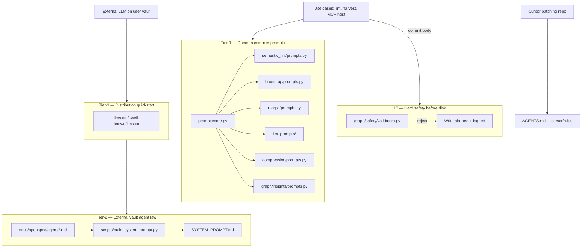
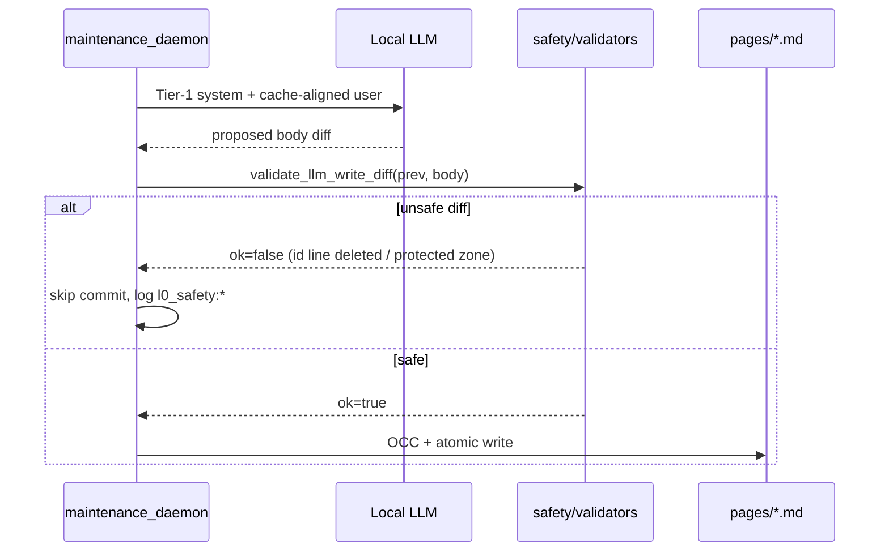
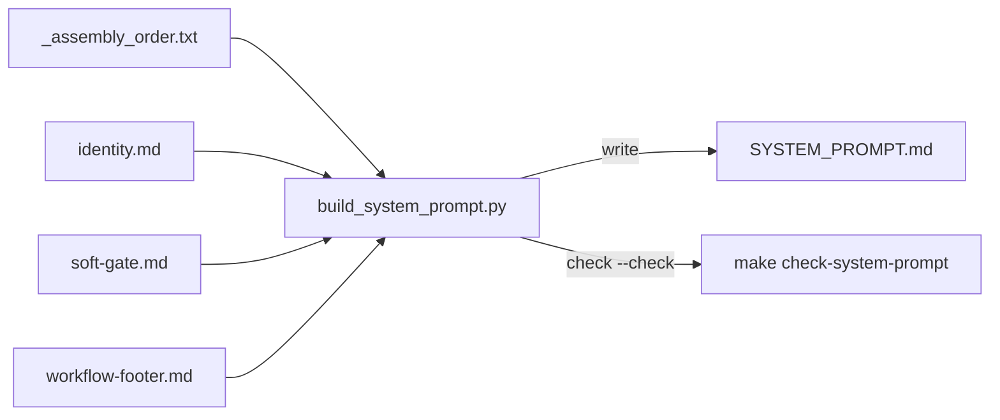

# Prompt architecture — Clean Architecture & Clean Code

**Version:** documents **v1.12.0** (plan v3 — shipped)  
**Audience:** maintainers extending Tier-1 prompts, cognitive modules, or runtime agent law  
**Companion:** [`ARCHITECTURE.md`](ARCHITECTURE.md) · [`openspec/llm-performance.md`](openspec/llm-performance.md) · [`AGENTS.md`](../AGENTS.md)

This document applies **Robert C. Martin’s** *Clean Architecture* (dependency rule, boundaries, use cases) and *Clean Code* (single responsibility, explicit names, tests as specification) to Matryca Plumber’s LLM prompt surface.

---

## Release recommendation (semver)

| Candidate | Verdict | Rationale |
|-----------|---------|-----------|
| **Patch (1.11.3)** | Too small | Hides a structural milestone behind a bugfix number. |
| **Minor (1.12.0)** | **Recommended** | New **maintainer contracts** (`AGENTS.md`, `make agents-check`, `make build-system-prompt`), **Tier-1 prompt DI** (`prompts/core.py` + domain builders), **L0 write-safety** (semantic index commits may abort where they previously succeeded), and **974+** regression tests. No intentional PyPI CLI/MCP breaking change for typical vault operators. |
| **Major (2.0.0)** | Not warranted | v2.0 remains reserved for Shadow DB / Safe-Sync ([`ROADMAP.md`](../ROADMAP.md)). |

Ship **1.12.0** when you cut a release; see [`CHANGELOG.md`](../CHANGELOG.md) `[1.12.0]`.

---

## Problem statement

Before v1.12, system prompts lived as **inline strings** inside `llm_client.py` and scattered modules. That violated:

1. **Single Responsibility** — orchestration and prompt prose in one file.  
2. **Dependency Rule** — cognitive domains could reach `prompt_constraints` from many paths.  
3. **Open/Closed** — changing semantic-lint rule (6) required hunting unrelated call sites.  
4. **Testability** — no stable contract for “what a Tier-1 system prompt must contain.”

Plan v3 centralizes **compiler rules** (Tier-1), **runtime law** (Tier-2), and **hard safety** (L0) into explicit boundaries.

---

## Concentric boundaries (Clean Architecture)

Matryca maps Uncle Bob’s rings to **instruction tiers** and **Python packages**:

```text
        ┌─────────────────────────────────────────────────────────┐
        │  Frameworks & drivers (FastMCP, OpenAI-compatible API)   │
        ├─────────────────────────────────────────────────────────┤
        │  Interface adapters (InstructorLLMClient, graph_dispatch) │
        ├─────────────────────────────────────────────────────────┤
        │  Application use cases (maintenance_daemon, plumber_modules) │
        ├─────────────────────────────────────────────────────────┤
        │  Domain (prompt builders, safety validators, graph/ AST) │
        ├─────────────────────────────────────────────────────────┤
        │  Entities (Logseq blocks, PageWrittenEvent, lint models) │
        └─────────────────────────────────────────────────────────┘
                              ▲
                    dependencies point inward
```

| Ring | Prompt-related artifacts | Depends on |
|------|--------------------------|------------|
| **Entities** | Pydantic lint models, `GraphInsightsLLMResult` | Nothing outward |
| **Domain** | `src/agent/prompts/core.py`, `*/prompts.py` builders, `graph/safety/validators.py` | `core` + `graph/prompt_constraints` only via `core` |
| **Use cases** | `InstructorLLMClient`, `apply_semantic_page_result`, MARPA, harvest | Injected `SystemPromptBuilder` callables |
| **Adapters** | `semantic_lint_prompts.py` (thin re-export), `build_system_prompt.py` | Domain + filesystem |
| **Frameworks** | `SYSTEM_PROMPT.md`, `llms.txt`, MCP docstrings | Assembled / hand-maintained surfaces |

**Dependency Rule (enforced in CI):** domain `*/prompts.py` modules import **only** `src/agent/prompts/core.py`, never `prompt_constraints` directly (`tests/test_daemon_prompts.py::test_domain_builders_do_not_import_prompt_constraints_directly`).

---

## Instruction tiers (runtime vs compile-time)



| Tier | Loaded by | Mutable via | CI guard |
|------|-----------|-------------|----------|
| **L0** | Daemon before semantic index write | `graph/safety/validators.py` | `tests/test_safety_validators.py` |
| **Tier-1A** | Local LLM structured JSON tasks | Domain `prompts.py` + hash snapshot | `tests/test_daemon_prompts.py` + `prompt_hash_snapshots.json` |
| **Tier-1B** | Free-text compression | `compression/prompts.py` | Same (no `Return JSON only`) |
| **Tier-2** | MCP / Hermes / runtime agents | `docs/openspec/agent/` fragments only | `make check-system-prompt` (fragment SHA-256) |
| **Tier-3** | PyPI `uvx` discovery | Manual sync with releases | `make agents-check` (byte-identity) |

---

## Tier-1 builder pattern (Clean Code)

Each cognitive domain owns **one** `prompts.py` with a narrow public API:

```text
build_<domain>_system_prompt() -> str
```

**Template contract** (`prompts/core.py`):

- **Tier-1A** — `[ROLE]` · `[INVARIANTS]` · `[OUTPUT]` · cross-lingual tail (Pydantic / JSON tasks).  
- **Tier-1B** — `[GOAL]` · prose output (compression); must not contain `English only` or spurious `Return JSON only`.

**Clean Code practices applied:**

| Principle | Implementation |
|-----------|----------------|
| **SRP** | One builder file per domain; `llm_client.py` has **zero** inline system strings. |
| **DIP** | `InstructorLLMClient` receives builder callables via constructor (`tests/test_llm_client_prompt_injection.py`). |
| **Meaningful names** | `compile_tier1a_prompt`, `reject_id_line_deletion`, `assert_no_unlisted_fragments`. |
| **Tests as spec** | Substring invariants, token budgets, SHA-256 snapshots — not golden files of full vault prompts. |
| **No speculative abstraction** | No `DaemonPromptRegistry` god-object; flat domain modules + `core` only. |

### Domain module map

| Builder | Module | Tier |
|---------|--------|------|
| Semantic lint (rules 1–6) | `src/agent/semantic_lint/prompts.py` | 1A |
| Bootstrap harvest | `src/agent/bootstrap/prompts.py` | 1A |
| MARPA classify | `src/agent/plumber_modules/marpa/prompts.py` | 1A |
| Entity / seed / tag | `src/agent/plumber_modules/llm_prompts/` | 1A |
| Graph insights | `src/graph/insights/prompts.py` | 1A |
| Session compression | `src/agent/compression/prompts.py` | 1B |

---

## L0 write safety (fail fast)

L0 runs **after** the LLM returns and **before** `atomic_write_bytes` in `apply_semantic_page_result`:



```text
  prev markdown          proposed markdown
        │                        │
        └──────── validate_llm_write_diff ────────┐
                    │                             │
            id:: lines preserved?                 │
            fenced/code dead zones intact?        │
                    │                             ▼
                    NO ──────────────────► abort (no disk write)
                    YES ─────────────────► OCC commit path
```

---

## Tier-2 assembly (`SYSTEM_PROMPT.md`)

Runtime cognitive law is **generated**, not hand-edited:

```text
docs/openspec/agent/
  _assembly_order.txt    ← single source of ordering
  identity.md
  soft-gate.md           ← decision tree (not bullet soup)
  mcp-tools.md
  paradigm.md
  …
        │
        ▼  scripts/build_system_prompt.py
        │  • SHA-256 over fragment bytes → <!-- build-hash: … -->
        │  • assert_no_unlisted_fragments() — orphan *.md fails CI
        ▼
SYSTEM_PROMPT.md  (<!-- GENERATED — do not edit -->)
```



---

## Data flow: one semantic index cycle

ASCII end-to-end view (simplified):

```text
  [File watcher / duty cycle]
           │
           ▼
  prepare_llm_context_payload() ──► stable user prefix (PagePromptSession)
           │
           ▼
  build_semantic_lint_system_prompt()  ◄── Tier-1A builder (domain)
           │
           ▼
  build_cache_aligned_prompt(stable, task)  ◄── graph/prompt_layout.py
           │
           ▼
  InstructorLLMClient.complete (stateless=True)
           │
           ▼
  parse / validate Pydantic lint result
           │
           ▼
  validate_llm_write_diff()  ◄── L0
           │
           ├── FAIL ──► skip write (human vault wins)
           │
           └── OK ──► page_rmw_lock + OCC + atomic_write_bytes
                         │
                         ▼
                    post_write → ast_cache delta
```

---

## Contributor surfaces (three audiences)

| Audience | Entry | Do not load |
|----------|-------|-------------|
| **Cursor agent patching repo** | [`AGENTS.md`](../AGENTS.md), [`.cursor/rules/`](../.cursor/rules/) | Full `SYSTEM_PROMPT.md` on every turn |
| **External agent on user vault** | [`llms.txt`](../llms.txt) → `SYSTEM_PROMPT.md` | Cursor rules |
| **Maintainer changing prompts** | This doc, [`11-prompt-maintainer`](../.cursor/rules/11-prompt-maintainer.mdc), fragments | Ad-hoc inline strings in `llm_client.py` |

**CI coherence:** `make agents-check` verifies paths, `llms.txt` byte-mirror, and that every `.cursor/rules/*.mdc` is indexed in `AGENTS.md`.

---

## Verification commands

```bash
make agents-check          # router + llms byte-identity
make build-system-prompt   # after editing docs/openspec/agent/
make check-system-prompt   # fragment hash vs SYSTEM_PROMPT.md
uv run pytest tests/test_daemon_prompts.py -q
uv run pytest tests/test_safety_validators.py -q
make check                 # full Ironclad gate
```

**Intentional Tier-1 change:**

```bash
uv run pytest tests/test_daemon_prompts.py --update-prompt-hashes
git add tests/prompt_hash_snapshots.json
# commit: prompt(<builder>): <why>
```

---

## Deferred (plan v4 backlog)

| Item | Why deferred |
|------|----------------|
| **`llms.txt` §2.4 tiering** | Highest token impact for external agents; separate from repo contributor prompts. |
| **`check_version_consistency` extensions** | `llms` byte-identity partially covered by `agents-check`; full header guard is ~20 LOC. |
| **Cursor rule polish (`00`, `01`, `03`)** | Non-blocking; `01` already points to `docs/openspec/agent/paradigm.md`. |

See [`ROADMAP.md`](../ROADMAP.md) for v4 tracking.
