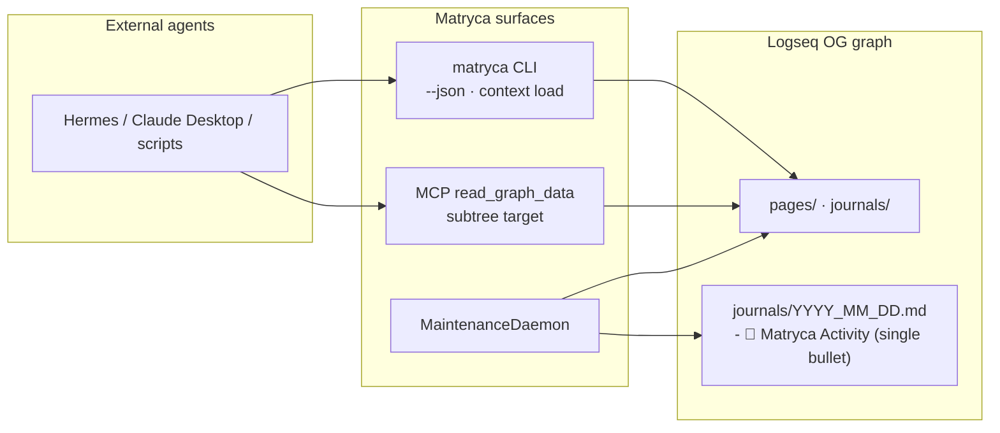
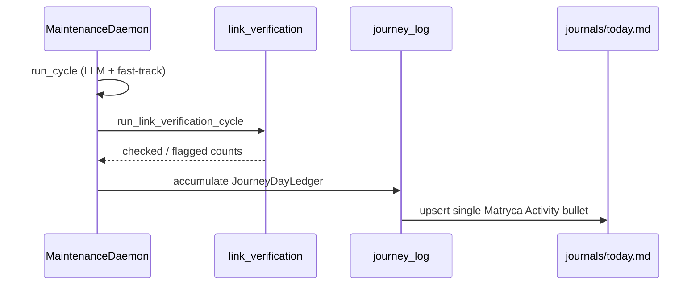

# Agent-centric DX & visual auditing (v1.9 — GitHub #16)

**Milestone:** v1.9.0 — Structural Graph Hygiene  
**Modules:** [`src/cli/__init__.py`](../../src/cli/__init__.py), [`src/agent/context_load.py`](../../src/agent/context_load.py), [`src/agent/journey_log.py`](../../src/agent/journey_log.py), [`src/agent/graph_tool_helpers.py`](../../src/agent/graph_tool_helpers.py) (`read_subtree_markdown`)

v1.8 delivered Ironclad AST parity and OCC. v1.9 improves **headless agent ergonomics**: machine-readable CLI output, semantic macros, token-efficient reads, and **visible daemon activity** in today's journal.

**v1.9.2** adds the distribution layer: [`llms.txt`](../../llms.txt) / [`.well-known/llms.txt`](../../.well-known/llms.txt) and [`agent-onboarding.md`](agent-onboarding.md) — verified `uvx` commands and anti-patterns for external hosts.

**v1.9.3** adds live Sovereign UI telemetry — see [`live-telemetry-ui.md`](live-telemetry-ui.md) (5s polling, daemon heartbeat, `daemon_pid` auto-unfreeze).

---

## Surface map



All paths share **`graph_dispatch`** / headless I/O — no second mutation plane.

---

## 1. Native JSON stdout (`--json`)

**Flag:** global on `matryca` (before subcommand)

```bash
matryca --json read page "My Project"
matryca --json search bm25 "redis cache"
matryca --json mutate edit_property --target "Demo|uuid" --payload '{"search":"x","replacement":"y","dry_run":true}'
matryca --json context load "My Project"
```

**Shape:** `{ "ok": true, "command": "...", ... }` with secrets redacted via `redact_secrets_in_text` (same policy as default dict stdout).

**Why:** External agents should not parse pretty-printed Markdown mixed with operational hints. JSON eliminates structure hallucinations.

---

## 2. Semantic macro — `matryca context load`

Bundles the most common read pattern into one call:

| Query | Mode | Returns |
|-------|------|---------|
| `Page Title` | `page` | Full spatial context (`get_page_spatial_context`) + `relative_path` |
| `Page Title\|block-uuid` | `subtree` | Focused Markdown excerpt (`read_subtree_markdown`) |

```bash
matryca context load "Architecture/Plumber"
matryca --json context load "Architecture/Plumber|aaaaaaaa-aaaa-aaaa-aaaa-aaaaaaaaaaaa"
```

MCP equivalent: compose `read_graph_data` (`page` or `subtree`) — no separate MCP tool (keeps seven-tool surface stable).

---

## 3. Targeted subtree reads (`read subtree`)

**CLI:**

```bash
matryca read subtree "My Page|block-uuid"
matryca --json read subtree '{"page":"My Page","block_uuid":"...","heading":"Implementation"}'
```

**MCP:**

```json
{ "target_type": "subtree", "query": "My Page|block-uuid" }
```

Optional JSON field **`heading`** narrows output to one bulleted heading and its nested children — saves context window vs full page or full block subtree.

Distinct from **`block_ast`**: `block_ast` is the raw on-disk splice for one `id::` subtree; `subtree` supports heading-filtered excerpts for agent planning.

---

## 4. Journey Log (visual auditing)

After each maintenance **duty cycle** with activity, the daemon **upserts one cumulative bullet** in **today's journal** (`journals/YYYY_MM_DD.md`). Counts increment on the same line instead of appending a new section per cycle:

```markdown
- 🤖 Matryca Activity — indexed 12 page(s); checked 340 link(s); flagged 2 block(s); fast-tracked 5 file(s); 47 duty cycle(s)
```

| Variable | Default |
|----------|---------|
| `MATRYCA_JOURNEY_LOG_ENABLED` | `true` |

### Design (v1.9+ consolidated)

| Concern | Behavior |
|---------|----------|
| **Logseq surface** | One top-level bullet (`- 🤖 Matryca Activity — …`); no `##` markdown heading per cycle |
| **Source of truth** | `DaemonState.journey_day` (`JourneyDayLedger` in `.matryca_daemon_state.json`) — resets at calendar day change |
| **Write trigger** | Cycle has activity: indexing, fast-track, link checks, or hygiene flags (`JourneyCycleStats.has_journal_activity`) |
| **Idle cycles** | No journal write when the cycle produced zero metrics (avoids poll spam) |
| **Legacy migration** | Existing `## 🤖 Matryca Activity` blocks on **today's** file are stripped on first upsert |
| **Agent MCP** | `mutate append_journal` stays append-only for explicit agent-authored notes |

**Modules:** `src/agent/journey_log.py` (`upsert_journey_log`, `JourneyDayLedger`), `src/graph/journal_task_scan.py` (`upsert_matryca_activity_block`), hook `MaintenanceDaemon._finalize_link_and_journey_pass`.

**Cumulative fields** (summed per day, shown inline in the bullet):

| Ledger field | Meaning |
|--------------|---------|
| `llm_files_processed` | LLM indexing turns completed |
| `links_checked` | URLs/assets verified (link-verification sidecar) |
| `dead_links_flagged` + `missing_assets_flagged` | Blocks stamped with hygiene properties |
| `fast_track_files` | Files processed without LLM this cycle |
| `cycles` | Duty cycles that contributed to the ledger |

**Write path:** `upsert_matryca_activity_block` under `page_rmw_lock` + atomic replace (same OCC stack as property edits). After a successful write, the daemon records today's journal in file state so `list_pending_files` does not re-queue it.

**Inspiration:** [LogseqBrain](https://github.com/jame581/LogseqBrain) journal auditing — implemented with Matryca's lock + AST stack to avoid data loss.



---

## CLI command tree (v1.9)

| Command | Role |
|---------|------|
| `matryca read` | `page`, `memory`, `block_ast`, **`subtree`**, `structural_hops`, `dashboard`, `xray_page` |
| `matryca search` | `bm25`, `semantic`, `regex`, `unlinked_mentions`, `journal_tasks`, `resolve_entity` |
| `matryca mutate` | `write_outline`, `edit_property`, `append_journal`, `inject_query` |
| `matryca refactor` | `split_large`, `reparent`, `generate_flashcards` |
| `matryca lint` | `unify_tags`, `block_refs`, `full_wiki_scan` |
| **`matryca context load`** | Semantic macro (page or subtree bundle) |
| `matryca plumber` | Daemon + Sovereign UI |
| `matryca service` | LaunchAgent / systemd install |

Global: **`--json`** on any subcommand.

---

## Paradigm checklist (issue #16)

- [x] No auxiliary databases — stdout/Journal are views; Markdown remains source of truth
- [x] Block-shaped thinking — subtree and flags anchor on `id::`
- [x] Strict OCC — journal upsert + hygiene properties use `page_rmw_lock` + mtime gates
- [x] AST parity — journal sections and properties respect Logseq indentation rules

---

## Related reading

- [`agent-onboarding.md`](agent-onboarding.md) — `llms.txt`, PyPI `uvx`, maintainer sync checklist
- [`link-verification.md`](link-verification.md) — dead-link / missing-asset pipeline (feeds Journey Log metrics)
- [`SYSTEM_PROMPT.md`](../../SYSTEM_PROMPT.md) — agent tool reference (updated for `subtree`)
- [`ARCHITECTURE.md`](../ARCHITECTURE.md) — v1.9 structural hygiene section
