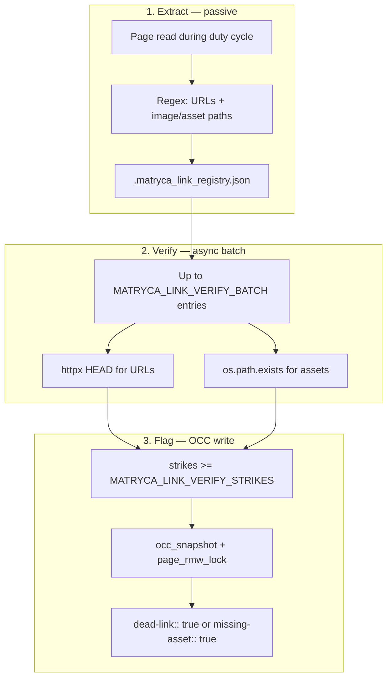

# Structural link verification (v1.9 — GitHub #15)

**Milestone:** v1.9.0 — Structural Graph Hygiene  
**Implementation:** [`src/graph/link_verification.py`](../../src/graph/link_verification.py)  
**Daemon hook:** [`MaintenanceDaemon._finalize_link_and_journey_pass`](../../src/agent/maintenance_daemon.py)

Zero-LLM hygiene for **external URL rot** and **missing local assets**. The graph remains the system of record; a JSON sidecar is only an ephemeral verification queue (TRIZ *Intermediary*).

---

## Problem

Large Logseq vaults accumulate:

- Dead `http(s)://` links (404, DNS failure, TLS errors)
- Broken `assets/` references after files are moved or deleted

Manual auditing does not scale. Synchronous HTTP on the daemon main thread would block the duty cycle and stress CPU-only hosts.

---

## Pipeline (three phases)



| Phase | When | Work |
|-------|------|------|
| **Extract** | Whenever the daemon reads page bytes (fast-track skip path or LLM cycle) | Anchor each URL/asset to `page_relpath` + `block_uuid` |
| **Verify** | End of each duty cycle (`_finalize_link_and_journey_pass`) | Async batch; no LLM |
| **Flag** | After repeated failures (default **2** cycles) | Append block property under the anchored bullet |

Protected lines (fenced code, queries) are excluded via `compute_page_protected_line_indices`.

---

## Sidecar schema

**Path:** `{LOGSEQ_GRAPH_PATH}/.matryca_link_registry.json`  
**Locking:** `cross_process_json_flock` (same family as daemon state)

```json
{
  "version": 1,
  "updated_at": "2026-06-01T12:00:00+00:00",
  "entries": {
    "pages/demo.md|uuid|url|https://example.com/dead": {
      "kind": "url",
      "target": "https://example.com/dead",
      "page_relpath": "pages/demo.md",
      "block_uuid": "aaaaaaaa-aaaa-aaaa-aaaa-aaaaaaaaaaaa",
      "strikes": 2,
      "last_status": 404,
      "last_checked_at": "...",
      "flagged": true
    }
  }
}
```

Registry keys are deterministic: `{page_relpath}|{block_uuid}|{kind}|{target}`.

---

## On-graph result (AST parity)

Properties are inserted at the correct **+2 indent** under the parent bullet (same rules as `matryca-plumber::` stamping):

```markdown
- Check out this article: https://example.com/dead-page
  dead-link:: true
  id:: aaaaaaaa-aaaa-aaaa-aaaa-aaaaaaaaaaaa
- 
  missing-asset:: true
  id:: bbbbbbbb-bbbb-bbbb-bbbb-bbbbbbbbbbbb
```

Writes use `atomic_write_bytes_if_unchanged` with Phase-1 `baseline_mtime` — identical OCC contract as cognitive lint ([`ARCHITECTURE.md`](../ARCHITECTURE.md#optimistic-concurrency-control-occ)).

---

## Environment variables

| Variable | Default | Role |
|----------|---------|------|
| `MATRYCA_LINK_VERIFY_ENABLED` | `true` | Master switch |
| `MATRYCA_LINK_VERIFY_STRIKES` | `2` | Failed checks before flagging |
| `MATRYCA_LINK_VERIFY_BATCH` | `25` | Max verifications per duty cycle |
| `MATRYCA_LINK_VERIFY_TIMEOUT` | `8` | HTTP HEAD timeout (seconds) |

Documented in [`.env.example`](../../.env.example) (Operator essentials).

---

## Alternatives rejected (issue #15)

| Approach | Why not Plumber |
|----------|-----------------|
| Semantic / LLM quote hashing | CPU + RAM cost on 16 GB hosts; better suited to Matryca Brain tier |
| Synchronous GET/HEAD on main thread | Blocks duty cycle and Sovereign UI responsiveness |
| Auxiliary SQL/Redis store | Violates local-first Markdown-only system of record |

**Prior art:** claims-sidecar pattern ([issue #14](https://github.com/MarcoPorcellato/matryca-plumber/issues/14), [gist](https://gist.github.com/kiluazen/727948f9517eacd665d21199e8318da1)).

---

## Operator notes

- Network blips can increment `strikes`; the threshold reduces false positives.
- Journey Log reports link checks when [`agent-dx.md`](agent-dx.md) journey logging is enabled.
- Disable entirely: `MATRYCA_LINK_VERIFY_ENABLED=false`.
