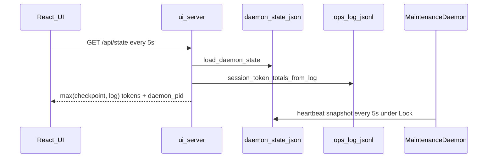

# Live telemetry — Sovereign UI (v1.9.3)

**Milestone:** v1.9.3 — Live Telemetry Update  
**Status:** Shipped  
**Modules:** `src/agent/maintenance_daemon.py`, `src/cli/ui_server.py`, `frontend/src/hooks/usePlumberPolling.ts`

## Problem

Operators saw a **frozen** control room during long LLM turns: progress bar, Phase 1/2 pills, and token counters jumped only on **Stop Engine**, because:

1. The daemon wrote `.matryca_daemon_state.json` only at coarse events (every 50 catalog pages, start/end of each LLM file).
2. `GET /api/state` exposed checkpoint token fields only — not live totals from `matryca_plumber_ops.log` (the TUI already merged both).
3. The React hook defaulted to **frozen** telemetry (0 Hz) until **Start Engine**, and did not poll when a daemon was started from the CLI after the page loaded.

## Design (pull, not push)

No WebSocket or SSE. The stack stays **HTTP polling + atomic checkpoint files**:

## Daemon writer

| Mechanism | Env | Default | Role |
|-----------|-----|---------|------|
| Telemetry heartbeat | `MATRYCA_TELEMETRY_HEARTBEAT_SECONDS` | `5` | Cooperative flush while `running` or dirty |
| Phase 1 pill flush | `MATRYCA_BOOTSTRAP_PILL_CHECKPOINT_EVERY` | `5` | Persist `bootstrap_recent` for control-room pills |
| Phase 1 progress | `MATRYCA_BOOTSTRAP_CHECKPOINT_EVERY` | `50` | Full catalog progress counters |

**Thread safety:** All checkpoint writes from the daemon (including the heartbeat thread during `index_page`) take `MaintenanceDaemon._telemetry_lock`, sync tokens, then persist **`DaemonState.from_json(state.to_json())`** — an immutable snapshot — via `save_daemon_state` (tmp + fsync + `os.replace`).

**Mid-LLM:** `_telemetry_heartbeat_scope()` starts a daemon thread for the duration of `llm_client.index_page()` so tokens and in-flight subtitles reach disk without blocking inference.

## API reader

`_build_daemon_state_response` merges `session_*_tokens` from the ops log (parity with `tui_dashboard.py`) and sets **`daemon_pid`** when `read_pid_file` + `is_plumber_process` succeed.

## Frontend reader

| Constant | Value | Behavior |
|----------|-------|----------|
| `POLL_CYCLE_MS` | `5000` | Base telemetry cycle |
| Frozen mode | default on load | Logs + graph-analytics frozen until **Start Engine** |
| Background poll | `daemon_pid` set | `GET /api/state` every 5s even when frozen |
| Auto-unfreeze | `running` / `idle` / live PID | Enables full poll loop (state + logs + analytics) |

## Operator expectations

- Click **Start Engine** (or start `matryca plumber start` before opening the UI) for the full live console.
- During Phase 1 on large vaults, expect pill updates about every **5 pages** and percent updates at heartbeat + catalog checkpoints.
- Phase 2 vault progress increments per processed file; full vault rescans remain at cycle boundaries (every 10 cycles) to avoid O(pages) scans on every tick.

## v1.9.11 graph analytics polling

| Change | Detail |
|--------|--------|
| Server cache TTL | `_ANALYTICS_TTL_SECONDS` raised to **18s** (aligned with ~20s UI poll cadence) |
| Client timeout | `MATRYCA_GRAPH_ANALYTICS_TIMEOUT_MS` = **60s** for `/api/graph-analytics` |
| Poll failure | UI merges `graph_analytics.status: offline` instead of silent no-op |

## Related specs

- [`llm-performance.md`](llm-performance.md) — bootstrap yield/checkpoint cadence  
- [`agent-onboarding.md`](agent-onboarding.md) — PyPI / `uvx` contract  
- [`runtime-bootstrap.md`](runtime-bootstrap.md) — lazy vs eager `prepare_matryca_runtime`  
- [`../ARCHITECTURE.md`](../ARCHITECTURE.md) — Sovereign UI topology
